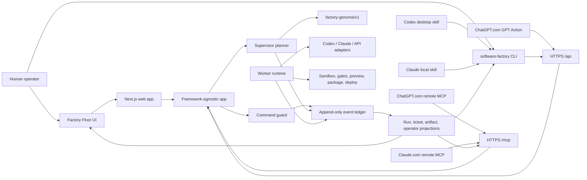
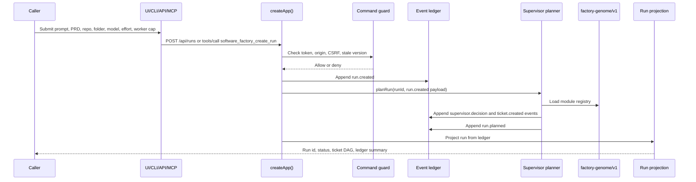
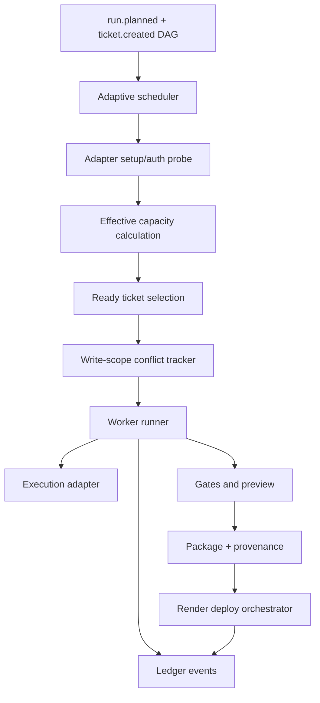
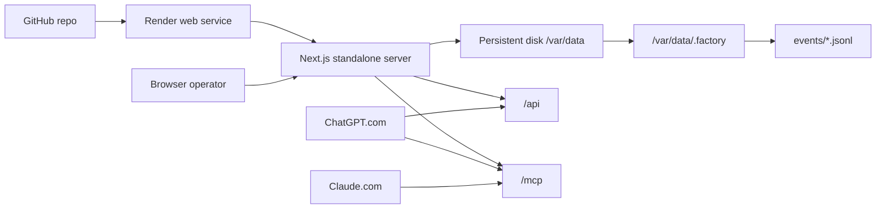

# Software Factory AI Architecture

Software Factory AI is a local-first, cloud-capable control room for turning a
prompt and/or PRD into a ledgered software build run. The system is built around
one rule: the append-only event ledger is the source of truth. UI, CLI, MCP
tools, projections, worker scheduling, provenance, and deploy status are all
derived from ledger events.

V1 is planning-first. A fresh run creates a durable `run.created` event, emits
supervisor decisions, creates a ticket DAG, and records `run.planned`. Worker,
package, preview, and deploy events are supported by the worker package, but the
default create-run path stops after planning until worker execution is wired into
the operator flow.

## System Context



## Runtime Shapes

The same codebase runs in two shapes.

### Local Runtime

Local mode is the default when `SF_RUNTIME` is unset or `local`.

```text
http://127.0.0.1:3000
http://127.0.0.1:3000/operator
```

Local mode characteristics:

- Binds to loopback by default.
- Stores ledger and local operator token under `.factory/`.
- Allows browser calls from local origins.
- Lets the CLI and local Codex/Claude skill wrappers talk to the local server.
- Can reference local folders that exist on the same machine as the running
  factory.

### Cloud Runtime

Cloud mode is enabled by `SF_RUNTIME=cloud` or by Render environment detection.

Required cloud variables:

| Variable                            | Meaning                                             |
| ----------------------------------- | --------------------------------------------------- |
| `SF_RUNTIME=cloud`                  | Uses hosted defaults.                               |
| `SF_FACTORY_DIR=/var/data/.factory` | Stores ledger/token state on persistent disk.       |
| `SF_OPERATOR_TOKEN`                 | Stable secret used by remote callers.               |
| `SF_PUBLIC_BASE_URL`                | Public HTTPS base URL for browser/model callbacks.  |
| `PORT`                              | Platform-provided port.                             |
| `SF_HOST=0.0.0.0`                   | Optional explicit bind host; cloud default is this. |

Cloud mode characteristics:

- Binds to `0.0.0.0` by default.
- Requires a stable operator token from the environment.
- Uses same-host origin allowance plus configured allowed origins.
- Exposes `/api` for browser/CLI/GPT Actions.
- Exposes `/mcp` for Claude.com and ChatGPT remote MCP integrations.
- Persists the JSONL ledger on a mounted disk when deployed with `render.yaml`.

## Entry Points

| Caller              | Entry point                       | Transport      | Auth model                                  |
| ------------------- | --------------------------------- | -------------- | ------------------------------------------- |
| Browser UI          | `/`, `/operator`, `/runs/:runId`  | Next.js pages  | Server-provided operator token plus CSRF    |
| CLI                 | `software-factory`                | HTTP `/api`    | `x-operator-token` or bearer token          |
| Codex local skill   | `skills/codex/...ps1`             | CLI wrapper    | Same as CLI                                 |
| Claude local skill  | `skills/claude/...sh`             | CLI wrapper    | Same as CLI                                 |
| ChatGPT.com Action  | `integrations/chatgpt/actions...` | OpenAPI `/api` | Action API key header `x-operator-token`    |
| ChatGPT.com MCP     | `https://<host>/mcp`              | JSON-RPC MCP   | Bearer token or `x-operator-token`          |
| Claude.com MCP      | `https://<host>/mcp`              | JSON-RPC MCP   | Bearer token, or auth proxy token injection |
| Programmatic caller | `createApp(...).handle(request)`  | In-process     | Caller supplies request/session context     |

GitHub repository access is separate from invocation. Pointing Claude.com or
ChatGPT.com at the GitHub repo lets the model read source code. Invoking the
factory requires the hosted `/mcp` connector or `/api` action, and `githubRepo`
is passed as a run parameter.

## Run Creation Flow



Accepted run intake fields:

| Field                | Purpose                                                         |
| -------------------- | --------------------------------------------------------------- |
| `prompt`             | Natural-language build request.                                 |
| `prdRef`             | Path or URL reference for a PRD.                                |
| `prdText`            | Pasted/imported PRD body text.                                  |
| `title`              | Optional display title.                                         |
| `localFolder`        | Folder visible to the factory host runtime.                     |
| `githubRepo`         | Repository destination/reference, such as `owner/repo`.         |
| `selectedAdapter`    | Adapter hint, for example Codex CLI or Claude CLI.              |
| `modelProfile`       | Model profile hint.                                             |
| `reasoningEffort`    | Effort budget hint.                                             |
| `requestedWorkerCap` | Requested worker upper bound, clamped to `1..20`.               |
| `reviewMode`         | `human` or `autonomous`.                                        |
| `callerFamily`       | `codex`, `claude`, or `api` provenance for nested-agent checks. |

For web-model callers, `prdText` is the most reliable way to submit PRD content.
A `prdRef` is recorded and used as planning signal, but the create-run API does
not fetch arbitrary remote documents during intake.

## Remote MCP Bridge

The remote MCP bridge lives at `/mcp` and wraps the existing API instead of
duplicating factory logic. It accepts JSON-RPC requests, exposes tool schemas,
verifies the operator token, creates an internal session, and calls the same
framework-agnostic app routes used by the browser and CLI.

Supported MCP methods:

| Method                      | Behavior                                  |
| --------------------------- | ----------------------------------------- |
| `initialize`                | Returns MCP capabilities and server info. |
| `notifications/initialized` | Acknowledges initialization.              |
| `tools/list`                | Lists Software Factory tools.             |
| `tools/call`                | Executes one tool.                        |
| `ping`                      | Health-style empty response.              |

Supported tools:

| Tool                          | Purpose                                                 |
| ----------------------------- | ------------------------------------------------------- |
| `software_factory_create_run` | Creates and plans a new run.                            |
| `software_factory_list_runs`  | Lists projected runs.                                   |
| `software_factory_get_run`    | Reads one projected run.                                |
| `software_factory_get_events` | Reads a run ledger, optionally after a sequence cursor. |
| `software_factory_cancel_run` | Cancels a run with stale-version protection.            |

Authentication accepted by `/mcp`:

```text
Authorization: Bearer <SF_OPERATOR_TOKEN>
x-operator-token: <SF_OPERATOR_TOKEN>
```

If a web model platform requires OAuth instead of static headers, place an auth
proxy in front of `/mcp`. The proxy should authenticate the model platform and
inject the factory operator token before forwarding the request.

## HTTP API Surface

The Next route handler forwards `/api/*` traffic into `createApp()`. `createApp`
has no Next.js dependency, so it is directly unit-testable and can also be used
in-process by another host.

Read routes:

```text
GET /api/setup
GET /api/runs
GET /api/runs/:runId
GET /api/runs/:runId/events
```

Mutating routes:

```text
POST /api/runs
POST /api/runs/:runId/cancel
POST /api/runs/:runId/review
```

All mutating routes pass through the command guard before appending side-effect
events.

## Event Ledger And Projections

The ledger is an append-only JSONL event stream partitioned by run. Events use a
versioned envelope with actor, subject, severity, evidence, and payload fields.

Important event families:

| Family     | Examples                                                                          |
| ---------- | --------------------------------------------------------------------------------- |
| Run        | `run.created`, `run.planned`, `run.completed`, `run.cancelled`                    |
| Supervisor | `supervisor.decision`                                                             |
| Ticket     | `ticket.created`, `ticket.queued`, `ticket.state_changed`, `ticket.dead_lettered` |
| Worker     | `worker.started`, `worker.progress`, `worker.retry`, `worker.completed`           |
| Adapter    | `adapter.selected`, `adapter.setup_required`, `adapter.capacity_changed`          |
| Sandbox    | `sandbox.started`, `sandbox.fallback`, `sandbox.error`                            |
| Gate       | `gate.started`, `gate.passed`, `gate.failed`                                      |
| Review     | `review.requested`, `review.decided`                                              |
| Artifact   | `artifact.created`, `artifact.confidence_computed`                                |
| Package    | `package.created`                                                                 |
| Deploy     | `deploy.setup_required`, `deploy.health_pending`, `deploy.hosted_ready`           |
| Security   | `security.block`, `security.command_rejected`                                     |
| Operator   | `operator.health_sample`                                                          |

Projections fold events into read models:

- run status and ledger summary,
- ticket DAG and ticket states,
- artifact confidence and package outputs,
- operator health/setup views,
- CLI artifact output contracts.

Because projections are derived, clients do not invent run state. If it is not
in the ledger, it is not shown as completed, hosted, packaged, or approved.

## Worker And Capacity Architecture

The worker package owns optional execution after planning. It accepts a ticket
DAG, selected adapter, capacity constraints, and an event store.



Effective capacity is the minimum of:

```text
readyTickets
requestedCap clamped to 1..20
adapterCapacity
sandboxCapacity
resourceBudget
writeScopeAvailable
reviewPolicyLimit
```

The scheduler emits `adapter.capacity_changed` only when a system constraint
throttles below both requested capacity and available demand. Having fewer ready
tickets than workers is treated as normal demand, not a system problem.

## Review And Safety Model

The command guard handles server-side command safety:

- operator token is required for mutations,
- browser origins must be allowed or same-host,
- browser mutations require CSRF when configured,
- stale subject versions are rejected,
- denied commands append `security.command_rejected`,
- denied commands perform no downstream side effects.

Review modes:

| Mode         | Meaning                                      |
| ------------ | -------------------------------------------- |
| `human`      | Pauses where policy requires human approval. |
| `autonomous` | Does not pause for review risk tiers.        |

Policy-blocked actions remain blocked by the policy/guard layer regardless of
review mode.

## Deployment Architecture

### Factory Control Room Deployment

The root `render.yaml` deploys the factory itself as a single Node web service.



The current JSONL event store is intended for one hosted instance. Horizontal
scaling should replace it with a database-backed event store plus advisory
locking, and add a real queue for worker execution.

### Generated App Deployment

Generated products use the worker deploy path, not the root `render.yaml`.
The Render deploy orchestrator only emits hosted-ready state after:

```text
local gates pass
preview is healthy
package and provenance exist
review policy is satisfied
Render deploy reaches live state
hosted health check passes
```

Until all of that is true, hosted URLs are not projected as ready.

## Package Map

```text
packages/core
  Event contracts, event store helpers, projections, command guard, supervisor
  planning, ticket DAG, genome contracts, adapters, provenance, observability.

packages/web
  Next.js UI, operator dashboard, API transport, framework-agnostic app,
  runtime config, server routes, MCP bridge.

packages/cli
  software-factory command, HTTP client, output contracts, local/cloud probing.

packages/worker
  Scheduler, cancellation, write-scope tracking, adapters, sandbox, gates,
  preview, packaging, provenance, Git/Render deploy helpers.

factory-genome/
  Versioned module registry and product blueprint contracts used by the planner.

skills/
  Local Codex and Claude skill wrappers plus installer.

integrations/
  ChatGPT Action schema, ChatGPT remote MCP notes, Claude remote MCP notes.

docs/
  Design notes, plans, runbooks, deployment guides.
```

## Design Boundaries

- The UI should stay projection-driven. It should not infer completed worker,
  package, preview, or deploy states without ledger events.
- The MCP bridge should keep delegating to `/api` rather than reimplementing
  command behavior.
- The CLI and local skills should remain thin wrappers over the same API.
- Web-model access should always use HTTPS plus an operator-token or auth-proxy
  boundary; Claude.com and ChatGPT.com cannot invoke local filesystem scripts.
- Local folders are only meaningful when the factory runtime can see that path.
  In cloud mode, a user's laptop path is not visible to the hosted service.
- PRD text should be submitted as `prdText` when the model needs the factory to
  reason over the PRD during intake.

## Current Limits And Next Architectural Moves

Current limits:

- Fresh runs are planning-first.
- JSONL storage is single-instance.
- Remote web-model auth may need an OAuth/auth proxy depending on platform UI.
- Cloud workers cannot see local desktop folders unless those folders are synced
  or mounted into the cloud runtime.

Recommended next moves:

- Wire operator-triggered worker execution into the run flow.
- Add a queue between planned tickets and workers.
- Replace JSONL with Postgres or SQLite-on-volume plus locking for hosted scale.
- Add OAuth-compatible auth in front of `/mcp` for Claude.com/ChatGPT.com setups
  that cannot send static headers.
- Add explicit repository checkout/materialization for cloud runs that specify
  `githubRepo`.
