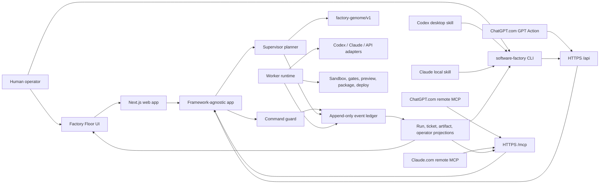
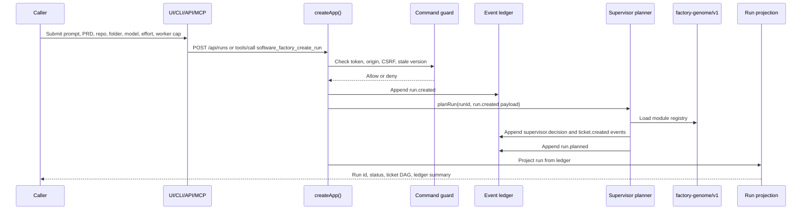
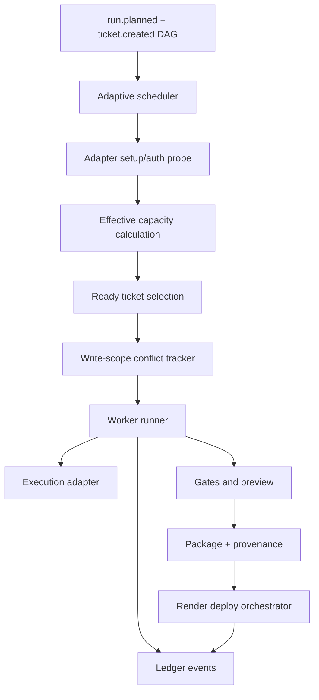
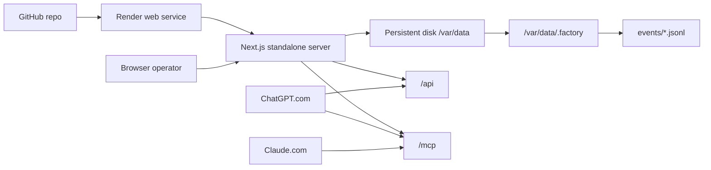

# Software Factory AI Architecture

Software Factory AI is a local-first, cloud-capable control room for turning a
prompt and/or PRD into a ledgered software build run. The system is built around
one rule: the append-only event ledger is the source of truth. UI, CLI, MCP
tools, projections, worker scheduling, provenance, and deploy status are all
derived from ledger events.

Runs are mode-gated. The default run mode is `plan-only`: a fresh run creates a
durable `run.created` event, emits supervisor decisions, creates a ticket DAG,
and records `run.planned`. Execution-capable modes (`research-and-plan`,
`research-plan-and-start`) add source-backed research, a build contract, a
dry-run preflight, and a ledger-backed execution queue owned by one execution
daemon per process, which drives workers, gates, repair loops, packaging,
provenance, and Render deploy.

## System Context


```mermaid
flowchart LR
  Human["Human operator"] --> Browser["Factory Floor UI"]
  Human --> CLI["software-factory CLI"]
  CodexLocal["Codex desktop skill"] --> CLI
  ClaudeLocal["Claude local skill"] --> CLI
  ChatGPTAction["ChatGPT.com GPT Action"] --> HTTP["HTTPS /api"]
  ChatGPTMcp["ChatGPT.com remote MCP"] --> MCP["HTTPS /mcp"]
  ClaudeWeb["Claude.com remote MCP"] --> MCP
  Browser --> Next["Next.js web app"]
  CLI --> HTTP
  HTTP --> App["Framework-agnostic app"]
  MCP --> App
  Next --> App
  App --> Guard["Command guard"]
  Guard --> Ledger["Append-only event ledger"]
  App --> Planner["Supervisor planner"]
  Planner --> Genome["factory-genome/v1"]
  Planner --> Ledger
  Worker["Worker runtime"] --> Ledger
  Worker --> Adapters["Codex / Claude / API adapters"]
  Worker --> Gates["Sandbox, gates, preview, package, deploy"]
  Ledger --> Projections["Run, ticket, artifact, operator projections"]
  Projections --> Browser
  Projections --> CLI
  Projections --> MCP
```

## Runtime Shapes

The same codebase runs in two shapes.

### Local Runtime

Local mode is the default when `SF_RUNTIME` is unset or `local`.

```text
http://127.0.0.1:3000
http://127.0.0.1:3000/operator
```

Local mode characteristics:

- Binds to loopback by default.
- Stores ledger and local operator token under `.factory/`.
- Allows browser calls from local origins.
- Lets the CLI and local Codex/Claude skill wrappers talk to the local server.
- Can reference local folders that exist on the same machine as the running
  factory.

### Cloud Runtime

Cloud mode is enabled by `SF_RUNTIME=cloud` or by Render environment detection.

Required cloud variables:

| Variable                            | Meaning                                             |
| ----------------------------------- | --------------------------------------------------- |
| `SF_RUNTIME=cloud`                  | Uses hosted defaults.                               |
| `SF_FACTORY_DIR=/var/data/.factory` | Stores ledger/token state on persistent disk.       |
| `SF_OPERATOR_TOKEN`                 | Stable secret used by remote callers.               |
| `SF_PUBLIC_BASE_URL`                | Public HTTPS base URL for browser/model callbacks.  |
| `PORT`                              | Platform-provided port.                             |
| `SF_HOST=0.0.0.0`                   | Optional explicit bind host; cloud default is this. |

Cloud mode characteristics:

- Binds to `0.0.0.0` by default.
- Requires a stable operator token from the environment.
- Uses same-host origin allowance plus configured allowed origins.
- Exposes `/api` for browser/CLI/GPT Actions.
- Exposes `/mcp` for Claude.com and ChatGPT remote MCP integrations.
- Persists the JSONL ledger on a mounted disk when deployed with `render.yaml`.

## Entry Points

| Caller              | Entry point                       | Transport      | Auth model                                  |
| ------------------- | --------------------------------- | -------------- | ------------------------------------------- |
| Browser UI          | `/`, `/operator`, `/runs/:runId`  | Next.js pages  | Server-provided operator token plus CSRF    |
| CLI                 | `software-factory`                | HTTP `/api`    | `x-operator-token` or bearer token          |
| Codex local skill   | `skills/codex/...ps1`             | CLI wrapper    | Same as CLI                                 |
| Claude local skill  | `skills/claude/...sh`             | CLI wrapper    | Same as CLI                                 |
| ChatGPT.com Action  | `integrations/chatgpt/actions...` | OpenAPI `/api` | Action API key header `x-operator-token`    |
| ChatGPT.com MCP     | `https://<host>/mcp`              | JSON-RPC MCP   | Bearer token or `x-operator-token`          |
| Claude.com MCP      | `https://<host>/mcp`              | JSON-RPC MCP   | Bearer token, or auth proxy token injection |
| Programmatic caller | `createApp(...).handle(request)`  | In-process     | Caller supplies request/session context     |

GitHub repository access is separate from invocation. Pointing Claude.com or
ChatGPT.com at the GitHub repo lets the model read source code. Invoking the
factory requires the hosted `/mcp` connector or `/api` action, and `githubRepo`
is passed as a run parameter.

## Run Creation Flow


```mermaid
sequenceDiagram
  participant Caller
  participant Transport as UI/CLI/API/MCP
  participant App as createApp()
  participant Guard as Command guard
  participant Store as Event ledger
  participant Planner as Supervisor planner
  participant Genome as factory-genome/v1
  participant Projection as Run projection

  Caller->>Transport: Submit prompt, PRD, repo, folder, model, effort, worker cap
  Transport->>App: POST /api/runs or tools/call software_factory_create_run
  App->>Guard: Check token, origin, CSRF, stale version
  Guard-->>App: Allow or deny
  App->>Store: Append run.created
  App->>Planner: planRun(runId, run.created payload)
  Planner->>Genome: Load module registry
  Planner->>Store: Append supervisor.decision and ticket.created events
  Planner->>Store: Append run.planned
  App->>Projection: Project run from ledger
  Projection-->>Caller: Run id, status, ticket DAG, ledger summary
```

Accepted run intake fields:

| Field                | Purpose                                                         |
| -------------------- | --------------------------------------------------------------- |
| `prompt`             | Natural-language build request.                                 |
| `prdRef`             | Path or URL reference for a PRD.                                |
| `prdText`            | Pasted/imported PRD body text.                                  |
| `title`              | Optional display title.                                         |
| `localFolder`        | Folder visible to the factory host runtime.                     |
| `githubRepo`         | Repository destination/reference, such as `owner/repo`.         |
| `selectedAdapter`    | Adapter hint, for example Codex CLI or Claude CLI.              |
| `modelProfile`       | Model profile hint.                                             |
| `reasoningEffort`    | Effort budget hint.                                             |
| `requestedWorkerCap` | Requested worker upper bound, clamped to `1..20`.               |
| `reviewMode`         | `human` or `autonomous`.                                        |
| `callerFamily`       | `codex`, `claude`, or `api` provenance for nested-agent checks. |

For web-model callers, `prdText` is the most reliable way to submit PRD content.
A `prdRef` is recorded and used as planning signal, but the create-run API does
not fetch arbitrary remote documents during intake.

## Remote MCP Bridge

The remote MCP bridge lives at `/mcp` and wraps the existing API instead of
duplicating factory logic. It accepts JSON-RPC requests, exposes tool schemas,
verifies the operator token, creates an internal session, and calls the same
framework-agnostic app routes used by the browser and CLI.

Supported MCP methods:

| Method                      | Behavior                                  |
| --------------------------- | ----------------------------------------- |
| `initialize`                | Returns MCP capabilities and server info. |
| `notifications/initialized` | Acknowledges initialization.              |
| `tools/list`                | Lists Software Factory tools.             |
| `tools/call`                | Executes one tool.                        |
| `ping`                      | Health-style empty response.              |

Supported tools. Every tool is a thin adapter over the SAME guarded HTTP route
the browser and CLI use — the bridge never reimplements command behavior.
Mutating tools carry the same token/origin/CSRF/stale-version guard and
idempotency as the route; run projections are returned as concise summaries
(ledger summarized to a count) plus detail links, and `get_events` is the
explicit event-level read.

Run lifecycle:

| Tool                             | Purpose                                                                         |
| -------------------------------- | ------------------------------------------------------------------------------- |
| `software_factory_create_run`    | Creates and plans a new run (any run mode).                                     |
| `software_factory_list_runs`     | Lists projected runs.                                                           |
| `software_factory_get_run`       | Reads one projected run.                                                        |
| `software_factory_get_events`    | Reads a run ledger, optionally after a sequence cursor.                         |
| `software_factory_cancel_run`    | Cancels a run with stale-version protection.                                    |
| `software_factory_review_decide` | Records an approve/reject review decision; an approval resumes a blocked stage. |

Research + workspace + contract:

| Tool                                     | Purpose                                                 |
| ---------------------------------------- | ------------------------------------------------------- |
| `software_factory_trigger_research`      | Runs one bounded research pass (idempotent).            |
| `software_factory_get_research`          | Reads the projected research state.                     |
| `software_factory_materialize_workspace` | Materializes/retries the run workspace (repo checkout). |
| `software_factory_get_workspace`         | Reads the projected workspace materialization state.    |
| `software_factory_get_contract`          | Reads the build contract for a run.                     |

Execution controls:

| Tool                             | Purpose                                            |
| -------------------------------- | -------------------------------------------------- |
| `software_factory_start_run`     | Preflight + enqueue execution for a planned run.   |
| `software_factory_pause_run`     | Pause execution (no new worker starts).            |
| `software_factory_resume_run`    | Resume a paused execution.                         |
| `software_factory_retry_run`     | Retry failed/blocked/abandoned execution.          |
| `software_factory_rerun_gates`   | Enqueue a quality-gate re-run job.                 |
| `software_factory_get_execution` | Reads projected execution state (queue/preflight). |
| `software_factory_get_preflight` | Reads the latest dry-run preflight rehearsal.      |

Interventions + outputs + setup:

| Tool                                    | Purpose                                                  |
| --------------------------------------- | -------------------------------------------------------- |
| `software_factory_list_interventions`   | Lists the operator intervention queue (filterable).      |
| `software_factory_resolve_intervention` | Resolves one intervention (idempotent).                  |
| `software_factory_get_outputs`          | Reads the run artifact contract (gates, deploy, hosted). |
| `software_factory_get_setup`            | Reads cloud/local setup diagnostics (presence only).     |

Authentication accepted by `/mcp`:

```text
Authorization: Bearer <SF_OPERATOR_TOKEN>
x-operator-token: <SF_OPERATOR_TOKEN>
```

If a web model platform requires OAuth instead of static headers, place an auth
proxy in front of `/mcp`. The proxy should authenticate the model platform and
inject the factory operator token before forwarding the request.

## HTTP API Surface

The Next route handler forwards `/api/*` traffic into `createApp()`. `createApp`
has no Next.js dependency, so it is directly unit-testable and can also be used
in-process by another host.

Read routes (no command guard, per policy):

```text
GET /api/setup
GET /api/runs
GET /api/runs/:runId
GET /api/runs/:runId/events
GET /api/runs/:runId/research
GET /api/runs/:runId/workspace
GET /api/runs/:runId/execution
GET /api/runs/:runId/outputs
GET /api/knowledge
GET /api/interventions
GET /api/execution
```

Mutating routes (all pass through the command guard —
token/origin/CSRF/stale-version — before appending side-effect events):

```text
POST /api/runs
POST /api/runs/cancel-all
POST /api/runs/:runId/cancel
POST /api/runs/:runId/review
POST /api/runs/:runId/research
POST /api/runs/:runId/workspace
POST /api/runs/:runId/start
POST /api/runs/:runId/pause
POST /api/runs/:runId/resume
POST /api/runs/:runId/retry
POST /api/runs/:runId/gates/rerun
POST /api/execution/resume
POST /api/execution/hold
POST /api/interventions/:interventionId/resolve
```

Grouped by concern: run lifecycle (`runs`, `cancel`, `cancel-all`, `review`),
research (`research`, `knowledge`), workspace materialization (`workspace`),
execution controls (`start`, `pause`, `resume`, `retry`, `gates/rerun`,
`execution`), the operator intervention queue (`interventions`, `resolve`), and
the run artifact contract (`outputs`). The MCP bridge and the ChatGPT Action
expose the same mutating surface through the same guarded routes; the one
deliberate web-only route is the read-only `GET /api/knowledge` index (remote
agents consume knowledge through the run-scoped research/contract/outputs
reads). This parity is enforced, not aspirational:
`packages/web/test/server/connector-parity.test.ts` derives the route surface
from the route factories and fails when a route ships without an Action
operation + MCP tool (or an explicit written exclusion).

Factory-wide execution gate: the execution daemon boots HELD by default —
opening the factory (any server entry point) never starts queued work
automatically. `GET /api/execution` reports the gate plus cross-run job
counts, `POST /api/execution/resume` releases it for the life of the process,
and `POST /api/execution/hold` re-engages it. The gate is deliberately
process-local (not a ledger event): every fresh process starts held again.
`SF_EXEC_AUTOSTART=1` opts a deployment back into drain-on-start (e.g. an
unattended hosted worker). `POST /api/runs/cancel-all` is the matching
"cancel all tasks" control: it cancels every cancellable run and propagates
to queued and in-flight execution work.

## Event Ledger And Projections

The ledger is an append-only JSONL event stream partitioned by run. Events use a
versioned envelope with actor, subject, severity, evidence, and payload fields.

Important event families:

| Family       | Examples                                                                          |
| ------------ | --------------------------------------------------------------------------------- |
| Run          | `run.created`, `run.planned`, `run.completed`, `run.cancelled`                    |
| Research     | `research.requested`, `research.finding_recorded`, `research.brief_completed`     |
| Knowledge    | `knowledge.entry_recorded`, `knowledge.entry_redacted`                            |
| Supervisor   | `supervisor.decision`                                                             |
| Contract     | `contract.generated`                                                              |
| Workspace    | `workspace.local_bound`, `workspace.checkout_completed`, `workspace.unavailable`  |
| Execution    | `execution.paused`, `execution.blocked`, `execution.completed`                    |
| Preflight    | `preflight.started`, `preflight.check_failed`, `preflight.passed`                 |
| Queue        | `queue.enqueued`, `queue.claimed`, `queue.heartbeat`, `queue.lease_abandoned`     |
| Intervention | `intervention.raised`, `intervention.resolved`                                    |
| Ticket       | `ticket.created`, `ticket.queued`, `ticket.state_changed`, `ticket.dead_lettered` |
| Worker       | `worker.started`, `worker.progress`, `worker.retry`, `worker.completed`           |
| Adapter      | `adapter.selected`, `adapter.setup_required`, `adapter.capacity_changed`          |
| Sandbox      | `sandbox.started`, `sandbox.fallback`, `sandbox.error`                            |
| Gate         | `gate.started`, `gate.passed`, `gate.failed`                                      |
| Repair       | `repair.started`, `repair.succeeded`, `repair.failed`                             |
| Review       | `review.requested`, `review.decided`                                              |
| Artifact     | `artifact.created`, `artifact.confidence_computed`                                |
| Package      | `package.created`                                                                 |
| Deploy       | `deploy.setup_required`, `deploy.health_pending`, `deploy.hosted_ready`           |
| Security     | `security.block`, `security.command_rejected`                                     |
| Operator     | `operator.health_sample`                                                          |

Projections fold events into read models:

- run status and ledger summary,
- ticket DAG and ticket states,
- artifact confidence and package outputs,
- operator health/setup views,
- CLI artifact output contracts.

Because projections are derived, clients do not invent run state. If it is not
in the ledger, it is not shown as completed, hosted, packaged, or approved.

## Worker And Capacity Architecture

The worker package owns optional execution after planning. It accepts a ticket
DAG, selected adapter, capacity constraints, and an event store.


```mermaid
flowchart TD
  Planned["run.planned + ticket.created DAG"] --> Scheduler["Adaptive scheduler"]
  Scheduler --> Setup["Adapter setup/auth probe"]
  Setup --> Capacity["Effective capacity calculation"]
  Capacity --> Ready["Ready ticket selection"]
  Ready --> Scope["Write-scope conflict tracker"]
  Scope --> Runner["Worker runner"]
  Runner --> Adapter["Execution adapter"]
  Runner --> Ledger["Ledger events"]
  Runner --> Gates["Gates and preview"]
  Gates --> Package["Package + provenance"]
  Package --> Deploy["Render deploy orchestrator"]
  Deploy --> Ledger
```

Effective capacity is the minimum of:

```text
readyTickets
requestedCap clamped to 1..20
adapterCapacity
sandboxCapacity
resourceBudget
writeScopeAvailable
reviewPolicyLimit
```

The scheduler emits `adapter.capacity_changed` only when a system constraint
throttles below both requested capacity and available demand. Having fewer ready
tickets than workers is treated as normal demand, not a system problem.

## Review And Safety Model

The command guard handles server-side command safety:

- operator token is required for mutations,
- browser origins must be allowed or same-host,
- browser mutations require CSRF when configured,
- stale subject versions are rejected,
- denied commands append `security.command_rejected`,
- denied commands perform no downstream side effects.

Review modes:

| Mode         | Meaning                                      |
| ------------ | -------------------------------------------- |
| `human`      | Pauses where policy requires human approval. |
| `autonomous` | Does not pause for review risk tiers.        |

Policy-blocked actions remain blocked by the policy/guard layer regardless of
review mode.

## Deployment Architecture

### Factory Control Room Deployment

The root `render.yaml` deploys the factory itself as a single Node web service.


```mermaid
flowchart LR
  GitHub["GitHub repo"] --> Render["Render web service"]
  Render --> Node["Next.js standalone server"]
  Node --> Disk["Persistent disk /var/data"]
  Disk --> FactoryDir["/var/data/.factory"]
  FactoryDir --> Ledger["events/*.jsonl"]
  Node --> API["/api"]
  Node --> MCP["/mcp"]
  ChatGPT["ChatGPT.com"] --> API
  ChatGPT --> MCP
  Claude["Claude.com"] --> MCP
  Operator["Browser operator"] --> Node
```

The current JSONL event store and ledger-backed execution queue are intended
for exactly one hosted instance. Horizontal scaling is unsafe with this build;
see "Hosted Scale Migration Seam" below for the diagnostics that state this
limit and the contracts a database-backed replacement must satisfy.

### Generated App Deployment

Generated products use the worker deploy path, not the root `render.yaml`.
The Render deploy orchestrator only emits hosted-ready state after:

```text
local gates pass
preview is healthy
package and provenance exist
review policy is satisfied
Render deploy reaches live state
hosted health check passes
```

Until all of that is true, hosted URLs are not projected as ready.

## Hosted Scale Migration Seam

This build is deliberately single-instance (KTD4): events persist in a JSONL
ledger, and the execution queue is a pure fold over `queue.*` ledger events
owned by ONE execution daemon per process. Horizontal scaling — running more
than one instance (or more than one daemon) against the same ledger — is
UNSAFE with this build. JSONL appends and per-run sequence allocation are
serialized inside one process, not across processes, so a second instance can
corrupt sequence ordering and defeat idempotency-key arbitration.

Operational diagnostics state this limit instead of hiding it:

- `GET /api/setup` reports `storage` (event-store mode, factory dir,
  persistent-disk status) and `queue` (queue mode, `singleInstance: true`,
  `horizontalScaling: "unsafe"`, and an explicit single-instance-only
  warning).
- Cloud entry points log one `[software-factory] scale-safety:` warning line
  at startup (`mode=cloud storage=jsonl queue=ledger
horizontal-scaling=unsafe ...`).
- `render.yaml` pins `numInstances: 1`.

### What stays stable across the migration

Replacing JSONL with a database is a storage/queue swap behind existing
interfaces, not a redesign. These contracts do not change:

| Seam                          | Stable contract                                                                                                                                                                 |
| ----------------------------- | ------------------------------------------------------------------------------------------------------------------------------------------------------------------------------- |
| `EventStore`                  | `append` / `readRun` / `readAll` / `listRuns` plus `AppendResult` (`packages/core/src/events/event-store.ts`)                                                                   |
| `EventReader` / `EventWriter` | Thin facades over `EventStore`; consumers never see the backend                                                                                                                 |
| Queue event semantics         | `queue.enqueued` -> `queue.claimed` -> `queue.heartbeat` -> `queue.released` / `queue.lease_abandoned`, idempotent per `(jobId, attempt)` and folded by `projectExecutionQueue` |
| Execution daemon seam         | `createExecutionDaemon` with the injectable `TicketExecutor` (`packages/web/src/server/execution/daemon.ts`)                                                                    |
| Projections                   | Pure functions over sequence-ordered events; no backend awareness                                                                                                               |
| Stale-version guard           | The command guard compares client `expectedVersion` against the run projection's `lastSequence` — ledger-derived                                                                |

A database-backed `EventStore` plugs in at exactly two construction sites,
both of which call `createFileSystemEventStore` today:
`packages/web/src/server/instance.ts` (`getStore`) and
`packages/web/src/server/standalone.ts`.

### What a database-backed EventStore must preserve

- Append atomicity: sequence assignment and persistence are one atomic step;
  two concurrent appends can never share a `(runId, sequence)` pair. In SQL,
  allocate the per-run sequence inside the insert transaction.
- Global idempotency: `idempotencyKey` dedup spans all runs, survives
  restarts, and returns the ORIGINAL stored event. In SQL, a unique index on
  the idempotency key; on conflict, return the existing row.
- Per-run ordering: `readRun` returns events ordered by sequence, and
  `readAll` ordering is deterministic (sequence, then eventId tie-break).
- Restart continuation: a fresh store instance over the same persisted state
  continues each run's sequence from the high-water mark, never from 1.

The executable form of this contract is
`packages/core/test/events/event-store-contract.ts`. The suite runs against
the JSONL and in-memory stores today and must pass UNCHANGED for any
replacement backend before it ships.

### Queue and daemon invariants that must survive the swap

1. Queue truth is a fold: queue state is `projectExecutionQueue` over
   `queue.*` events — a restart replays the exact same queue.
2. Store-level claim arbitration: `queue.claimed` is idempotent per
   `(jobId, attempt)`; a deduplicated claim means another owner already won
   and the loser must not execute.
3. Single active daemon owner OR lease-safe multi-owner: safety against
   foreign owners rests only on ledger lease expiry, never on shared memory.
4. Heartbeat freshness: heartbeats extend `leaseExpiresAt` on the ledger; an
   unexpired foreign lease is never abandoned or re-claimed.
5. Abandoned-lease recovery: expired leases are marked abandoned and
   escalated to the operator intervention queue — never silently re-run.
6. Reconcile-before-drain: every daemon pass reconciles stale leases before
   claiming new work, so restart recovery is never starved.
7. Pause fold immunity: pause/cancel gating reads the run projection from the
   ledger on every decision, so pauses survive restarts and apply to every
   owner identically.

Documented exception: the daemon's `inFlight` map is process-local, but it
only guards that owner's own live executions (abort on cancel/shutdown, and
not self-abandoning a job its executor is still running). Foreign owners never
observe it; for them, correctness rests purely on invariants 2-5, which
`packages/web/test/server/execution-queue.test.ts` pins ("database-ready
semantics (U11)").

### Explicitly out of scope

Multi-tenant SaaS concerns — billing, quotas, team administration, and tenant
isolation — stay out of this seam. The upgrade path above covers single-tenant
hosted scale only; it must not be widened to multi-tenancy without a new plan.

## Package Map

```text
packages/core
  Event contracts, event store helpers, projections, command guard, supervisor
  planning, ticket DAG, genome contracts, adapters, provenance, observability.

packages/web
  Next.js UI, operator dashboard, API transport, framework-agnostic app,
  runtime config, server routes, MCP bridge.

packages/cli
  software-factory command, HTTP client, output contracts, local/cloud probing.

packages/worker
  Scheduler, cancellation, write-scope tracking, adapters, sandbox, gates,
  preview, packaging, provenance, Git/Render deploy helpers.

factory-genome/
  Versioned module registry and product blueprint contracts used by the planner.

skills/
  Local Codex and Claude skill wrappers plus installer.

integrations/
  ChatGPT Action schema, ChatGPT remote MCP notes, Claude remote MCP notes.

docs/
  Design notes, plans, runbooks, deployment guides.
```

## Design Boundaries

- The UI should stay projection-driven. It should not infer completed worker,
  package, preview, or deploy states without ledger events.
- The MCP bridge should keep delegating to `/api` rather than reimplementing
  command behavior.
- The CLI and local skills should remain thin wrappers over the same API.
- Web-model access should always use HTTPS plus an operator-token or auth-proxy
  boundary; Claude.com and ChatGPT.com cannot invoke local filesystem scripts.
- Local folders are only meaningful when the factory runtime can see that path.
  In cloud mode, a user's laptop path is not visible to the hosted service.
- PRD text should be submitted as `prdText` when the model needs the factory to
  reason over the PRD during intake.

## Current Limits And Next Architectural Moves

Current limits:

- Fresh runs default to the `plan-only` mode; execution requires an
  execution-capable run mode plus explicit start controls.
- JSONL storage and the ledger-backed queue are single-instance; horizontal
  scaling is unsafe (see "Hosted Scale Migration Seam").
- Remote web-model auth may need an OAuth/auth proxy depending on platform UI;
  the reference proxy shape lives in the cloud deployment runbook.
- Cloud runs never read laptop paths; they require a GitHub repository,
  uploaded PRD content, or a future sync/upload input.

Recommended next moves:

- Implement the database-backed event store and durable queue behind the
  documented migration seam, keeping the contract test suite green.
- Promote the OAuth/auth-proxy reference in front of `/mcp` to a maintained
  component if a hosted platform drops static-header auth.
- Extend deploy beyond the Render path once the single-provider flow is
  proven in hosted use.
