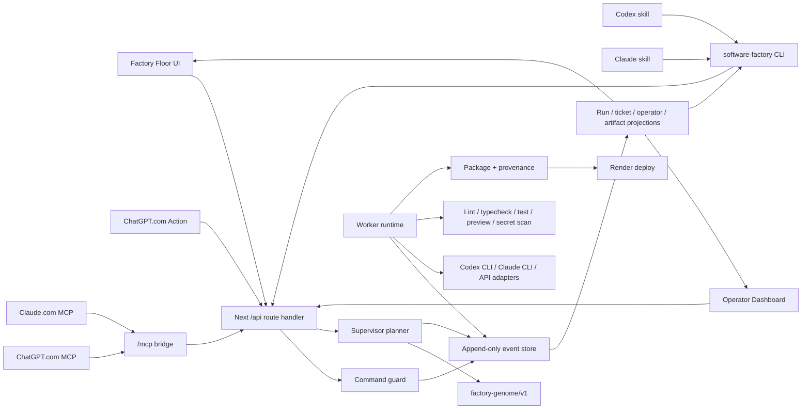

# Software Factory AI

Software Factory AI is a local-first, cloud-capable factory for turning a prompt
or PRD into a ledgered software build run. It plans a ticket DAG, records every
supervisor/worker/gate/deploy event in an append-only ledger, exposes the run in
the Factory Floor UI, and can be called from the browser, CLI, API, Claude skill,
Codex skill, ChatGPT.com Action or remote MCP connector, and Claude.com remote
MCP connector.

Current V1 status: fresh runs are planning-first. A run produces a real
`run.created` event, supervisor decisions, ticket DAG, and `run.planned` capstone.
Preview URLs, hosted URLs, packaged repos, and handoff artifacts appear after
worker/package/deploy events are emitted by the worker path.

## Quick Start

```bash
corepack enable
corepack pnpm@10.27.0 install
corepack pnpm@10.27.0 dev
```

Open the Factory Floor:

```text
http://127.0.0.1:3000
```

The operator view is at:

```text
http://127.0.0.1:3000/operator
```

Useful verification commands:

```bash
corepack pnpm@10.27.0 typecheck
corepack pnpm@10.27.0 test
corepack pnpm@10.27.0 exec playwright test
```

## What You Can Submit

A run can be started from:

- a prompt only,
- a PRD file only,
- pasted/imported PRD text only,
- any combination of prompt, PRD reference, and PRD body text.

Run controls also capture:

- local folder,
- GitHub repository,
- execution adapter,
- model profile,
- effort budget,
- review mode,
- worker cap.

Worker cap defaults to `10` and can be set from `1` through `20`. The scheduler
still treats this as an upper bound and can throttle lower when sandbox,
resource, write-scope, review, or adapter constraints require it.

## Ways To Call The Factory

### 1. Browser UI

Start the Next.js app:

```bash
corepack pnpm@10.27.0 dev
```

Then use:

- `http://127.0.0.1:3000` for the Factory Floor run surface.
- `http://127.0.0.1:3000/runs/<runId>` for a specific run.
- `http://127.0.0.1:3000/operator` for the operator dashboard.
- `http://127.0.0.1:3000/operator?runId=<runId>` for an operator view scoped to one run.

The browser gets an operator token and CSRF token from the server component and
sends them back on mutating actions. Reads are projection-only.

### 2. CLI

The CLI entrypoint is `software-factory`.

During development, run it through the workspace:

```bash
corepack pnpm@10.27.0 --filter @software-factory/cli dev -- help
```

Or directly through `tsx`:

```bash
corepack pnpm@10.27.0 exec tsx packages/cli/src/index.ts help
```

Common commands:

```bash
software-factory start --json
software-factory run "Build an AI services marketplace with providers and proposals" --json
software-factory run --prd ./docs/PRD.md --json
software-factory run --request '{"prompt":"Build a marketplace","reviewMode":"human"}' --json
software-factory status <runId> --json
software-factory events <runId> --json
software-factory events <runId> --follow
software-factory artifacts <runId> --json
```

CLI environment:

| Variable            | Purpose                                                               |
| ------------------- | --------------------------------------------------------------------- |
| `SF_BASE_URL`       | Backend URL. Defaults to `http://127.0.0.1:3000`.                     |
| `SF_OPERATOR_TOKEN` | Operator token override for mutating routes.                          |
| `SF_CSRF_TOKEN`     | CSRF token for browser-style servers when needed.                     |
| `SF_FACTORY_DIR`    | Overrides the `.factory` directory used for local ledger/token files. |

When `SF_BASE_URL` is loopback, `software-factory start` can boot a standalone
local backend. When `SF_BASE_URL` points at a remote URL, it only probes the
cloud backend and never tries to spawn a local server.

### 3. Codex Skill

The Codex skill is installed globally at:

```text
C:\Users\jaynyasg\.codex\skills\software-factory-codex
```

Repo-local source:

```text
skills/codex/SKILL.md
skills/codex/scripts/software-factory.ps1
```

Use it from Codex as `software-factory-codex` when the skill registry refreshes,
or call the wrapper directly:

```powershell
.\skills\codex\scripts\software-factory.ps1 "Build an AI services marketplace" --json
.\skills\codex\scripts\software-factory.ps1 run --prd .\docs\PRD.md --json
.\skills\codex\scripts\software-factory.ps1 status <runId> --json
```

The wrapper adds `--caller-family codex` so the run records nested-agent
provenance.

### 4. Claude Skill

The Claude skill is installed globally at:

```text
C:\Users\jaynyasg\.claude\skills\software-factory-claude
```

Repo-local source:

```text
skills/claude/SKILL.md
skills/claude/scripts/software-factory.sh
```

Use it from Claude as `software-factory-claude` when the skill registry refreshes,
or call the wrapper directly:

```bash
skills/claude/scripts/software-factory.sh "Build an AI services marketplace" --json
skills/claude/scripts/software-factory.sh run --prd ./docs/PRD.md --json
skills/claude/scripts/software-factory.sh status <runId> --json
```

The wrapper adds `--caller-family claude`.

To reinstall both global skills after edits:

```powershell
pwsh -NoProfile -ExecutionPolicy Bypass -File .\skills\install-software-factory-skills.ps1
```

### 5. HTTP API

The Next route handler mounts the framework-agnostic API under `/api`.

Read-only routes:

```text
GET /api/setup
GET /api/runs
GET /api/runs/:runId
GET /api/runs/:runId/events
```

Mutating routes:

```text
POST /api/runs
POST /api/runs/:runId/cancel
POST /api/runs/:runId/review
```

Example run creation:

```bash
curl -X POST "$SF_BASE_URL/api/runs" \
  -H "content-type: application/json" \
  -H "x-operator-token: $SF_OPERATOR_TOKEN" \
  -d '{"prompt":"Build an AI services marketplace","requestedWorkerCap":10,"reviewMode":"human"}'
```

Browser-origin mutations also require the CSRF token. CLI and skill calls are
non-browser callers and authenticate with the operator token.

### 6. ChatGPT.com

ChatGPT.com cannot run this repo's local scripts. To call the factory from
ChatGPT on the web, deploy the factory to HTTPS, then use either a Custom GPT
Action or the hosted MCP endpoint.

#### Custom GPT Action

Create a GPT Action from:

```text
integrations/chatgpt/actions.openai.yaml
```

Setup:

1. Replace `https://YOUR_FACTORY_HOST` in the OpenAPI file with your hosted
   factory URL.
2. In the GPT Action authentication settings, use API key auth.
3. Set the header name to `x-operator-token`.
4. Set the API key value to the hosted factory's `SF_OPERATOR_TOKEN`.

The Action exposes setup, run creation, run listing, run inspection, event log,
and cancellation operations.

#### Hosted MCP

ChatGPT/App-style integrations can point at the same hosted MCP bridge used by
Claude:

```text
https://your-factory.example.com/mcp
```

The MCP bridge exposes the factory tools listed in the Claude.com section below.
Tool calls require the hosted `SF_OPERATOR_TOKEN` as `Authorization: Bearer
<SF_OPERATOR_TOKEN>` or `x-operator-token: <SF_OPERATOR_TOKEN>`. See
`integrations/chatgpt/remote-mcp.md`.

### 7. Claude.com

Claude.com also cannot run local shell scripts. To call the factory from Claude
on the web, deploy the factory to HTTPS and add a custom connector pointing at:

```text
https://your-factory.example.com/mcp
```

The `/mcp` endpoint exposes remote tools:

- `software_factory_create_run`
- `software_factory_list_runs`
- `software_factory_get_run`
- `software_factory_get_events`
- `software_factory_cancel_run`

Tool calls require the operator token as either:

```text
Authorization: Bearer <SF_OPERATOR_TOKEN>
```

or:

```text
x-operator-token: <SF_OPERATOR_TOKEN>
```

If your Claude.com connector setup cannot attach a static Bearer token, put the
factory behind an OAuth/auth proxy that injects the token before forwarding to
`/mcp`.

See `integrations/claude/remote-mcp.md`.

### 8. Programmatic API

Core server construction is framework-agnostic:

```ts
import { createInMemoryEventStore, createOperatorTokenProvider } from '@software-factory/core';
import { createApp } from './packages/web/src/server/app';

const app = createApp({
  store: createInMemoryEventStore(),
  operatorToken: createOperatorTokenProvider(),
});

const response = await app.handle({
  method: 'GET',
  path: '/api/setup',
  query: {},
  headers: {},
});
```

The CLI HTTP client can also be imported from `packages/cli/src/api-client.ts`.

## Cloud Usage

For web-model access, the factory must run as a public HTTPS service because
ChatGPT.com and Claude.com call tools from their own cloud. The root
`render.yaml` deploys the factory itself on Render with a persistent disk mounted
at `/var/data` and the event ledger under `/var/data/.factory`.

Required cloud environment:

| Variable                            | Purpose                                                          |
| ----------------------------------- | ---------------------------------------------------------------- |
| `SF_RUNTIME=cloud`                  | Enables hosted defaults.                                         |
| `SF_FACTORY_DIR=/var/data/.factory` | Stores ledger/token state on the persistent disk.                |
| `SF_OPERATOR_TOKEN`                 | Stable secret for CLI and skill mutations.                       |
| `SF_PUBLIC_BASE_URL`                | Hosted URL, for example `https://software-factory.onrender.com`. |

Call a hosted factory from local CLI or skills:

```powershell
$env:SF_BASE_URL = 'https://your-factory.onrender.com'
$env:SF_OPERATOR_TOKEN = '<hosted SF_OPERATOR_TOKEN>'
software-factory run "Build an AI services marketplace" --json
```

Call a hosted factory from web models:

- ChatGPT.com: import `integrations/chatgpt/actions.openai.yaml` as a GPT Action
  or point a remote MCP integration at `https://<host>/mcp`.
- Claude.com: configure a remote MCP connector at `https://<host>/mcp`.

Cloud caveat: the current JSONL event store is safe for one hosted instance. For
horizontal scaling, replace it with a database-backed event store and add a
worker queue.

See `docs/runbooks/cloud-deployment.md` for the full hosted setup.

## Architecture

For the deeper system map, runtime topology, invocation flows, MCP bridge, event
ledger, worker scheduler, and cloud deployment boundaries, see
`ARCHITECTURE.md`.



Package layout:

```text
packages/core    Events, projections, command guard, supervisor, genome contracts, adapters, provenance, observability
packages/web     Next.js Factory Floor UI, operator dashboard, API transport, runtime config
packages/cli     software-factory CLI and HTTP client
packages/worker  Scheduler, sandbox, gates, preview, packaging, Git/Render deploy helpers
factory-genome/  Versioned product modules used by the planner
skills/          Claude and Codex skill wrappers plus installer
integrations/    ChatGPT Action schema plus ChatGPT/Claude remote MCP setup
docs/            Design docs, implementation plan, runbooks
tests/e2e/       Playwright suites for UI, CLI, skill, deploy, replay flows
```

## Data And Security Model

The ledger is the source of truth. Runs are projected from events, and UI state is
read from projections rather than invented client state.

Local default storage:

```text
.factory/events/*.jsonl
.factory/operator-token.json
```

Cloud default storage:

```text
/var/data/.factory/events/*.jsonl
```

Mutating commands pass through the shared command guard:

- valid operator token required,
- browser origins must be allowed or same-host,
- browser mutations require CSRF,
- stale subject versions are rejected,
- denied commands emit security events and perform no downstream side effects.

## Review Modes

The UI exposes `human` and `autonomous` review modes.

- `human` mode pauses only where policy requires a human approval.
- `autonomous` mode does not pause for review risk tiers.
- Policy-blocked actions remain blocked by the server guard/policy layer.

## Generated App Deploys

The factory itself can be deployed with the root `render.yaml`.

Generated products use the worker deploy path and generated Render blueprints.
See `docs/runbooks/render-deployment.md` for the generated-app deployment flow.

## Development Commands

```bash
corepack pnpm@10.27.0 typecheck
corepack pnpm@10.27.0 --filter @software-factory/core test -- --runInBand
corepack pnpm@10.27.0 --filter @software-factory/web test -- --runInBand
corepack pnpm@10.27.0 --filter @software-factory/cli test -- --runInBand
corepack pnpm@10.27.0 --filter @software-factory/worker test -- --runInBand
corepack pnpm@10.27.0 --filter @software-factory/web build
corepack pnpm@10.27.0 exec playwright test tests/e2e/cli-skill-invocation.spec.ts
```

## Current Limits

- V1 fresh runs settle at `planned` until worker/package/deploy events are emitted.
- The cloud runtime is single-instance with persistent disk storage.
- Multi-user cloud auth is not implemented yet. Treat the hosted UI as an
  operator surface and protect the service.
- The current planner recognizes the AI Services Marketplace path; unknown or
  underspecified requests route to triage.
