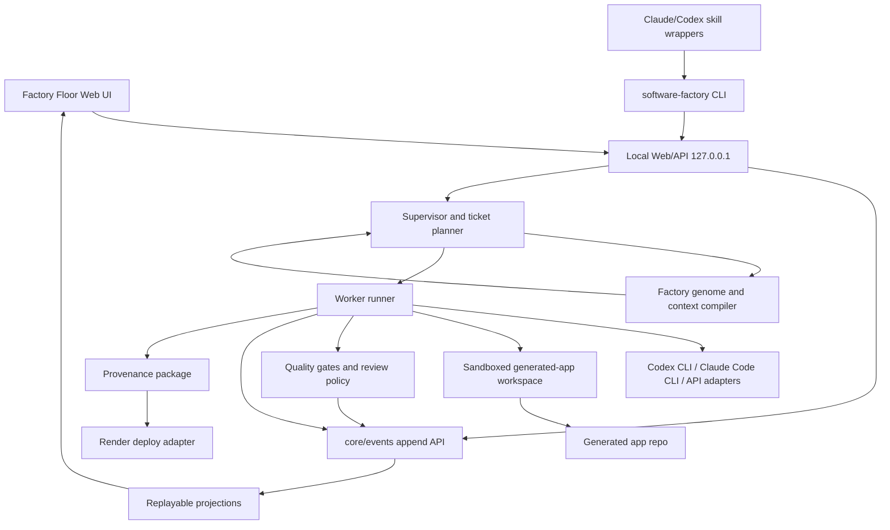

# feat: Build Software Factory V1

## Summary

Build a local-first Software Factory product that takes a prompt or PRD, decomposes it into a dependency-aware ticket plan, runs multiple specialist workers through local Codex/Claude/API execution adapters, verifies the generated software, exposes every step through an append-only ledger and Ash-inspired Factory Floor UI, packages the result as a repo with provenance, and promotes it to Render after local completion.

This plan converts the existing CEO, engineering, design, and office-hours direction into a `ce-work`-ready implementation plan. The current repository contains source references and planning artifacts, not an application scaffold, so the first units create the product skeleton and contracts before feature work fans out.

## Planning Audit And Gap Fill

The existing strategy is directionally complete, but it was not yet executable by `ce-work` without interpretation. This plan fills these gaps:

| Gap | Resolution in this plan |
| --- | --- |
| No repo-local CE plan artifact | This file becomes the active implementation plan under `docs/plans/`. |
| Implementation tasks used checkboxes instead of stable units | Work is split into stable `U` units with dependencies, files, tests, and verification. |
| Repo has no product scaffold | `U1` establishes the monorepo, package boundaries, commands, CI, and design-contract location. |
| Approved design is outside the repo | `U1` and `U8` bring the approved Factory Floor direction into `docs/design/` and `packages/web`. |
| Worker concurrency changed from 5 to adaptive 10 | `U5` defines adaptive concurrency up to 10, with resource throttling and tests for both full-capacity and reduced-capacity paths. |
| "Skill-like" invocation was a product requirement but not an implementation unit | `U10` implements one CLI/API path plus Claude and Codex wrappers around the same backend. |
| Observability needed both user and operator surfaces | `U2`, `U8`, and `U11` split ledger truth, run UI, and operator runbooks/metrics. |
| Wetware graph/vector concepts are too large for V1 | `U4` implements a lightweight genome/context contract; full graph/vector intelligence remains deferred in `TODOS.md`. |
| Render deploy needs local-first ordering and fallback repo ownership | `U9` requires local gates before deploy and supports user GitHub destination with factory-owned temporary repo fallback. |

## Requirements

| ID | Requirement |
| --- | --- |
| R1 | Prompt/PRD intake must work from the web UI and from a skill-style CLI invocation. |
| R2 | The factory must create a ticket DAG from the request and expose supervisor decisions. |
| R3 | Workers must use explicit execution adapters, including local Codex CLI and Claude Code CLI adapters, with API execution behind the same interface. |
| R4 | Concurrency must be adaptive up to 10 active workers when system, adapter, sandbox, write-scope, and review constraints allow. |
| R5 | Human review is the default mode; an autonomous mode may run only when policy and risk tier allow it. |
| R6 | Ledger events are the source of truth for run, ticket, worker, artifact, gate, review, preview, deploy, and provenance state. |
| R7 | The UI must mimic the Ash SWF operating model: supervisor, tickets, worker parallelism, skill library, QA/retry loops, risk-tiered review, backlog, deploy, and skill update suggestions. |
| R8 | Generated app V1 is a real AI Services Marketplace product slice, not a demo-only toy. |
| R9 | The generated app must be locally testable and previewable before any hosted deploy is attempted. |
| R10 | Render is the default hosted deploy target after local completion; GitHub is configured first, with factory-owned temporary repo fallback when the user does not provide one. |
| R11 | Every artifact must carry provenance, confidence, gate evidence, and a handoff summary. |
| R12 | Local operator access must protect mutating API routes and CLI calls with token/session, origin, CSRF, and stale-command checks. |
| R13 | Sandbox and dependency policies must prevent host-secret leakage, unsafe commands, data-loss migrations, and dependency changes without risk-aware review. |
| R14 | Observability must include user-facing run evidence and operator-facing health, resource, adapter, queue, and deploy diagnostics. |
| R15 | The implementation must prepare for future existing-repo feature insertion without making it part of V1. |

## Scope

### In Scope

- A local web/API/worker/CLI product that can create and run software-factory jobs.
- A generated AI Services Marketplace app path using TypeScript, Next.js, local SQLite/test database, Render Postgres profile, Prisma or an equivalent lightweight ORM, Vitest, and Playwright.
- Local BYO Codex CLI and Claude Code CLI execution adapters, plus API adapter stubs behind the same contract.
- Dependency-aware worker scheduling with adaptive concurrency up to 10 active workers.
- Append-only ledger, replay projections, review studio, gate evidence, artifact confidence, and provenance bundles.
- Local preview and automated gate pipeline before hosted deployment.
- Render deploy adapter with generated `render.yaml`, hosted health check, and deploy evidence.
- CLI plus Claude/Codex skill wrappers that call the same backend as the web UI.
- Ash-inspired Factory Floor UI with dark control-room ledger styling, decision cards, trace severity, and artifact confidence.
- Operator observability docs, runbooks, and local diagnostic surfaces.

### Deferred To `TODOS.md`

- Existing-repo feature insertion.
- Full wetware graph/vector codebase intelligence.
- Non-Render deployment providers.
- Hosted multi-user SaaS factory platform.
- Automatic skill/genome mutation without human approval.
- npm publishing.
- Desktop app packaging.
- Branch-per-ticket isolation.

### Not In Scope

- Guaranteed success for arbitrary prompts across arbitrary stacks.
- Auto-merge or production release without review policy satisfaction.
- Running untrusted generated code with host secrets mounted.
- Real payments, external marketplace transactions, or production customer data in the generated app.
- Replacing Claude, Codex, or other agent plans; V1 orchestrates them through adapters when available.

## Key Decisions

- Use a TypeScript monorepo so the web UI, local API, worker runtime, CLI, generated app template, event schemas, and tests share contracts.
- Treat the append-only ledger as the system of record. Projections are disposable and can be replayed.
- Bind the local server to loopback by default. Mutating routes require a local operator token/session plus origin, CSRF, and stale-command checks.
- Keep execution adapters separate from generated-code execution. Local Codex/Claude CLIs run as trusted control-plane processes; generated app install/test/preview commands run in a sandboxed workspace.
- Implement adaptive worker concurrency as an upper bound, not a promise. The effective active worker count is `min(ready tickets, requested cap, adapter capacity, sandbox capacity, CPU/memory budget, write-scope availability, review policy)`.
- Default to human review. Autonomous mode is an explicit option and must still stop for high-risk or policy-blocked actions.
- Promote local-first: prompt -> plan -> workers -> gates -> local preview -> package/provenance -> Render deploy.
- Use the wetware POC concepts as architecture fuel for genome, context, boundary, quality, and delivery, but keep V1 lighter than the full graph/vector model.
- Use Fabro/Sgai reference concepts for workflow graphs, human gates, visible dashboards, skill/API control, durable events, and completion gates without adopting either runtime wholesale.

## High-Level Architecture



## Proposed Repository Shape

```text
.
|-- package.json
|-- pnpm-workspace.yaml
|-- tsconfig.base.json
|-- packages/
|   |-- core/
|   |-- web/
|   |-- worker/
|   `-- cli/
|-- factory-genome/
|-- generated-app-template/
|-- skills/
|   |-- claude/
|   `-- codex/
|-- docs/
|   |-- design/
|   |-- plans/
|   `-- runbooks/
|-- tests/
|   |-- e2e/
|   `-- fixtures/
`-- .github/
    `-- workflows/
```

## Existing Patterns To Preserve

- `CLAUDE.md` routes work through skills. Keep skill wrappers thin and reusable rather than embedding a second orchestration path.
- `TODOS.md` already defines long-term deferrals. Do not pull deferred P2/P3 work into V1 unless it is required for an in-scope acceptance test.
- The Ash reference is an operating model, not a decorative diagram. Preserve the supervisor/worker/review/deploy/skill-update relationships in UI and event taxonomy.
- Wetware POC lessons to reuse: genome/context distinction, fail-closed boundary control, gate-retry loops, audit trails, and provenance-bearing context.

## Implementation Units

### U1. Scaffold Monorepo, Commands, And Design Contract

Requirements: R1, R7, R8, R14.

Depends on: none.

Files:

- `package.json`
- `pnpm-workspace.yaml`
- `tsconfig.base.json`
- `.gitignore`
- `.github/workflows/ci.yml`
- `packages/core/package.json`
- `packages/core/src/index.ts`
- `packages/web/package.json`
- `packages/worker/package.json`
- `packages/cli/package.json`
- `docs/design/DESIGN.md`
- `docs/design/factory-floor-approved-direction.md`
- `docs/runbooks/local-development.md`

Approach:

- Initialize a pnpm TypeScript workspace with shared lint, typecheck, test, build, and format scripts.
- Choose a minimal web framework stack for `packages/web` that supports local API routes, SSE or polling, Playwright, and responsive UI work.
- Create empty package boundaries for core contracts, web/API, worker runtime, and CLI.
- Convert the approved Factory Floor direction into repo-owned design docs: control-room ledger, dark but not one-note palette, decision cards, trace severity, artifact confidence, responsive behavior, and anti-slop rules.
- Keep generated app code in `generated-app-template/`, separate from the factory runtime.

Test Scenarios:

- `pnpm install` succeeds from a clean checkout.
- `pnpm typecheck`, `pnpm test`, and `pnpm lint` run through all packages.
- CI runs the same commands.
- `docs/design/DESIGN.md` includes tokens, core surfaces, interaction states, and accessibility criteria needed by `U8`.

Verification:

- Run `pnpm install`.
- Run `pnpm typecheck`.
- Run `pnpm test`.
- Run `pnpm lint`.

### U2. Implement Ledger Events, Storage, And Replay Projections

Requirements: R2, R6, R11, R14.

Depends on: U1.

Files:

- `packages/core/src/events/event-types.ts`
- `packages/core/src/events/event-store.ts`
- `packages/core/src/events/event-writer.ts`
- `packages/core/src/events/event-reader.ts`
- `packages/core/src/events/sequence.ts`
- `packages/core/src/projections/run-projection.ts`
- `packages/core/src/projections/ticket-projection.ts`
- `packages/core/src/projections/artifact-projection.ts`
- `packages/core/src/projections/operator-projection.ts`
- `packages/core/test/events/event-store.test.ts`
- `packages/core/test/events/event-replay.test.ts`
- `packages/core/test/projections/run-projection.test.ts`
- `packages/core/test/projections/operator-projection.test.ts`

Approach:

- Define a versioned event envelope with `event_id`, `run_id`, optional `ticket_id`, actor, subject, event type, monotonic sequence, timestamp, severity, evidence links, and payload.
- Implement append-only writes and ordered reads with a filesystem-backed development store first. Keep the interface ready for a relational backend later.
- Model event families for run, supervisor, ticket, worker, adapter, sandbox, gate, review, preview, artifact, package, deploy, security, and operator health.
- Build replay projections for UI and CLI status. Projections must never invent state not present in events.
- Add idempotency keys for run creation and command events.

Test Scenarios:

- Events append with strictly increasing per-run sequence numbers.
- Duplicate idempotency keys return the original event/result instead of creating duplicate runs or commands.
- Replaying the same event log twice produces identical projections.
- Out-of-order reads are sorted by sequence before projection.
- Projection gaps and corrupt events surface explicit diagnostic states.
- Severity and evidence fields flow into the projected ledger rows.

Verification:

- Run `pnpm --filter @software-factory/core test`.
- Run `pnpm typecheck`.

### U3. Build Local API, Operator Access, And Command Guard

Requirements: R1, R5, R6, R12, R13.

Depends on: U1, U2.

Files:

- `packages/core/src/security/operator-token.ts`
- `packages/core/src/security/command-guard.ts`
- `packages/core/src/security/review-policy.ts`
- `packages/web/src/server/app.ts`
- `packages/web/src/server/routes/runs.ts`
- `packages/web/src/server/routes/events.ts`
- `packages/web/src/server/routes/review.ts`
- `packages/web/src/server/routes/setup.ts`
- `packages/web/test/server/operator-token.test.ts`
- `packages/web/test/server/command-guard.test.ts`
- `packages/web/test/server/run-routes.test.ts`
- `tests/e2e/operator-access.spec.ts`

Approach:

- Start a loopback-only local server by default.
- Generate or load a local operator token/session at startup.
- Require token/session, origin checks, CSRF checks, and stale-command subject versions for mutating routes.
- Expose read-only event/projection routes separately from mutation routes.
- Ensure review actions, run start/cancel/retry, adapter selection, sandbox fallback override, deploy setup, Render trigger, and repo ownership actions all share the same command guard.
- Emit security and stale-command rejection events without starting workers or writing generated repo files.

Test Scenarios:

- Missing, expired, deleted, rotated, or mismatched operator token blocks all mutating routes.
- Cross-origin and CSRF-suspicious requests are rejected before side effects.
- Read-only event routes remain available where policy allows.
- Stale review commands reject and reload current projected state.
- Guard failures emit ledger events and do not start workers, adapters, deploys, or repo writes.

Verification:

- Run `pnpm --filter @software-factory/web test`.
- Run `pnpm exec playwright test tests/e2e/operator-access.spec.ts`.

### U4. Implement Supervisor, Ticket DAG, Genome, And Lightweight Context Compiler

Requirements: R2, R5, R7, R8, R11, R15.

Depends on: U1, U2, U3.

Files:

- `packages/core/src/supervisor/run-request.ts`
- `packages/core/src/supervisor/planner.ts`
- `packages/core/src/supervisor/ticket-dag.ts`
- `packages/core/src/supervisor/risk-tier.ts`
- `packages/core/src/genome/module-contract.ts`
- `packages/core/src/genome/context-compiler.ts`
- `packages/core/src/genome/module-registry.ts`
- `factory-genome/v1/factory.json`
- `factory-genome/v1/modules/scaffold-app.json`
- `factory-genome/v1/modules/data-model.json`
- `factory-genome/v1/modules/api-contract.json`
- `factory-genome/v1/modules/marketplace-ui.json`
- `factory-genome/v1/modules/ai-brief.json`
- `factory-genome/v1/modules/provider-proposals.json`
- `factory-genome/v1/modules/qa-gates.json`
- `packages/core/test/supervisor/planner.test.ts`
- `packages/core/test/supervisor/ticket-dag.test.ts`
- `packages/core/test/genome/context-compiler.test.ts`

Approach:

- Parse a prompt or PRD into a normalized run request.
- Implement a deterministic planner for the V1 AI Services Marketplace path.
- Generate tickets for scaffold, data model, API contract, marketplace request flow, AI brief generation, provider proposals, review/acceptance, admin/status, tests, preview, package, and deploy.
- Encode dependencies as a DAG so scaffold, model, and API contracts gate downstream UI and test work.
- Implement a lightweight genome registry with module versions, required inputs, expected outputs, allowed tools, risk hints, and artifact contracts.
- Compile worker context from the run request, ticket, previous artifacts, module contract, risk tier, and gate feedback. This is the V1 version of wetware-style context compilation without the full graph/vector store.
- Default review mode to human. Autonomous mode may only pass low-risk tickets and must pause on higher-risk review requirements.

Test Scenarios:

- Marketplace prompt produces the expected ticket DAG and dependencies.
- Unknown or underspecified prompts create review-needed tickets instead of guessing dangerous implementation.
- Risk-tier computation marks dependency changes, auth/security work, deploy changes, and data migrations above low risk.
- Context compiler includes required inputs and excludes disallowed tools.
- Planner emits supervisor decision events with rationale and confidence.

Verification:

- Run `pnpm --filter @software-factory/core test`.
- Run `pnpm typecheck`.

### U5. Implement Worker Runner, Execution Adapters, And Adaptive 10-Worker Scheduling

Requirements: R3, R4, R5, R6, R11, R13.

Depends on: U2, U3, U4.

Files:

- `packages/core/src/adapters/execution-adapter.ts`
- `packages/core/src/adapters/codex-cli-adapter.ts`
- `packages/core/src/adapters/claude-code-cli-adapter.ts`
- `packages/core/src/adapters/api-adapter.ts`
- `packages/core/src/adapters/adapter-errors.ts`
- `packages/worker/src/runner/worker-runner.ts`
- `packages/worker/src/runner/scheduler.ts`
- `packages/worker/src/runner/capacity.ts`
- `packages/worker/src/runner/write-scope.ts`
- `packages/worker/src/runner/cancellation.ts`
- `packages/worker/test/runner/scheduler.test.ts`
- `packages/worker/test/runner/adaptive-concurrency.test.ts`
- `packages/worker/test/adapters/adapter-contract.test.ts`
- `packages/worker/test/adapters/nested-agent-metadata.test.ts`

Approach:

- Define one execution-adapter interface for plan, execute, stream events, cancel, collect artifacts, and report setup/auth/capacity state.
- Implement Codex CLI and Claude Code CLI local/BYO adapters behind the same interface. They use the user's authenticated local environment when available.
- Add an API adapter stub behind the same contract for future hosted/server-side execution.
- Normalize adapter failures: unavailable, unauthenticated, rate-limited, usage-limited, tool-denied, timeout, cancelled, and malformed-output.
- Implement scheduler capacity as `min(ready tickets, requested cap, adapter capacity, sandbox capacity, CPU/memory budget, write-scope availability, review policy)`, with requested cap configurable from 1 to 10.
- Enforce ticket write scopes and queue tickets whose scopes conflict.
- Record nested agent execution metadata when a Claude/Codex wrapper invokes the factory and the selected worker adapter is the same agent family.

Test Scenarios:

- Ten independent tickets run concurrently when adapter capacity, sandbox capacity, CPU/memory budget, write scopes, and review policy allow it.
- An eleventh ready ticket remains queued until capacity frees.
- A request for 10 workers on an under-capacity system throttles active workers and emits a capacity-reduction event with reason.
- Write-scope conflicts serialize affected tickets even when worker capacity is available.
- Adapter auth/setup failures stop before ticket execution and surface setup actions.
- Cancellation propagates to adapter, worker, and ledger without corrupting projections.
- Codex and Claude adapters satisfy the same contract tests.

Verification:

- Run `pnpm --filter @software-factory/worker test`.
- Run `pnpm --filter @software-factory/core test`.

### U6. Implement Sandbox, Dependency Policy, Quality Gates, And Local Preview

Requirements: R6, R8, R9, R11, R13.

Depends on: U2, U3, U5.

Files:

- `packages/worker/src/sandbox/sandbox.ts`
- `packages/worker/src/sandbox/docker-sandbox.ts`
- `packages/worker/src/sandbox/local-fallback.ts`
- `packages/worker/src/sandbox/dependency-policy.ts`
- `packages/worker/src/gates/gate-runner.ts`
- `packages/worker/src/gates/lint-gate.ts`
- `packages/worker/src/gates/typecheck-gate.ts`
- `packages/worker/src/gates/test-gate.ts`
- `packages/worker/src/gates/secret-scan-gate.ts`
- `packages/worker/src/gates/preview-health-gate.ts`
- `packages/worker/src/preview/preview-server.ts`
- `packages/worker/test/sandbox/sandbox-policy.test.ts`
- `packages/worker/test/gates/gate-runner.test.ts`
- `packages/worker/test/gates/secret-scan.test.ts`
- `tests/e2e/local-preview.spec.ts`

Approach:

- Prefer Docker or WSL2 sandbox execution when available. Provide an explicit local fallback state with reduced-trust events when sandboxing is unavailable and the user permits fallback.
- Run generated app install, lint, typecheck, unit tests, Playwright smoke tests, secret scan, dependency audit, and preview health checks as blocking gates.
- Feed structured failure context back to the worker runner for bounded retries.
- Require review for dependency additions above low risk and for sandbox fallback.
- Emit gate, preview, failure, retry, and reduced-trust events.

Test Scenarios:

- Sandbox policy blocks host-secret access and disallowed paths.
- Dependency allowlist/review policy blocks unapproved higher-risk packages.
- Lint/type/test/secret/preview gates emit pass/fail evidence.
- Failed gates return structured retry context and respect retry budget.
- Local fallback can only run after explicit review/policy allowance and marks artifacts as reduced trust.
- Preview URL appears only after local health returns success.

Verification:

- Run `pnpm --filter @software-factory/worker test`.
- Run `pnpm exec playwright test tests/e2e/local-preview.spec.ts`.

### U7. Build Generated AI Services Marketplace App Template

Requirements: R8, R9, R11.

Depends on: U1, U4, U6.

Files:

- `generated-app-template/package.json`
- `generated-app-template/next.config.ts`
- `generated-app-template/prisma/schema.prisma`
- `generated-app-template/prisma/seed.ts`
- `generated-app-template/src/app/page.tsx`
- `generated-app-template/src/app/customer/page.tsx`
- `generated-app-template/src/app/provider/page.tsx`
- `generated-app-template/src/app/admin/page.tsx`
- `generated-app-template/src/app/api/requests/route.ts`
- `generated-app-template/src/app/api/proposals/route.ts`
- `generated-app-template/src/app/api/status/route.ts`
- `generated-app-template/src/lib/ai-brief.ts`
- `generated-app-template/src/lib/repository.ts`
- `generated-app-template/src/lib/status-events.ts`
- `generated-app-template/src/components/*`
- `generated-app-template/tests/unit/*.test.ts`
- `generated-app-template/tests/e2e/marketplace.spec.ts`
- `generated-app-template/README.md`

Approach:

- Create a real generated product slice for an AI Services Marketplace.
- Include entities for `Customer`, `Provider`, `ServiceRequest`, `AIBrief`, `Proposal`, and `StatusEvent`.
- Implement core flow: customer submits request, AI brief is generated or falls back to deterministic mock, providers submit proposals, customer accepts/rejects, statuses are visible in dashboards.
- Provide DB profiles for local/dev/test and hosted Render Postgres.
- Keep template code compatible with factory gates and deploy adapter.
- Include README, setup, env, and handoff content generated from template metadata.

Test Scenarios:

- Prisma schema validates and migrations run for local/test profile.
- Customer request creates a service request and status event.
- AI brief generation has deterministic fallback when live provider config is absent.
- Provider can submit proposal for a request.
- Customer can accept/reject proposal and status updates persist.
- Admin/status page shows recent requests, proposal state, and health.
- Playwright smoke flow passes against local preview.

Verification:

- Run generated app `pnpm install`.
- Run generated app `pnpm lint`.
- Run generated app `pnpm typecheck`.
- Run generated app `pnpm test`.
- Run generated app Playwright smoke test.

### U8. Build Factory Floor UI, Review Studio, And Run Observability

Requirements: R1, R5, R6, R7, R11, R12, R14.

Depends on: U2, U3, U4, U6, U7.

Files:

- `packages/web/src/app/page.tsx`
- `packages/web/src/app/runs/[runId]/page.tsx`
- `packages/web/src/components/factory-floor/RunControl.tsx`
- `packages/web/src/components/factory-floor/SupervisorPanel.tsx`
- `packages/web/src/components/factory-floor/WorkerBoard.tsx`
- `packages/web/src/components/factory-floor/TicketCard.tsx`
- `packages/web/src/components/factory-floor/DecisionCard.tsx`
- `packages/web/src/components/factory-floor/ArtifactConfidence.tsx`
- `packages/web/src/components/factory-floor/TraceLedger.tsx`
- `packages/web/src/components/factory-floor/ArtifactDrawer.tsx`
- `packages/web/src/components/factory-floor/ReviewStudio.tsx`
- `packages/web/src/components/factory-floor/SetupChecklist.tsx`
- `packages/web/src/components/factory-floor/DeployStatus.tsx`
- `packages/web/src/styles/tokens.css`
- `packages/web/test/components/factory-floor.test.tsx`
- `packages/web/test/components/review-studio.test.tsx`
- `tests/e2e/factory-floor.spec.ts`
- `tests/e2e/review-studio.spec.ts`
- `tests/e2e/responsive-a11y.spec.ts`

Approach:

- Implement the approved control-room ledger direction using the repo-owned design contract from `U1`.
- First screen is the actual Factory Floor run surface, not a marketing landing page.
- Include prompt/PRD intake, local folder selector, execution adapter selector, model and effort controls, review mode control, adaptive worker cap up to 10, local preview status, hosted deploy status, and setup checklist.
- Show supervisor decisions, worker ticket states, gate evidence, trace severity, artifact confidence, review decisions, deploy logs, and provenance from ledger projections only.
- Use decision cards for human approvals. Default mode is human review; autonomous mode remains explicit and policy-gated.
- Provide loading, empty, error, success, partial, reduced-trust, setup-required, stale-command, and reconnecting states.
- Verify desktop, tablet, and mobile layouts with no incoherent overlap and no horizontal scroll from long paths or URLs.

Test Scenarios:

- Empty state allows prompt/PRD entry and shows setup status without fake progress.
- Active run renders tickets, supervisor decisions, worker count, gate states, preview, ledger, review studio, artifacts, provenance, and deploy state from events.
- Decision card approval/rejection uses command guard and handles stale subject versions.
- Trace ledger reconnects with `last_sequence` or polling fallback.
- Worker cap control allows 1 through 10 and labels cap as system-gated.
- Artifact confidence blends gate pass rate, provenance completeness, dependency risk, and preview evidence.
- Responsive tests pass for desktop, tablet, and mobile.
- Keyboard and screen-reader checks pass for core review actions.

Verification:

- Run `pnpm --filter @software-factory/web test`.
- Run `pnpm exec playwright test tests/e2e/factory-floor.spec.ts`.
- Run `pnpm exec playwright test tests/e2e/review-studio.spec.ts`.
- Run `pnpm exec playwright test tests/e2e/responsive-a11y.spec.ts`.

### U9. Package Provenance, Git Destination, And Render Deployment

Requirements: R9, R10, R11, R13, R14.

Depends on: U2, U3, U6, U7, U8.

Files:

- `packages/core/src/provenance/provenance-bundle.ts`
- `packages/core/src/provenance/artifact-confidence.ts`
- `packages/worker/src/package/repo-packager.ts`
- `packages/worker/src/package/handoff-writer.ts`
- `packages/worker/src/git/git-destination.ts`
- `packages/worker/src/deploy/render/render-config.ts`
- `packages/worker/src/deploy/render/render-client.ts`
- `packages/worker/src/deploy/render/render-deployer.ts`
- `packages/worker/test/provenance/provenance-bundle.test.ts`
- `packages/worker/test/package/repo-packager.test.ts`
- `packages/worker/test/deploy/render-config.test.ts`
- `packages/worker/test/deploy/render-deployer.test.ts`
- `tests/e2e/render-deploy-mocked.spec.ts`
- `docs/runbooks/render-deployment.md`

Approach:

- Package the generated app as a valid Git repo with README, env examples, tests summary, run ledger excerpt, provenance bundle, and handoff markdown.
- Prefer a user-provided GitHub destination. If missing, create or use a factory-owned temporary repo destination and mark ownership as temporary in provenance and UI.
- Generate and validate `render.yaml` with app service, Postgres service, migration/start commands, environment variables, and health endpoint.
- Trigger Render deploy only after local gates, preview health, package/provenance, and review policy pass.
- Emit deploy setup-required, config invalid, provider failed, migration failed, health pending, health failed, and hosted ready events.
- Show hosted URL only after provider success and hosted health success.

Test Scenarios:

- Provenance bundle includes source prompt/PRD reference, ticket plan, events, adapter metadata, gate evidence, generated files, dependency decisions, preview result, deploy config, and confidence.
- Artifact confidence decreases for missing tests, missing provenance, sandbox fallback, dependency risk, or uninspected preview.
- Missing GitHub or Render setup pauses deploy and shows setup action without marking local run failed.
- Render config validation catches missing build/start/migration/env/health fields.
- Mocked Render success emits hosted URL only after health passes.
- Provider failure, deploy timeout, migration failure, and health failure attach logs and allow retry.

Verification:

- Run `pnpm --filter @software-factory/worker test`.
- Run `pnpm exec playwright test tests/e2e/render-deploy-mocked.spec.ts`.
- Optional manual credentialed E2E: provision Render Postgres, deploy generated app, run migrations, check hosted health, record evidence, and clean up resources.

### U10. Implement CLI, Claude Wrapper, And Codex Wrapper

Requirements: R1, R3, R5, R6, R10, R11, R12.

Depends on: U2, U3, U4, U5, U8, U9.

Files:

- `packages/cli/src/index.ts`
- `packages/cli/src/commands/start.ts`
- `packages/cli/src/commands/run.ts`
- `packages/cli/src/commands/status.ts`
- `packages/cli/src/commands/events.ts`
- `packages/cli/src/commands/artifacts.ts`
- `packages/cli/src/api-client.ts`
- `packages/cli/src/operator-token.ts`
- `packages/cli/test/cli-run.test.ts`
- `packages/cli/test/api-client.test.ts`
- `skills/claude/SKILL.md`
- `skills/claude/scripts/software-factory.sh`
- `skills/codex/SKILL.md`
- `skills/codex/scripts/software-factory.ps1`
- `tests/e2e/cli-skill-invocation.spec.ts`
- `.github/workflows/release.yml`

Approach:

- Implement `software-factory start`, `software-factory run`, `software-factory status`, `software-factory events`, and `software-factory artifacts`.
- Accept a prompt string, PRD path, or JSON request.
- Connect to the local backend using the same operator token/session model as the web UI.
- Stream ledger events and return `run_id`, local preview URL, hosted URL when ready, repo artifact path, tests summary, handoff markdown, and events URL.
- Add Claude and Codex skill wrappers that call the CLI/local API. Wrappers must not implement their own supervisor, worker runner, ledger, or artifact packager.
- Prepare release packaging through GitHub Releases. npm publishing remains deferred.

Test Scenarios:

- CLI starts or connects to local backend and authenticates with operator token.
- CLI creates a run from prompt and PRD path.
- CLI streams events with reconnect/resume behavior.
- CLI returns final preview/repo/test/handoff/deploy outputs.
- Token mismatch blocks mutating commands before side effects.
- Claude and Codex wrappers call the same CLI/backend path and return the same artifact contract.
- Nested-agent metadata is recorded when the caller and selected worker adapter share an agent family.

Verification:

- Run `pnpm --filter @software-factory/cli test`.
- Run `pnpm exec playwright test tests/e2e/cli-skill-invocation.spec.ts`.
- Run `pnpm typecheck`.

### U11. Add Operator Observability, Golden Run Replay, And Runbooks

Requirements: R6, R11, R13, R14.

Depends on: U2, U5, U6, U8, U9, U10.

Files:

- `packages/core/src/observability/metrics.ts`
- `packages/core/src/observability/failure-registry.ts`
- `packages/core/src/observability/run-diagnostics.ts`
- `packages/web/src/app/operator/page.tsx`
- `packages/web/src/components/operator/HealthPanel.tsx`
- `packages/web/src/components/operator/AdapterPanel.tsx`
- `packages/web/src/components/operator/QueuePanel.tsx`
- `packages/web/src/components/operator/DeployPanel.tsx`
- `packages/core/test/observability/failure-registry.test.ts`
- `packages/web/test/operator/operator-dashboard.test.tsx`
- `tests/e2e/golden-run-replay.spec.ts`
- `tests/fixtures/golden-runs/ai-services-marketplace.jsonl`
- `docs/runbooks/failure-taxonomy.md`
- `docs/runbooks/adapter-troubleshooting.md`
- `docs/runbooks/sandbox-troubleshooting.md`
- `docs/runbooks/golden-run-replay.md`

Approach:

- Define operator metrics for event lag, projection lag, worker capacity, queue wait, adapter setup/auth/capacity, sandbox fallback, gate retries, preview failures, deploy failures, and hosted health.
- Implement failure registry mappings to human-readable rescue actions.
- Add operator dashboard panels fed by ledger/projections.
- Add a golden-run replay fixture for the AI Services Marketplace path so future work can validate the full event/projection/UI contract without live adapters.
- Write runbooks for local setup, adapter issues, sandbox issues, Render issues, stale commands, and replay debugging.

Test Scenarios:

- Golden-run event log replays into stable run, ticket, artifact, deploy, and operator projections.
- Operator dashboard shows adapter unavailable, capacity throttled, sandbox fallback, gate failed, deploy setup-required, provider failed, and hosted health failed states.
- Failure registry maps known failures to severity, blocking behavior, retryability, and rescue action.
- Runbooks cover every failure class emitted by core events.

Verification:

- Run `pnpm --filter @software-factory/core test`.
- Run `pnpm --filter @software-factory/web test`.
- Run `pnpm exec playwright test tests/e2e/golden-run-replay.spec.ts`.
- Run `pnpm typecheck`.

## Test Strategy

- Unit tests cover event schema, projections, supervisor planning, genome contracts, scheduler capacity, adapter contracts, command guard, provenance, artifact confidence, and failure registry.
- Integration tests cover run creation, operator auth, worker scheduling, sandbox gates, local preview, package/provenance, mocked Render deploy, and CLI invocation.
- Playwright tests cover Factory Floor UI, review studio, local preview, CLI/skill invocation, responsive/a11y behavior, and golden-run replay.
- Optional manual tests cover live local Codex CLI, live Claude Code CLI, and credentialed Render deploy. These should be skipped in CI unless credentials and adapter availability are explicitly configured.
- Generated app tests are run both inside the template package and through the factory gate runner.

## Execution Order And Parallelization

1. Implement U1 first. No other work should start until package boundaries and commands exist.
2. Implement U2 and U3 next. Ledger and command guard are shared foundations.
3. Implement U4 once U2/U3 contracts compile.
4. U5 and U6 can progress in parallel after U4 interfaces are stable, but merge scheduler/adapters before trusting gate results.
5. U7 can start after U1 and U4, then integrate with U6 gates.
6. U8 can begin with mocked projections after U2, then wire live projections as U4-U7 land.
7. U9 starts after generated app gates and package artifacts exist.
8. U10 starts after the local API and run flow exist.
9. U11 closes the loop after enough event families exist to replay a golden run.

Suggested parallel lanes after U2/U3:

- Lane A: U4 supervisor/genome.
- Lane B: U5 adapters/scheduler.
- Lane C: U6 sandbox/gates.
- Lane D: U7 generated app template.
- Lane E: U8 UI with mocked projections.

Final integration must run the golden AI Services Marketplace flow through prompt/PRD intake, ticket DAG, adaptive scheduling, gates, preview, review, package, CLI wrapper, and mocked Render deploy.

## Risk Register

| Risk | Mitigation |
| --- | --- |
| Repo begins with no scaffold | U1 is a dedicated scaffold and CI unit. |
| Local Codex/Claude CLI behavior varies by installation/auth state | Use adapter contract tests, setup detection, normalized failures, and optional live tests. |
| Adaptive 10-worker cap overloads local machine | Capacity manager throttles based on measured local limits and emits ledgered reasons. |
| Generated code accesses host secrets or unsafe paths | Sandbox policy, command guard, secret scan, and reduced-trust fallback gating. |
| UI claims progress that did not happen | UI reads only ledger projections and shows reconnect/projection-gap states explicitly. |
| Render deploy becomes a second product too early | U9 limits deploy to generated config, default Render path, mocked CI tests, and optional credentialed E2E. |
| Full wetware graph/vector model expands V1 beyond reach | U4 implements lightweight contracts and keeps full graph/vector work deferred. |
| Skill wrappers fork orchestration logic | U10 requires wrappers to call the same CLI/backend and pass contract tests. |
| Human review/autonomous mode becomes ambiguous | U3 and U4 centralize review policy, risk tiers, and stale-command checks. |

## Documentation Updates

- `docs/design/DESIGN.md` must become the design-system source of truth before UI implementation.
- `docs/design/factory-floor-approved-direction.md` must summarize the approved B2 Control Room Ledger direction.
- `docs/runbooks/local-development.md` must document local startup, operator token behavior, and common setup issues.
- `docs/runbooks/render-deployment.md` must document GitHub/Render setup, temporary repo behavior, and cleanup.
- `docs/runbooks/failure-taxonomy.md` must enumerate all emitted failure classes and rescue actions.
- `generated-app-template/README.md` must explain local, test, and hosted Render profiles.
- `skills/claude/SKILL.md` and `skills/codex/SKILL.md` must explain prompt/PRD invocation and expected artifact output.

## Acceptance Criteria

- A user can start the local factory, enter a prompt or PRD, and see a run created in the Factory Floor UI.
- The same run can be created from `software-factory run "<prompt>"` and from Claude/Codex skill wrappers.
- The supervisor creates a visible ticket DAG for the AI Services Marketplace app.
- Workers execute through explicit adapters and emit ledger events.
- Scheduler supports requested cap 1 through 10 and throttles with evidence when constraints require it.
- Human review is default; autonomous mode is explicit and policy-gated.
- Generated app passes local install, lint, typecheck, unit tests, Playwright smoke, and preview health before deploy.
- Review studio shows risk tier, decision cards, trace severity, artifact confidence, diffs/logs, and provenance.
- Package step produces a valid Git repo artifact with README, handoff, tests summary, provenance bundle, and event evidence.
- Render deploy is attempted only after local gates pass and setup/review policy is satisfied.
- Hosted URL is shown only after Render success and hosted health success.
- Golden-run replay reconstructs the same projections and UI states from events.

## Sources Checked

- `PRD.docx`
- `Ash SWF.png`
- `software-factory-case-study.pdf`
- `TODOS.md`
- `CLAUDE.md`
- Wetware factory reference concepts: knowledge store, context engine, agent runtime, boundary control, quality gates, delivery pipeline, and POC runtime.
- SWF reference concepts: Fabro workflow graphs, human gates, run observability, sandboxes, API/event streams; Sgai goal-driven dashboard, coordinator/delegates, completion gates, MCP/skill-style control, and local-first posture.

## Confidence And Remaining Review

Confidence: 8/10.

The plan is ready for `ce-work` because it has stable implementation units, repo-relative files, explicit tests, dependencies, verification commands, and scope boundaries. The main remaining uncertainty is exact local CLI command behavior for Codex and Claude adapters; `U5` contains setup detection, normalized failures, and optional live tests so implementation can discover that safely without blocking scaffold and core runtime work.
