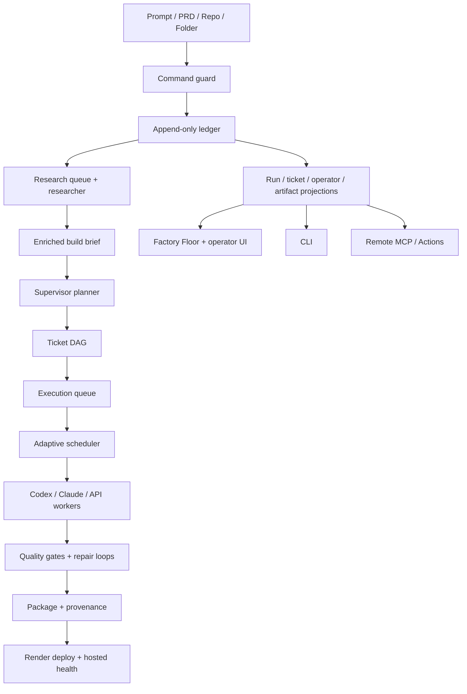

# feat: Complete Software Factory Build Loop

## Summary

Complete Software Factory AI by connecting the existing control plane to a full
research, execution, verification, repair, package, and deploy loop. The work
keeps the event ledger as the source of truth, adds a source-backed deep
research stage, materializes local/cloud workspaces, wires planned tickets into
workers, exposes operator controls, and extends hosted web-model connectors so
Claude.com and ChatGPT.com can use the factory as a remote build system.

## Current State

The repository already has strong foundations:

- prompt/PRD intake through UI, CLI, HTTP API, ChatGPT Action, and remote MCP,
- operator token and command guard for mutating routes,
- append-only event store and replay projections,
- deterministic supervisor planning and ticket DAG creation,
- adaptive worker scheduler and capacity model,
- execution adapter contracts,
- worker lifecycle events,
- gate, packaging, provenance, Git, and Render deploy helpers,
- Factory Floor and operator UI surfaces,
- cloud runtime config and Render deployment shape.

The gap is that default run creation stops after `run.planned`. The worker,
gate, package, and deploy subsystems exist in pieces but are not yet connected
to the run lifecycle, operator controls, or hosted invocation flows.

## Goals

- Add a deep research/discovery stage before planning and optionally during
  worker execution.
- Convert planned runs into executable runs with explicit start, pause, resume,
  cancel, retry, and gate-rerun controls.
- Materialize workspaces from local folders or GitHub repositories depending on
  runtime visibility.
- Connect planned ticket DAGs to the worker scheduler and execution adapters.
- Project active queues, workers, research, gates, artifacts, packages, and
  deploy state into the UI/CLI/MCP surfaces.
- Preserve planning-only mode for safe blueprint review.
- Make hosted Claude.com and ChatGPT.com invocation capable of creating,
  researching, starting, inspecting, and collecting run outputs.
- Keep single-instance local/cloud operation reliable, while defining the
  database/queue migration path for hosted scale.

## Non-Goals

- Multi-tenant SaaS billing, quotas, or team administration.
- Guaranteed success for arbitrary prompts across arbitrary technology stacks.
- Unreviewed automatic mutation of the factory genome or skills.
- Deploy providers beyond the existing Render path.
- Branch-per-ticket isolation unless write-scope safety requires it.

## Requirements Trace

| Plan Area                      | Requirements |
| ------------------------------ | ------------ |
| Research stage                 | R1-R6        |
| Blueprint/planning             | R7-R10       |
| Workspace/repo materialization | R11-R14      |
| Worker execution               | R15-R20      |
| Gates/repair/review            | R21-R25      |
| Package/provenance/deploy      | R26-R30      |
| Cloud/web-model invocation     | R31-R34      |
| Observability/operations       | R35-R38      |

## Architecture Direction



## Implementation Units

### U1. Research Event Model And Projections

Requirements: R1-R6, R35-R38.

Depends on: existing event ledger and projections.

Files:

- `packages/core/src/events/event-types.ts`
- `packages/core/src/projections/run-projection.ts`
- `packages/core/src/projections/artifact-projection.ts`
- `packages/core/src/projections/operator-projection.ts`
- `packages/core/src/research/*`
- `packages/core/test/research/*`
- `packages/core/test/projections/*`

Approach:

- Add ledger event families for research lifecycle: requested, source found,
  source read, finding recorded, assumption recorded, gap recorded, brief
  completed, and research failed.
- Add a projected research view per run with status, source count, findings,
  assumptions, unresolved gaps, and evidence links.
- Keep events source-agnostic so later providers can include web search,
  documentation fetch, repo scan, uploaded PRD, and model-generated synthesis.
- Ensure projection replay is deterministic and does not invent research state.

Test Scenarios:

- Research events replay into the same projected brief on repeated projection.
- Failed research still leaves useful partial findings and gaps.
- A run with no research events remains compatible with planning-only V1 runs.
- Evidence links and source summaries survive projection.

Verification:

- `corepack pnpm@10.27.0 --filter @software-factory/core test -- --runInBand`
- `corepack pnpm@10.27.0 typecheck`

### U2. Research Engine And Source Policy

Requirements: R1-R6, R31-R34.

Depends on: U1.

Files:

- `packages/worker/src/research/*`
- `packages/web/src/server/research/*`
- `packages/web/src/server/runtime.ts`
- `packages/cli/src/commands/*`
- `docs/runbooks/research.md`
- `packages/worker/test/research/*`
- `packages/web/test/server/research-routes.test.ts`

Approach:

- Implement a bounded research runner that accepts run context and emits
  research events through the existing store.
- Support source adapters for repo/local scan, PRD text, PRD reference metadata,
  configured documentation URLs, and external web/search provider hooks.
- Add budgets for effort, source count, elapsed time, and source class.
- Classify output as verified fact, inference, assumption, or unresolved gap.
- Fail closed when no provider credentials are configured, recording a setup
  requirement instead of silently hallucinating research.

Test Scenarios:

- Research respects source/time/count budgets.
- Missing provider credentials emit setup-required/gap events, not fabricated
  findings.
- Repo/local source adapters do not read outside the allowed workspace.
- The enriched brief is stable for deterministic fake providers.

Verification:

- `corepack pnpm@10.27.0 --filter @software-factory/worker test -- --runInBand`
- `corepack pnpm@10.27.0 --filter @software-factory/web test -- --runInBand`
- `corepack pnpm@10.27.0 typecheck`

### U3. Research-First Run Flow

Requirements: R1-R10.

Depends on: U1, U2.

Files:

- `packages/web/src/server/routes/runs.ts`
- `packages/web/src/server/planner.ts`
- `packages/core/src/supervisor/run-request.ts`
- `packages/core/src/supervisor/planner.ts`
- `packages/cli/src/commands/run.ts`
- `packages/cli/src/api-client.ts`
- `packages/web/test/server/run-routes.test.ts`
- `packages/core/test/supervisor/planner.test.ts`
- `packages/cli/test/cli-run.test.ts`

Approach:

- Add run mode options for `plan-only`, `research-and-plan`, and
  `research-plan-and-start`.
- Insert research before planning when enabled.
- Feed the enriched brief into supervisor planning and record which findings
  influenced the DAG.
- Preserve existing planning-only behavior as the default until execution
  controls are ready.
- Add idempotency so retrying run creation does not duplicate research or plan
  events.

Test Scenarios:

- Plan-only runs behave like current V1.
- Research-enabled runs append research events before supervisor/ticket events.
- Repeated create calls with the same idempotency key do not duplicate research,
  supervisor, or ticket events.
- Planner output includes research-backed rationale when findings exist.

Verification:

- `corepack pnpm@10.27.0 --filter @software-factory/web test -- --runInBand`
- `corepack pnpm@10.27.0 --filter @software-factory/core test -- --runInBand`
- `corepack pnpm@10.27.0 typecheck`

### U4. Workspace And Repository Materialization

Requirements: R11-R14, R31-R34.

Depends on: U1.

Files:

- `packages/worker/src/workspace/*`
- `packages/worker/src/git/*`
- `packages/web/src/server/routes/setup.ts`
- `packages/web/src/server/routes/runs.ts`
- `packages/core/src/events/event-types.ts`
- `packages/worker/test/workspace/*`
- `docs/runbooks/workspace-materialization.md`

Approach:

- Add workspace materialization events for local folder bound, repo checkout
  started/completed/failed, branch/commit resolved, and workspace unavailable.
- In local mode, allow local folders only when they resolve inside an approved
  working boundary or explicitly chosen operator folder.
- In cloud mode, treat laptop paths as unavailable and require GitHub repo,
  uploaded PRD text, or future upload/sync input.
- Record repo, branch, commit, checkout path, and dirty-state policy as evidence.
- Keep materialization separate from worker execution so setup failures can be
  inspected and retried.

Test Scenarios:

- Cloud run with local-only path records unavailable path and does not pretend it
  can read it.
- GitHub repo materialization records branch and commit.
- Path traversal or outside-boundary local paths are rejected with security
  evidence.
- Materialization can be retried after setup changes.

Verification:

- `corepack pnpm@10.27.0 --filter @software-factory/worker test -- --runInBand`
- `corepack pnpm@10.27.0 --filter @software-factory/web test -- --runInBand`

### U5. Execution Queue And Run Controls

Requirements: R15-R20, R35-R38.

Depends on: U3, U4.

Files:

- `packages/core/src/events/event-types.ts`
- `packages/core/src/projections/run-projection.ts`
- `packages/web/src/server/routes/runs.ts`
- `packages/web/src/server/routes/execution.ts`
- `packages/web/src/server/execution/*`
- `packages/cli/src/commands/*`
- `packages/web/src/server/mcp.ts`
- `integrations/chatgpt/actions.openai.yaml`
- `packages/web/test/server/*`
- `packages/cli/test/*`

Approach:

- Add explicit commands for start, pause, resume, cancel, retry ticket, and rerun
  gates.
- Add execution state events such as run started, paused, resumed, execution
  blocked, execution completed, and execution failed.
- Implement a single-instance durable queue backed by the ledger for local/cloud
  V1.5 operation.
- Ensure command guard checks token, origin, CSRF, stale versions, and policy
  before queue mutations.
- Extend CLI, MCP, and GPT Action surfaces with the same control verbs.

Test Scenarios:

- Planned run can be started once and does not double-enqueue on retry.
- Pause stops new worker starts while allowing safe in-flight handling.
- Cancel propagates to queued and active work.
- MCP and GPT Action callers can start/inspect/cancel when authorized.
- Stale start/retry commands are rejected.

Verification:

- `corepack pnpm@10.27.0 --filter @software-factory/web test -- --runInBand`
- `corepack pnpm@10.27.0 --filter @software-factory/cli test -- --runInBand`
- `corepack pnpm@10.27.0 typecheck`

### U6. Ticket-To-Worker Execution Integration

Requirements: R15-R20, R24-R25.

Depends on: U4, U5.

Files:

- `packages/web/src/server/execution/*`
- `packages/worker/src/runner/scheduler.ts`
- `packages/worker/src/runner/worker-runner.ts`
- `packages/core/src/genome/context-compiler.ts`
- `packages/core/src/adapters/*`
- `packages/worker/test/runner/*`
- `packages/web/test/server/execution-worker.test.ts`

Approach:

- Convert projected ticket DAGs into scheduler nodes with workspace directories,
  compile inputs, risk tiers, expected outputs, and write scopes.
- Select adapters from run settings and setup detection.
- Invoke the existing scheduler from the execution queue.
- Emit ticket state transitions in addition to worker lifecycle events.
- Respect review mode and policy limits when computing effective capacity.
- Keep adapter failures retryable and explainable in projections.

Test Scenarios:

- A planned DAG runs in dependency order.
- Write-scope conflicts serialize tickets even when worker slots are free.
- Adapter setup/auth failure prevents execution and emits setup events.
- Human/autonomous review modes affect execution only through policy.
- Worker completion updates ticket and run projections.

Verification:

- `corepack pnpm@10.27.0 --filter @software-factory/worker test -- --runInBand`
- `corepack pnpm@10.27.0 --filter @software-factory/web test -- --runInBand`
- `corepack pnpm@10.27.0 typecheck`

### U7. Gates, Repair Loops, And Review Studio

Requirements: R21-R25, R35-R38.

Depends on: U6.

Files:

- `packages/worker/src/gates/*`
- `packages/worker/src/runner/*`
- `packages/core/src/security/review-policy.ts`
- `packages/web/src/server/routes/review.ts`
- `packages/web/src/components/factory-floor/*`
- `packages/web/src/styles/factory-floor.css`
- `packages/worker/test/gates/*`
- `packages/web/test/components/factory-floor.test.tsx`
- `tests/e2e/factory-floor.spec.ts`

Approach:

- Wire lint, typecheck, tests, secret scan, dependency policy, and preview health
  into post-ticket and post-run gate stages.
- Record gate logs/evidence and attach failures to the ticket or run stage.
- Create bounded repair attempts with clear retry counters and escalation.
- Expand review UI so required human approvals can unblock paused stages.
- Ensure policy-blocked actions remain blocked in both human and autonomous
  modes.

Test Scenarios:

- Passing gates advance the run.
- Failing gates create repair work or pause with evidence.
- Retry budget exhaustion escalates instead of looping.
- Review approval resumes the correct blocked stage.
- Policy-blocked action cannot be approved accidentally through autonomous mode.

Verification:

- `corepack pnpm@10.27.0 --filter @software-factory/worker test -- --runInBand`
- `corepack pnpm@10.27.0 --filter @software-factory/web test -- --runInBand`
- `corepack pnpm@10.27.0 exec playwright test tests/e2e/factory-floor.spec.ts`

### U8. Package, Provenance, Handoff, And Deploy Completion

Requirements: R26-R30.

Depends on: U7.

Files:

- `packages/worker/src/package/*`
- `packages/worker/src/provenance/*`
- `packages/worker/src/deploy/render/*`
- `packages/cli/src/run-outputs.ts`
- `packages/web/src/components/factory-floor/*`
- `docs/runbooks/render-deployment.md`
- `packages/worker/test/package/*`
- `packages/worker/test/deploy/*`
- `packages/cli/test/*`

Approach:

- Trigger packaging only after all required tickets and local gates pass.
- Emit package/provenance/artifact confidence events tied to ticket outputs,
  research sources, workers, gates, and commits.
- Wire the existing Render deploy orchestrator into the run lifecycle after
  package readiness and review satisfaction.
- Keep hosted URL projection strict: only after provider success and hosted
  health pass.
- Surface package paths, provenance references, deploy state, and handoff summary
  through CLI, UI, and MCP.

Test Scenarios:

- Completed local build produces package and provenance events.
- Deploy setup missing pauses deploy but preserves local success artifacts.
- Hosted URL is absent until hosted health succeeds.
- Migration/provider/health failures produce retryable deploy states.
- CLI artifacts output includes package, provenance, gates, and hosted URL only
  when present.

Verification:

- `corepack pnpm@10.27.0 --filter @software-factory/worker test -- --runInBand`
- `corepack pnpm@10.27.0 --filter @software-factory/cli test -- --runInBand`
- `corepack pnpm@10.27.0 typecheck`

### U9. Factory Floor Blueprint And Operator Experience

Requirements: R6, R9, R15-R23, R35-R38.

Depends on: U1, U3, U5, U6, U7, U8.

Files:

- `packages/web/src/components/factory-floor/FactoryFloor.tsx`
- `packages/web/src/components/factory-floor/RunControl.tsx`
- `packages/web/src/components/factory-floor/RunBoard.tsx`
- `packages/web/src/components/factory-floor/RunDetail.tsx`
- `packages/web/src/components/factory-floor/RunView.tsx`
- `packages/web/src/lib/run-view.ts`
- `packages/web/src/styles/factory-floor.css`
- `packages/web/test/components/factory-floor.test.tsx`
- `tests/e2e/factory-floor.spec.ts`

Approach:

- Add blueprint lanes for research, planning, queued tickets, active workers,
  gates, repair, package, and deploy.
- Add compact run controls for start, pause, resume, cancel, retry, clear runs,
  and focus run.
- Keep runs at the bottom/secondary surface so active blueprint work stays
  visible on one screen.
- Show capacity, throttle reason, active worker count, queued count, and
  currently blocking policy/setup item.
- Avoid decorative dashboard bloat; keep the operator view dense and scannable.

Test Scenarios:

- A running factory fits core controls and blueprint on common desktop and
  laptop viewports.
- Research findings and source evidence are visible without opening raw JSON.
- Queue and capacity reasons update as events arrive.
- Clear/collapse runs behavior preserves active run focus.
- Mobile/tablet views do not overlap or hide critical controls.

Verification:

- `corepack pnpm@10.27.0 --filter @software-factory/web test -- --runInBand`
- `corepack pnpm@10.27.0 exec playwright test tests/e2e/factory-floor.spec.ts`
- Browser screenshot review for desktop and mobile breakpoints.

### U10. Cloud/Web-Model Connector Completion

Requirements: R31-R34, R35-R38.

Depends on: U3, U5, U8.

Files:

- `packages/web/src/server/mcp.ts`
- `packages/web/src/app/mcp/route.ts`
- `integrations/chatgpt/actions.openai.yaml`
- `integrations/chatgpt/remote-mcp.md`
- `integrations/claude/remote-mcp.md`
- `docs/runbooks/cloud-deployment.md`
- `packages/web/test/server/mcp.test.ts`

Approach:

- Extend remote MCP tools with research/start/pause/resume/retry/artifact
  operations.
- Extend ChatGPT Action schema with the same lifecycle controls.
- Add an auth-proxy/OAuth-compatible deployment note and, if practical, a small
  reference proxy package or runbook.
- Ensure remote tools return concise run summaries plus links/ids for fetching
  detailed event logs and artifacts.
- Add cloud setup diagnostics for missing GitHub credentials, source provider
  credentials, deploy credentials, and persistent storage.

Test Scenarios:

- MCP lists all lifecycle tools.
- MCP create-run with research enabled returns projected research/planning state.
- MCP start/pause/resume/cancel obeys command guard and stale-version checks.
- ChatGPT Action schema validates and includes lifecycle operations.
- Missing cloud credentials surface setup-required states.

Verification:

- `corepack pnpm@10.27.0 --filter @software-factory/web test -- --runInBand`
- OpenAPI schema validation for `integrations/chatgpt/actions.openai.yaml`
- Manual hosted smoke test against `/api/setup` and `/mcp`.

### U11. Durable Hosted Scale Path

Requirements: R34-R38.

Depends on: U5, U6, U10.

Files:

- `packages/core/src/events/*`
- `packages/web/src/server/runtime.ts`
- `packages/web/src/server/execution/*`
- `docs/runbooks/cloud-deployment.md`
- `ARCHITECTURE.md`
- `render.yaml`

Approach:

- Keep the first implementation single-instance and JSONL-compatible.
- Define and document the migration seam for database-backed event storage and a
  durable execution queue.
- Add operational diagnostics that warn when the runtime is cloud/single-instance
  and not safe for horizontal scaling.
- Make idempotency and stale-version checks database-ready.
- Keep multi-tenant SaaS concerns out of this plan while preserving an upgrade
  path.

Test Scenarios:

- Single-instance cloud restart replays active/planned/completed state.
- Runtime setup reports storage mode and queue mode.
- Docs clearly state when horizontal scaling is unsafe.
- Event store interface remains compatible with alternate persistence.

Verification:

- `corepack pnpm@10.27.0 test`
- `corepack pnpm@10.27.0 typecheck`
- Cloud runbook review.

## Delivery Order

1. U1 research events/projections.
2. U2 bounded research engine.
3. U3 research-first run flow.
4. U4 workspace/repo materialization.
5. U5 execution queue and controls.
6. U6 ticket-to-worker execution integration.
7. U7 gates, repair loops, and review studio.
8. U8 package/provenance/deploy completion.
9. U9 Factory Floor blueprint/operator polish.
10. U10 cloud/web-model connector completion.
11. U11 hosted scale path documentation and seams.

This order intentionally ships research and blueprint value before full worker
execution, then adds the dangerous side-effect path behind controls.

## Acceptance Gate For The Whole Plan

- A local run can go from prompt/PRD through research, planning, worker
  execution, gates, package, and local handoff.
- A configured deploy run can proceed to Render and project a hosted URL only
  after hosted health passes.
- A cloud-hosted factory can be invoked from Claude.com or ChatGPT.com through
  HTTPS and can create, research, start, inspect, and cancel a run.
- The operator can see why work is queued, running, blocked, failed, retried, or
  complete.
- A server restart can replay run state from the ledger.
- All new behavior is covered by unit, integration, and focused e2e tests.

## Risks And Mitigations

| Risk                                         | Mitigation                                                                                   |
| -------------------------------------------- | -------------------------------------------------------------------------------------------- |
| Research becomes unbounded browsing          | Enforce budgets, source policy, timeout, and explicit unresolved gaps.                       |
| Cloud workers assume local filesystem access | Treat cloud local paths as unavailable; require repo checkout/upload.                        |
| Worker execution causes unsafe side effects  | Start behind command guard, operator controls, workspace boundaries, and write-scope checks. |
| Retry loops spin forever                     | Add bounded retry budgets and escalation events.                                             |
| UI becomes a noisy dashboard                 | Keep blueprint-first density, hide/collapse run history, and test viewport fit.              |
| JSONL store limits hosted scale              | Keep single-instance support now; define database/queue seam before horizontal scaling.      |
| MCP auth differs by platform                 | Support bearer/header tokens and document auth-proxy/OAuth path.                             |

## Verification Matrix

Before calling the full plan complete, run:

```bash
corepack pnpm@10.27.0 typecheck
corepack pnpm@10.27.0 test
corepack pnpm@10.27.0 --filter @software-factory/core test -- --runInBand
corepack pnpm@10.27.0 --filter @software-factory/web test -- --runInBand
corepack pnpm@10.27.0 --filter @software-factory/worker test -- --runInBand
corepack pnpm@10.27.0 --filter @software-factory/cli test -- --runInBand
corepack pnpm@10.27.0 exec playwright test
```

Add hosted smoke tests once a cloud URL is configured:

```bash
curl "$SF_BASE_URL/api/setup"
curl "$SF_BASE_URL/mcp" \
  -H "content-type: application/json" \
  -H "authorization: Bearer $SF_OPERATOR_TOKEN" \
  -d '{"jsonrpc":"2.0","id":1,"method":"tools/list"}'
```
