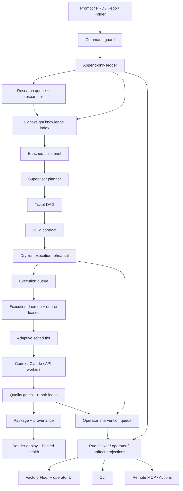

# feat: Complete Software Factory Build Loop

## Summary

Complete Software Factory AI by connecting the existing control plane to a full
research, execution, verification, repair, package, and deploy loop. The work
keeps the event ledger as the source of truth, adds a source-backed deep
research stage, materializes local/cloud workspaces, wires planned tickets into
workers, exposes operator controls, and extends hosted web-model connectors so
Claude.com and ChatGPT.com can use the factory as a remote build system.

## What already exists

The repository already has strong foundations:

- prompt/PRD intake through UI, CLI, HTTP API, ChatGPT Action, and remote MCP,
- operator token and command guard for mutating routes,
- append-only event store and replay projections,
- deterministic supervisor planning and ticket DAG creation,
- adaptive worker scheduler and capacity model,
- execution adapter contracts,
- worker lifecycle events,
- gate, packaging, provenance, Git, and Render deploy helpers,
- Factory Floor and operator UI surfaces,
- cloud runtime config and Render deployment shape.

The gap is that default run creation stops after `run.planned`. The worker,
gate, package, and deploy subsystems exist in pieces but are not yet connected
to the run lifecycle, operator controls, or hosted invocation flows.

## Goals

- Add a deep research/discovery stage before planning and optionally during
  worker execution.
- Convert planned runs into executable runs with explicit start, pause, resume,
  cancel, retry, and gate-rerun controls.
- Materialize workspaces from local folders or GitHub repositories depending on
  runtime visibility.
- Connect planned ticket DAGs to the worker scheduler and execution adapters.
- Project active queues, workers, research, gates, artifacts, packages, and
  deploy state into the UI/CLI/MCP surfaces.
- Preserve planning-only mode for safe blueprint review.
- Make hosted Claude.com and ChatGPT.com invocation capable of creating,
  researching, starting, inspecting, and collecting run outputs.
- Add a lightweight knowledge index so research, repo scans, gate evidence, and
  completed-run lessons can be reused without taking on the full graph/vector
  intelligence layer yet.
- Add a dry-run execution rehearsal and build contract before workers mutate
  files.
- Add an operator intervention queue so blocked runs surface actionable human
  decisions in one place.
- Keep single-instance local/cloud operation reliable, while defining the
  database/queue migration path for hosted scale.

## Scope Boundaries

### Not In Scope For This Plan

- Multi-tenant SaaS billing, quotas, or team administration.
- Guaranteed success for arbitrary prompts across arbitrary technology stacks.
- Unreviewed automatic mutation of the factory genome or skills.
- Deploy providers beyond the existing Render path.
- Branch-per-ticket isolation unless write-scope safety requires it.
- Full wetware graph/vector intelligence; this plan adds only the lightweight
  reusable index needed for the build loop.

### Deferred To Follow-Up Work

- Database-backed queue/storage implementation after the single-instance JSONL
  seam is proven.
- OAuth/provider-specific auth proxy implementation beyond the reference path
  needed for Claude.com and ChatGPT.com connector compatibility.
- Non-Render deploy adapters and production SaaS controls from `TODOS.md`.

## Requirements Trace

| Plan Area                                           | Requirements |
| --------------------------------------------------- | ------------ |
| Research stage                                      | R1-R6        |
| Blueprint/planning                                  | R7-R10       |
| Workspace/repo materialization                      | R11-R14      |
| Worker execution                                    | R15-R20      |
| Gates/repair/review                                 | R21-R25      |
| Package/provenance/deploy                           | R26-R30      |
| Cloud/web-model invocation                          | R31-R34      |
| Observability/operations                            | R35-R38      |
| CEO accepted expansion: lightweight knowledge index | X1           |
| CEO accepted expansion: dry-run execution rehearsal | X2           |
| CEO accepted expansion: build contract              | X3           |
| CEO accepted expansion: operator intervention queue | X4           |

## Origin Acceptance Trace

| Origin Example | Plan Coverage                                                    |
| -------------- | ---------------------------------------------------------------- |
| AE1            | U1, U2, U3, U9 cover source-backed research and visible briefs.  |
| AE2            | U3, U5 cover blueprint-only mode and explicit start controls.    |
| AE3            | U4 covers cloud repo checkout and local-path unavailability.     |
| AE4            | U5, U6, U9 cover capacity, write conflicts, and explanations.    |
| AE5            | U7 covers gate failure evidence, repair loops, and escalation.   |
| AE6            | U8 covers hosted health failure without false hosted-ready URLs. |
| AE7            | U10 covers hosted connector auth, provenance, and run status.    |

## Architecture Direction


```mermaid
flowchart TB
  Intake["Prompt / PRD / Repo / Folder"] --> Guard["Command guard"]
  Guard --> Ledger["Append-only ledger"]
  Ledger --> Research["Research queue + researcher"]
  Ledger --> Knowledge["Lightweight knowledge index"]
  Research --> Knowledge
  Knowledge --> Brief["Enriched build brief"]
  Brief --> Planner["Supervisor planner"]
  Planner --> Tickets["Ticket DAG"]
  Tickets --> Contract["Build contract"]
  Contract --> Preflight["Dry-run execution rehearsal"]
  Preflight --> ExecQueue["Execution queue"]
  ExecQueue --> Daemon["Execution daemon + queue leases"]
  Daemon --> Scheduler["Adaptive scheduler"]
  Scheduler --> Workers["Codex / Claude / API workers"]
  Workers --> Gates["Quality gates + repair loops"]
  Preflight --> Interventions["Operator intervention queue"]
  Gates --> Interventions
  Gates --> Package["Package + provenance"]
  Package --> Deploy["Render deploy + hosted health"]
  Ledger --> Projections["Run / ticket / operator / artifact projections"]
  Interventions --> Projections
  Projections --> UI["Factory Floor + operator UI"]
  Projections --> CLI["CLI"]
  Projections --> MCP["Remote MCP / Actions"]
```

## Sources & Research

- Existing local architecture and user-facing invocation paths:
  `README.md`, `ARCHITECTURE.md`, `docs/runbooks/cloud-deployment.md`,
  `integrations/claude/remote-mcp.md`, `integrations/chatgpt/remote-mcp.md`,
  and `integrations/chatgpt/actions.openai.yaml`.
- Existing runtime and ledger patterns:
  `packages/web/src/server/app.ts`, `packages/web/src/server/instance.ts`,
  `packages/web/src/server/standalone.ts`, `packages/web/src/server/runtime.ts`,
  `packages/core/src/events/event-store.ts`, and
  `packages/core/test/events/event-store.test.ts`.
- Existing worker, gate, package, and deploy patterns:
  `packages/worker/src/runner/scheduler.ts`,
  `packages/worker/test/runner/adaptive-concurrency.test.ts`,
  `packages/worker/test/_helpers/gated-adapter.ts`,
  `packages/worker/test/gates/gate-runner.test.ts`,
  `packages/worker/test/package/repo-packager.test.ts`, and
  `packages/worker/test/deploy/render-deployer.test.ts`.
- External grounding for long-running execution: Next.js route handlers expose
  deployment-controlled `maxDuration`
  (`https://nextjs.org/docs/app/api-reference/file-conventions/route-segment-config/maxDuration`),
  so long build execution should not be owned by request lifetimes; Render
  documents background workers for long-running asynchronous work
  (`https://render.com/docs/background-workers`); BullMQ's lock/stalled-job model
  validates the plan's claim/lease/heartbeat/reconciler shape
  (`https://docs.bullmq.io/guide/workers/stalled-jobs`) without forcing BullMQ as
  a dependency.

## Key Technical Decisions

- KTD1. Ledger-first orchestration: research, workspace materialization, queue
  claims, worker lifecycle, gates, repair, package, deploy, and interventions
  are event-backed so UI, CLI, MCP, and replay use the same truth.
- KTD2. Research before mutable execution: the run may remain blueprint-only, but
  execution-capable modes must produce source-backed research, an enriched brief,
  and a build contract before workers mutate files.
- KTD3. Daemon-owned execution: HTTP, CLI, ChatGPT Action, and MCP calls enqueue
  or mutate execution state; an execution daemon owns long-running worker loops
  and is bootstrapped once from each server entry point.
- KTD4. Single-instance durable queue first: V1.5 uses ledger-backed claim,
  lease, heartbeat, release, and abandoned-lease events, with explicit database
  and queue replacement seams for hosted scale.
- KTD5. Cloud source boundaries are explicit: cloud runs do not pretend to read
  laptop paths; they require GitHub repository materialization, uploaded PRD
  content, or future sync/upload input.
- KTD6. Autonomy is policy-gated: human and autonomous modes adjust review flow,
  but policy-blocked actions remain blocked and intervention events are visible.
- KTD7. Operator UI is blueprint-first: active build state stays primary, while
  run history remains clearable/collapsible so the factory fits the control-room
  design target.

## Accepted CEO Selective Expansions

These additions were accepted during `/plan-ceo-review` in Selective Expansion
mode. They are now part of the implementation baseline.

- X1. Lightweight knowledge index: capture reusable research, repo-scan,
  gate-failure, source, and completed-run evidence so future runs start with
  context without pulling in the full graph/vector intelligence layer.
- X2. Dry-run execution rehearsal: before workers mutate files, verify the DAG,
  workspace, write scopes, credentials, adapter readiness, gate setup, and deploy
  prerequisites.
- X3. Build contract: after research and planning, generate a concise artifact
  that states scope, workspace, write boundaries, risks, gates, deploy target,
  completion criteria, and operator approvals needed before execution.
- X4. Operator intervention queue: collect human-needed decisions across runs,
  including approvals, missing credentials, branch choices, source ambiguity,
  retry decisions, and policy blocks.

## Engineering Review Hardening Decisions

These constraints were added during `/plan-eng-review`; they are now part of the
plan's execution contract.

- E1. Worker execution must be owned by an execution daemon/background service,
  not by the HTTP request that starts a run. API/MCP/CLI commands enqueue work
  and return projected state.
- E2. The execution queue must use claim, lease, heartbeat, and reconciler
  semantics so a server restart can recover queued or abandoned work without
  double-running tickets.
- E3. Research, knowledge-index, build-contract, preflight, and intervention
  states must have explicit event families and projections before UI/CLI/MCP
  surfaces render them.
- E4. The lightweight knowledge index must include source freshness, confidence,
  redaction/privacy policy, and retention controls so stale or sensitive context
  is not silently reused.
- E5. Cloud repo materialization must separate source checkout credentials,
  deploy credentials, and research provider credentials, and must never emit
  secret values into evidence.
- E6. Crash/restart, duplicate command, stale lease, and partial worker failure
  tests are required before enabling automatic start-by-default.

## Implementation Units

### U1. Research Event Model And Projections

Goal: Make research, assumptions, gaps, and reusable knowledge replayable from
the ledger before any execution surfaces render them.

Requirements: R1-R6, R35-R38.

Dependencies: existing event ledger and projections.

Files:

- `packages/core/src/events/event-types.ts`
- `packages/core/src/projections/run-projection.ts`
- `packages/core/src/projections/artifact-projection.ts`
- `packages/core/src/projections/operator-projection.ts`
- `packages/core/src/research/*`
- `packages/core/src/knowledge/*`
- `packages/core/test/research/*`
- `packages/core/test/knowledge/*`
- `packages/core/test/projections/*`

Approach:

- Add ledger event families for research lifecycle: requested, source found,
  source read, finding recorded, assumption recorded, gap recorded, brief
  completed, and research failed.
- Add a projected research view per run with status, source count, findings,
  assumptions, unresolved gaps, and evidence links.
- Keep events source-agnostic so later providers can include web search,
  documentation fetch, repo scan, uploaded PRD, and model-generated synthesis.
- Define the lightweight knowledge-index contract and projection shape for
  reusable sources, findings, repo facts, gate lessons, and completed-run
  references.
- Include freshness, confidence, retention, and redaction metadata on reusable
  knowledge entries.
- Ensure projection replay is deterministic and does not invent research state.

Patterns to follow:

- Event append/replay and idempotency patterns in
  `packages/core/src/events/event-store.ts` and
  `packages/core/test/events/event-store.test.ts`.
- Projection style in `packages/core/src/projections/run-projection.ts`,
  `packages/core/src/projections/operator-projection.ts`, and their existing
  tests.

Test Scenarios:

- Research events replay into the same projected brief on repeated projection.
- Failed research still leaves useful partial findings and gaps.
- A run with no research events remains compatible with planning-only V1 runs.
- Evidence links and source summaries survive projection.
- Reusable knowledge entries can be replayed from ledger evidence and queried by
  later planning/research stages.
- Redacted or sensitive findings are not returned through normal knowledge
  queries.

Verification:

- `corepack pnpm@10.27.0 --filter @software-factory/core test -- --runInBand`
- `corepack pnpm@10.27.0 typecheck`

### U2. Research Engine And Source Policy

Goal: Implement bounded, source-backed research that can read approved local,
repo, PRD, and external documentation sources without hallucinating missing
credentials or evidence.

Requirements: R1-R6, R31-R34.

Dependencies: U1.

Files:

- `packages/worker/src/research/*`
- `packages/web/src/server/research/*`
- `packages/web/src/server/runtime.ts`
- `packages/cli/src/commands/*`
- `docs/runbooks/research.md`
- `packages/worker/test/research/*`
- `packages/web/test/server/research-routes.test.ts`

Approach:

- Implement a bounded research runner that accepts run context and emits
  research events through the existing store.
- Support source adapters for repo/local scan, PRD text, PRD reference metadata,
  configured documentation URLs, and external web/search provider hooks.
- Normalize reusable findings into the lightweight knowledge index with source,
  confidence, freshness, and originating run references.
- Apply source policy before fetching or indexing external content, including
  allowed source classes, credential requirements, and redaction rules.
- Add budgets for effort, source count, elapsed time, and source class.
- Classify output as verified fact, inference, assumption, or unresolved gap.
- Fail closed when no provider credentials are configured, recording a setup
  requirement instead of silently hallucinating research.

Patterns to follow:

- Adapter setup/error reporting style in `packages/core/src/adapters/*`.
- Runtime configuration and cloud/local boundary handling in
  `packages/web/src/server/runtime.ts`.
- Worker test helper style in `packages/worker/test/_helpers/*`.

Test Scenarios:

- Research respects source/time/count budgets.
- Missing provider credentials emit setup-required/gap events, not fabricated
  findings.
- Repo/local source adapters do not read outside the allowed workspace.
- The enriched brief is stable for deterministic fake providers.
- Prior knowledge can seed a new research brief without hiding source age or
  confidence.
- Source policy prevents disallowed network/source classes and records a gap or
  setup requirement instead.

Verification:

- `corepack pnpm@10.27.0 --filter @software-factory/worker test -- --runInBand`
- `corepack pnpm@10.27.0 --filter @software-factory/web test -- --runInBand`
- `corepack pnpm@10.27.0 typecheck`

### U3. Research-First Run Flow

Goal: Add run modes that let callers choose blueprint-only, research-and-plan,
or research-plan-and-start while preserving current plan-only behavior.

Requirements: R1-R10.

Dependencies: U1, U2.

Files:

- `packages/web/src/server/routes/runs.ts`
- `packages/web/src/server/planner.ts`
- `packages/core/src/supervisor/run-request.ts`
- `packages/core/src/supervisor/planner.ts`
- `packages/cli/src/commands/run.ts`
- `packages/cli/src/api-client.ts`
- `packages/web/test/server/run-routes.test.ts`
- `packages/core/test/supervisor/planner.test.ts`
- `packages/cli/test/cli-run.test.ts`

Approach:

- Add run mode options for `plan-only`, `research-and-plan`, and
  `research-plan-and-start`.
- Insert research before planning when enabled.
- Feed the enriched brief into supervisor planning and record which findings
  influenced the DAG.
- Generate a build contract after research/planning that summarizes scope,
  workspace, write boundaries, risks, gate expectations, deploy target, and
  completion criteria.
- Preserve existing planning-only behavior as the default until execution
  controls are ready.
- Add idempotency so retrying run creation does not duplicate research or plan
  events.

Patterns to follow:

- Existing run creation and planning split in
  `packages/web/src/server/routes/runs.ts` and
  `packages/web/src/server/planner.ts`.
- CLI/API client request-shape tests in `packages/cli/test/cli-run.test.ts` and
  `packages/web/test/server/run-routes.test.ts`.

Test Scenarios:

- Plan-only runs behave like current V1.
- Research-enabled runs append research events before supervisor/ticket events.
- Repeated create calls with the same idempotency key do not duplicate research,
  supervisor, or ticket events.
- Planner output includes research-backed rationale when findings exist.
- Build-contract output is idempotent and updates only when the underlying
  research or plan changes.

Verification:

- `corepack pnpm@10.27.0 --filter @software-factory/web test -- --runInBand`
- `corepack pnpm@10.27.0 --filter @software-factory/core test -- --runInBand`
- `corepack pnpm@10.27.0 typecheck`

### U4. Workspace And Repository Materialization

Goal: Materialize a trustworthy workspace for local and cloud runs while making
unavailable or unsafe source inputs explicit.

Requirements: R11-R14, R31-R34.

Dependencies: U1.

Files:

- `packages/worker/src/workspace/*`
- `packages/worker/src/git/*`
- `packages/web/src/server/routes/setup.ts`
- `packages/web/src/server/routes/runs.ts`
- `packages/core/src/events/event-types.ts`
- `packages/worker/test/workspace/*`
- `packages/web/test/server/setup-routes.test.ts`
- `docs/runbooks/workspace-materialization.md`

Approach:

- Add workspace materialization events for local folder bound, repo checkout
  started/completed/failed, branch/commit resolved, and workspace unavailable.
- In local mode, allow local folders only when they resolve inside an approved
  working boundary or explicitly chosen operator folder.
- In cloud mode, treat laptop paths as unavailable and require GitHub repo,
  uploaded PRD text, or future upload/sync input.
- Record repo, branch, commit, checkout path, and dirty-state policy as evidence.
- Keep materialization separate from worker execution so setup failures can be
  inspected and retried.

Patterns to follow:

- Cloud/local runtime detection in `packages/web/src/server/runtime.ts`.
- Git destination and setup-required outcome style in
  `packages/worker/src/git/git-destination.ts`.
- Security-oriented path tests in `packages/worker/test/sandbox/*`.

Test Scenarios:

- Cloud run with local-only path records unavailable path and does not pretend it
  can read it.
- GitHub repo materialization records branch and commit.
- Path traversal or outside-boundary local paths are rejected with security
  evidence.
- Materialization can be retried after setup changes.

Verification:

- `corepack pnpm@10.27.0 --filter @software-factory/worker test -- --runInBand`
- `corepack pnpm@10.27.0 --filter @software-factory/web test -- --runInBand`

### U5. Execution Queue And Run Controls

Goal: Add the execution command surface, ledger-backed queue, and daemon owner
that turn planned runs into recoverable executable work.

Requirements: R15-R20, R35-R38.

Dependencies: U3, U4.

Files:

- `packages/core/src/events/event-types.ts`
- `packages/core/src/projections/run-projection.ts`
- `packages/web/src/server/routes/runs.ts`
- `packages/web/src/server/routes/execution.ts`
- `packages/web/src/server/execution/*`
- `packages/web/src/server/execution/daemon.ts`
- `packages/web/src/server/execution/queue.ts`
- `packages/web/src/server/instance.ts`
- `packages/web/src/server/standalone.ts`
- `packages/cli/src/commands/*`
- `packages/web/src/server/mcp.ts`
- `integrations/chatgpt/actions.openai.yaml`
- `packages/web/test/server/execution-routes.test.ts`
- `packages/web/test/server/execution-daemon.test.ts`
- `packages/web/test/server/execution-queue.test.ts`
- `packages/web/test/server/command-guard.test.ts`
- `packages/cli/test/execution-commands.test.ts`

Approach:

- Add explicit commands for start, pause, resume, cancel, retry ticket, and rerun
  gates.
- Add execution state events such as run started, paused, resumed, execution
  blocked, execution completed, and execution failed.
- Add dry-run/preflight execution events and require preflight success before
  normal start enqueues worker execution.
- Add intervention-needed events for approvals, missing credentials, ambiguous
  source choices, unsafe paths, adapter setup, deploy setup, and retry choices.
- Implement a single-instance durable queue backed by the ledger for local/cloud
  V1.5 operation, with explicit claim, lease, heartbeat, release, and abandoned
  lease recovery events.
- Run worker execution from an execution daemon/background service. HTTP, CLI,
  GPT Action, and MCP commands enqueue or mutate execution state but do not hold
  request lifetimes open while workers run.
- Bootstrap the daemon from both the Next-mounted singleton and standalone API
  server exactly once per process, with testable lifecycle hooks and graceful
  shutdown behavior.
- Add a reconciler that resumes safe queued work after restart and escalates
  ambiguous in-flight work to the operator intervention queue.
- Ensure command guard checks token, origin, CSRF, stale versions, and policy
  before queue mutations.
- Extend CLI, MCP, and GPT Action surfaces with the same control verbs.

Execution note: Start with failing integration tests for duplicate start,
stale-version rejection, daemon singleton startup, and abandoned lease recovery.

Patterns to follow:

- Framework-agnostic app and route registration in
  `packages/web/src/server/app.ts`.
- Process-wide singleton handling in `packages/web/src/server/instance.ts` and
  standalone startup in `packages/web/src/server/standalone.ts`.
- Command guard tests in `packages/web/test/server/command-guard.test.ts`.
- Queue recovery should borrow the lock/heartbeat/stalled-work shape from queue
  systems without introducing BullMQ as a V1 dependency.

Test Scenarios:

- Planned run can be started once and does not double-enqueue on retry.
- Pause stops new worker starts while allowing safe in-flight handling.
- Cancel propagates to queued and active work.
- MCP and GPT Action callers can start/inspect/cancel when authorized.
- Stale start/retry commands are rejected.
- Failed preflight blocks start with actionable setup/intervention entries rather
  than partial worker execution.
- Next-mounted and standalone servers start one daemon owner per process, not
  one daemon per request or module import.
- Restart after an acquired-but-unfinished queue lease either safely resumes the
  work or marks the lease abandoned for operator resolution.

Verification:

- `corepack pnpm@10.27.0 --filter @software-factory/web test -- --runInBand`
- `corepack pnpm@10.27.0 --filter @software-factory/cli test -- --runInBand`
- `corepack pnpm@10.27.0 typecheck`

### U6. Ticket-To-Worker Execution Integration

Goal: Connect claimed queue work to the existing scheduler and adapter contracts
without letting API handlers or duplicate claims run tickets directly.

Requirements: R15-R20, R24-R25.

Dependencies: U4, U5.

Files:

- `packages/web/src/server/execution/*`
- `packages/worker/src/runner/scheduler.ts`
- `packages/worker/src/runner/worker-runner.ts`
- `packages/core/src/genome/context-compiler.ts`
- `packages/core/src/adapters/*`
- `packages/worker/test/runner/*`
- `packages/web/test/server/execution-worker.test.ts`

Approach:

- Convert projected ticket DAGs into scheduler nodes with workspace directories,
  compile inputs, risk tiers, expected outputs, and write scopes.
- Select adapters from run settings and setup detection.
- Invoke the existing scheduler from the execution daemon after queue lease
  acquisition, not directly from API request handlers.
- Emit ticket state transitions in addition to worker lifecycle events.
- Respect review mode and policy limits when computing effective capacity.
- Keep adapter failures retryable and explainable in projections.

Patterns to follow:

- Adaptive scheduler and capacity code in
  `packages/worker/src/runner/scheduler.ts` and
  `packages/worker/src/runner/capacity.ts`.
- Concurrency tests and gated adapter helpers in
  `packages/worker/test/runner/adaptive-concurrency.test.ts` and
  `packages/worker/test/_helpers/gated-adapter.ts`.
- Adapter failure normalization in `packages/core/src/adapters/adapter-errors.ts`.

Test Scenarios:

- A planned DAG runs in dependency order.
- Write-scope conflicts serialize tickets even when worker slots are free.
- Adapter setup/auth failure prevents execution and emits setup events.
- Human/autonomous review modes affect execution only through policy.
- Worker completion updates ticket and run projections.
- Duplicate queue claims cannot run the same ticket twice.

Verification:

- `corepack pnpm@10.27.0 --filter @software-factory/worker test -- --runInBand`
- `corepack pnpm@10.27.0 --filter @software-factory/web test -- --runInBand`
- `corepack pnpm@10.27.0 typecheck`

### U7. Gates, Repair Loops, And Review Studio

Goal: Wire quality gates, bounded repair loops, and review approvals into the
run lifecycle so failures become actionable stages instead of opaque endings.

Requirements: R21-R25, R35-R38.

Dependencies: U6.

Files:

- `packages/worker/src/gates/*`
- `packages/worker/src/runner/*`
- `packages/core/src/security/review-policy.ts`
- `packages/web/src/server/routes/review.ts`
- `packages/web/src/components/factory-floor/*`
- `packages/web/src/styles/factory-floor.css`
- `packages/worker/test/gates/*`
- `packages/web/test/components/factory-floor.test.tsx`
- `tests/e2e/factory-floor.spec.ts`

Approach:

- Wire lint, typecheck, tests, secret scan, dependency policy, and preview health
  into post-ticket and post-run gate stages.
- Record gate logs/evidence and attach failures to the ticket or run stage.
- Create bounded repair attempts with clear retry counters and escalation.
- Expand review UI so required human approvals can unblock paused stages.
- Ensure policy-blocked actions remain blocked in both human and autonomous
  modes.

Patterns to follow:

- Gate contracts and evidence style in `packages/worker/src/gates/*` and
  `packages/worker/test/gates/*`.
- Review policy behavior in `packages/core/src/security/review-policy.ts`.
- Review Studio UI patterns in
  `packages/web/src/components/factory-floor/ReviewStudio.tsx`.

Test Scenarios:

- Passing gates advance the run.
- Failing gates create repair work or pause with evidence.
- Retry budget exhaustion escalates instead of looping.
- Review approval resumes the correct blocked stage.
- Policy-blocked action cannot be approved accidentally through autonomous mode.
- Partial gate or repair failure after process restart remains replayable and
  does not lose retry budget.

Verification:

- `corepack pnpm@10.27.0 --filter @software-factory/worker test -- --runInBand`
- `corepack pnpm@10.27.0 --filter @software-factory/web test -- --runInBand`
- `corepack pnpm@10.27.0 exec playwright test tests/e2e/factory-floor.spec.ts`

### U8. Package, Provenance, Handoff, And Deploy Completion

Goal: Finish successful runs with package, provenance, handoff, and Render deploy
state that only projects hosted success after provider and health checks pass.

Requirements: R26-R30.

Dependencies: U7.

Files:

- `packages/worker/src/package/*`
- `packages/worker/src/provenance/*`
- `packages/worker/src/deploy/render/*`
- `packages/cli/src/run-outputs.ts`
- `packages/web/src/components/factory-floor/*`
- `docs/runbooks/render-deployment.md`
- `packages/worker/test/package/*`
- `packages/worker/test/deploy/*`
- `packages/cli/test/*`

Approach:

- Trigger packaging only after all required tickets and local gates pass.
- Emit package/provenance/artifact confidence events tied to ticket outputs,
  research sources, workers, gates, and commits.
- Wire the existing Render deploy orchestrator into the run lifecycle after
  package readiness and review satisfaction.
- Keep hosted URL projection strict: only after provider success and hosted
  health pass.
- Surface package paths, provenance references, deploy state, and handoff summary
  through CLI, UI, and MCP.

Patterns to follow:

- Package/provenance tests in `packages/worker/test/package/*` and
  `packages/core/test/provenance/*`.
- Render setup, failure, and hosted-ready ordering in
  `packages/worker/test/deploy/render-deployer.test.ts`.
- Git destination setup-required behavior in
  `packages/worker/src/git/git-destination.ts`.

Test Scenarios:

- Completed local build produces package and provenance events.
- Deploy setup missing pauses deploy but preserves local success artifacts.
- Hosted URL is absent until hosted health succeeds.
- Migration/provider/health failures produce retryable deploy states.
- CLI artifacts output includes package, provenance, gates, and hosted URL only
  when present.

Verification:

- `corepack pnpm@10.27.0 --filter @software-factory/worker test -- --runInBand`
- `corepack pnpm@10.27.0 --filter @software-factory/cli test -- --runInBand`
- `corepack pnpm@10.27.0 typecheck`

### U9. Factory Floor Blueprint And Operator Experience

Goal: Make the operator view show the live factory blueprint, intervention queue,
and compact run controls without letting run history consume the screen.

Requirements: R6, R9, R15-R23, R35-R38.

Dependencies: U1, U3, U5, U6, U7, U8.

Files:

- `packages/web/src/components/factory-floor/FactoryFloor.tsx`
- `packages/web/src/components/factory-floor/RunControl.tsx`
- `packages/web/src/components/factory-floor/RunBoard.tsx`
- `packages/web/src/components/factory-floor/RunDetail.tsx`
- `packages/web/src/components/factory-floor/RunView.tsx`
- `packages/web/src/lib/run-view.ts`
- `packages/web/src/styles/factory-floor.css`
- `packages/web/test/components/factory-floor.test.tsx`
- `tests/e2e/factory-floor.spec.ts`

Approach:

- Add blueprint lanes for research, planning, queued tickets, active workers,
  gates, repair, package, and deploy.
- Show the build contract and dry-run/preflight outcome as the handoff between
  blueprint and execution.
- Add an operator intervention queue that can be filtered by run, severity,
  blocking stage, and required action.
- Add compact run controls for start, pause, resume, cancel, retry, clear runs,
  and focus run.
- Keep runs at the bottom/secondary surface so active blueprint work stays
  visible on one screen.
- Show capacity, throttle reason, active worker count, queued count, and
  currently blocking policy/setup item.
- Avoid decorative dashboard bloat; keep the operator view dense and scannable.

Execution note: Verify with component tests plus Playwright desktop/mobile
screenshots; do not mark this unit complete from unit tests alone.

Patterns to follow:

- Existing Factory Floor component split in
  `packages/web/src/components/factory-floor/*`.
- Projected view mapping in `packages/web/src/lib/run-view.ts`.
- Current operator tests in
  `packages/web/test/components/factory-floor.test.tsx` and
  `tests/e2e/factory-floor.spec.ts`.

Test Scenarios:

- A running factory fits core controls and blueprint on common desktop and
  laptop viewports.
- Research findings and source evidence are visible without opening raw JSON.
- Queue and capacity reasons update as events arrive.
- Clear/collapse runs behavior preserves active run focus.
- Intervention items remain visible across runs and link back to the relevant
  ledger evidence.
- Mobile/tablet views do not overlap or hide critical controls.

Verification:

- `corepack pnpm@10.27.0 --filter @software-factory/web test -- --runInBand`
- `corepack pnpm@10.27.0 exec playwright test tests/e2e/factory-floor.spec.ts`
- Browser screenshot review for desktop and mobile breakpoints.

### U10. Cloud/Web-Model Connector Completion

Goal: Let Claude.com, ChatGPT.com, and other hosted model callers operate the
same lifecycle controls and artifact reads over HTTPS.

Requirements: R31-R34, R35-R38.

Dependencies: U3, U5, U8.

Files:

- `packages/web/src/server/mcp.ts`
- `packages/web/src/app/mcp/route.ts`
- `integrations/chatgpt/actions.openai.yaml`
- `integrations/chatgpt/remote-mcp.md`
- `integrations/claude/remote-mcp.md`
- `docs/runbooks/cloud-deployment.md`
- `packages/web/test/server/mcp.test.ts`
- `packages/web/test/server/chatgpt-action-schema.test.ts`

Approach:

- Extend remote MCP tools with research/start/pause/resume/retry/artifact
  operations.
- Extend remote MCP tools with build-contract, preflight, and intervention-queue
  read/resolve operations.
- Extend ChatGPT Action schema with the same lifecycle controls.
- Add an auth-proxy/OAuth-compatible deployment note and, if practical, a small
  reference proxy package or runbook.
- Ensure remote tools return concise run summaries plus links/ids for fetching
  detailed event logs and artifacts.
- Add cloud setup diagnostics for missing GitHub credentials, source provider
  credentials, deploy credentials, and persistent storage.
- Keep source checkout credentials, deploy credentials, and research provider
  credentials separate in setup diagnostics and never emit secret values into
  evidence.
- Keep remote lifecycle tools idempotent: repeated start/retry/resolve calls
  return existing queue/intervention state instead of duplicating work.

Execution note: Treat MCP tool shapes and the ChatGPT Action schema as contracts;
write/adjust schema tests before widening remote lifecycle behavior.

Patterns to follow:

- Current MCP bridge and tests in `packages/web/src/server/mcp.ts`,
  `packages/web/src/app/mcp/route.ts`, and
  `packages/web/test/server/mcp.test.ts`.
- Existing Action schema and connector documentation under `integrations/`.
- Command guard and token verification behavior in
  `packages/web/test/server/command-guard.test.ts`.

Test Scenarios:

- MCP lists all lifecycle tools.
- MCP create-run with research enabled returns projected research/planning state.
- MCP start/pause/resume/cancel obeys command guard and stale-version checks.
- ChatGPT Action schema validates and includes lifecycle operations.
- Missing cloud credentials surface setup-required states.

Verification:

- `corepack pnpm@10.27.0 --filter @software-factory/web test -- --runInBand`
- OpenAPI schema validation for `integrations/chatgpt/actions.openai.yaml`
- Manual hosted smoke test against `/api/setup` and `/mcp`.

### U11. Durable Hosted Scale Path

Goal: Preserve a clear migration path from single-instance JSONL execution to
database-backed event storage and a durable hosted queue.

Requirements: R34-R38.

Dependencies: U5, U6, U10.

Files:

- `packages/core/src/events/*`
- `packages/web/src/server/runtime.ts`
- `packages/web/src/server/execution/*`
- `packages/web/src/server/execution/reconciler.ts`
- `packages/core/test/events/event-store.test.ts`
- `packages/web/test/server/runtime-config.test.ts`
- `docs/runbooks/cloud-deployment.md`
- `ARCHITECTURE.md`
- `render.yaml`

Approach:

- Keep the first implementation single-instance and JSONL-compatible.
- Define and document the migration seam for database-backed event storage and a
  durable execution queue.
- Add operational diagnostics that warn when the runtime is cloud/single-instance
  and not safe for horizontal scaling.
- Make idempotency and stale-version checks database-ready.
- Document which queue and execution-daemon invariants must be preserved when
  replacing JSONL with a database-backed queue.
- Keep multi-tenant SaaS concerns out of this plan while preserving an upgrade
  path.

Patterns to follow:

- Event store interface boundaries in `packages/core/src/events/event-store.ts`.
- Cloud runtime configuration in `packages/web/src/server/runtime.ts`.
- Hosted deployment shape in `render.yaml` and `ARCHITECTURE.md`.

Test Scenarios:

- Single-instance cloud restart replays active/planned/completed state.
- Runtime setup reports storage mode and queue mode.
- Docs clearly state when horizontal scaling is unsafe.
- Event store interface remains compatible with alternate persistence.
- Queue leases, heartbeats, and abandoned-work recovery have database-ready
  semantics.

Verification:

- `corepack pnpm@10.27.0 test`
- `corepack pnpm@10.27.0 typecheck`
- Cloud runbook review.

## Delivery Order

1. U1 research events/projections.
2. U2 bounded research engine.
3. U3 research-first run flow.
4. U4 workspace/repo materialization.
5. U5 execution queue and controls.
6. U6 ticket-to-worker execution integration.
7. U7 gates, repair loops, and review studio.
8. U8 package/provenance/deploy completion.
9. U9 Factory Floor blueprint/operator polish.
10. U10 cloud/web-model connector completion.
11. U11 hosted scale path documentation and seams.

This order intentionally ships research and blueprint value before full worker
execution, then adds the dangerous side-effect path behind controls.

## Implementation-Time Unknowns

- Initial external research provider selection remains configuration-dependent.
  U2 must support missing credentials cleanly and can start with repo/local/PRD
  sources plus provider hooks.
- Queue lease durations, reconciler interval, and retry limits should be chosen
  in U5 while writing restart and stale-lease tests; the plan fixes the
  invariants, not the exact numbers.
- The auth-proxy/OAuth-compatible hosted connector path in U10 may remain a
  reference implementation or runbook if Claude.com/ChatGPT.com static-header
  support is sufficient for the first hosted smoke.
- Hosted smoke verification requires an actual configured cloud URL and operator
  token; local implementation can still complete without that environment.

## Engineering Review Test Diagram


```mermaid
flowchart TB
  Unit["Unit tests"] --> Events["Event schemas + projections"]
  Unit --> Research["Research budgets + source policy"]
  Unit --> Queue["Queue leases + reconciler"]
  Unit --> Scheduler["Scheduler + write scopes"]
  Integration["Integration tests"] --> RunFlow["Research -> plan -> contract -> preflight"]
  Integration --> Execution["Start/pause/resume/cancel/retry"]
  Integration --> Restart["Crash/restart recovery"]
  Integration --> Remote["MCP + GPT Action lifecycle tools"]
  E2E["Focused e2e"] --> Operator["Factory Floor blueprint + intervention queue"]
  E2E --> Gates["Gate failure + repair loop"]
  Hosted["Hosted smoke"] --> Cloud["/api/setup + /mcp"]
  Hosted --> Deploy["Render deploy + hosted health"]
```

## Acceptance Gate For The Whole Plan

- A local run can go from prompt/PRD through research, planning, worker
  execution, gates, package, and local handoff.
- A configured deploy run can proceed to Render and project a hosted URL only
  after hosted health passes.
- A cloud-hosted factory can be invoked from Claude.com or ChatGPT.com through
  HTTPS and can create, research, start, inspect, and cancel a run.
- The operator can see why work is queued, running, blocked, failed, retried, or
  complete.
- A server restart can replay run state from the ledger.
- All new behavior is covered by unit, integration, and focused e2e tests.

## System-Wide Impact

- API/UI/MCP parity: every lifecycle command added for local UI or CLI must have
  the same authorization, idempotency, and stale-version behavior when exposed
  through `/mcp` or the ChatGPT Action.
- Ledger compatibility: new event families must remain replayable alongside
  existing planning-only V1 runs and must not require client-side invented state.
- Runtime ownership: Next-mounted and standalone servers both need one execution
  daemon owner per process, with no worker execution tied to request lifetimes.
- Security posture: local path access, GitHub checkout credentials, deploy
  credentials, research provider credentials, and operator tokens remain separate
  setup surfaces and must not leak secret values into evidence.
- Operator trust: the Factory Floor must explain queued, blocked, failed,
  retried, and complete states from projections, not from optimistic UI labels.

## Risks And Mitigations

| Risk                                         | Mitigation                                                                                   |
| -------------------------------------------- | -------------------------------------------------------------------------------------------- |
| Research becomes unbounded browsing          | Enforce budgets, source policy, timeout, and explicit unresolved gaps.                       |
| Cloud workers assume local filesystem access | Treat cloud local paths as unavailable; require repo checkout/upload.                        |
| Worker execution causes unsafe side effects  | Start behind command guard, operator controls, workspace boundaries, and write-scope checks. |
| Retry loops spin forever                     | Add bounded retry budgets and escalation events.                                             |
| UI becomes a noisy dashboard                 | Keep blueprint-first density, hide/collapse run history, and test viewport fit.              |
| JSONL store limits hosted scale              | Keep single-instance support now; define database/queue seam before horizontal scaling.      |
| MCP auth differs by platform                 | Support bearer/header tokens and document auth-proxy/OAuth path.                             |

## Verification Matrix

Before calling the full plan complete, run:

```bash
corepack pnpm@10.27.0 typecheck
corepack pnpm@10.27.0 test
corepack pnpm@10.27.0 --filter @software-factory/core test -- --runInBand
corepack pnpm@10.27.0 --filter @software-factory/web test -- --runInBand
corepack pnpm@10.27.0 --filter @software-factory/worker test -- --runInBand
corepack pnpm@10.27.0 --filter @software-factory/cli test -- --runInBand
corepack pnpm@10.27.0 exec playwright test
```

Add hosted smoke tests once a cloud URL is configured:

```bash
curl "$SF_BASE_URL/api/setup"
curl "$SF_BASE_URL/mcp" \
  -H "content-type: application/json" \
  -H "authorization: Bearer $SF_OPERATOR_TOKEN" \
  -d '{"jsonrpc":"2.0","id":1,"method":"tools/list"}'
```

## Failure Mode Coverage

| Codepath                    | Realistic failure                              | Planned handling                                                              | Test / proof path                                 |
| --------------------------- | ---------------------------------------------- | ----------------------------------------------------------------------------- | ------------------------------------------------- |
| Research runner             | Source provider times out or credentials miss  | Emit setup-required/gap events and continue with explicit unresolved gaps     | U2 budget/provider tests                          |
| Knowledge index             | Stale or sensitive evidence is reused          | Store freshness, confidence, retention, and redaction metadata                | U1 knowledge replay/redaction tests               |
| Run creation                | Caller retries create/start                    | Idempotency keys and stale-version checks prevent duplicate run/queue state   | U3 and U5 idempotency tests                       |
| Workspace materialization   | Cloud caller supplies laptop-only path         | Record unavailable workspace and require GitHub repo/upload input             | U4 cloud/local path tests                         |
| Execution queue/daemon      | Process restarts while a lease is active       | Claim/lease/heartbeat/reconciler events recover or escalate abandoned work    | U5 crash/restart and stale-lease tests            |
| Ticket scheduler            | Worker slots are free but write scopes collide | Serialize conflicting tickets despite available capacity                      | U6 scheduler/write-scope tests                    |
| Gates and repair loops      | Repair loop exhausts retries                   | Escalate with evidence and preserve retry budget through projection replay    | U7 gate failure/retry-budget tests                |
| Package/deploy              | Render setup or hosted health fails            | Preserve local package, pause deploy, and hide hosted URL until health passes | U8 deploy setup/health tests                      |
| Remote MCP / ChatGPT Action | Hosted caller lacks credentials or repeats op  | Auth guard plus idempotent lifecycle tools return existing setup/intervention | U10 MCP/action auth and repeat-call tests         |
| Factory Floor operator UI   | Long run history hides active work             | Blueprint-first layout, bottom/secondary run history, clear/collapse controls | U9 component tests and Playwright viewport review |

Critical silent-failure gaps after this review: none. Every high-risk path above
has a projected event, operator-visible state, and named test path.

## Worktree Parallelization Strategy

| Step | Modules Touched                         | Depends On  |
| ---- | --------------------------------------- | ----------- |
| U1   | `packages/core/events`, projections     | -           |
| U2   | `packages/worker/research`, web server  | U1          |
| U3   | web run routes, supervisor, CLI         | U1, U2      |
| U4   | worker workspace/git, setup routes      | U1          |
| U5   | web execution server, CLI, MCP, Actions | U3, U4      |
| U6   | worker runner/scheduler, adapters       | U4, U5      |
| U7   | gates, review UI, policy                | U6          |
| U8   | package, provenance, deploy             | U7          |
| U9   | web Factory Floor UI                    | U1, U3-U8   |
| U10  | MCP, Actions, cloud docs                | U3, U5, U8  |
| U11  | runtime docs, execution seams           | U5, U6, U10 |

Parallel lanes:

- Lane A: U1 -> U2 -> U3, sequential because research events feed planning.
- Lane B: U4 can start after U1 while U2/U3 continue.
- Lane C: U5 starts after U3 and U4, then U6 follows.
- Lane D: U9 UI shell can start after U1/U3 with mocked projections, but final
  wiring waits for U5-U8.
- Lane E: U10 docs/schema work can start after U3, but lifecycle controls wait
  for U5 and artifact retrieval waits for U8.
- Lane F: U11 follows U5/U6/U10 because it documents the actual queue/hosted
  invariants.

Conflict flags: U5, U9, and U10 all touch web server/UI integration surfaces;
coordinate or sequence merges around `packages/web/src/server/*` and
`packages/web/src/components/factory-floor/*`.

## GSTACK REVIEW REPORT

| Review        | Trigger               | Why                             | Runs | Status  | Findings                                            |
| ------------- | --------------------- | ------------------------------- | ---- | ------- | --------------------------------------------------- |
| CEO Review    | `/plan-ceo-review`    | Scope & strategy                | 1    | CLEAR   | 4 proposals, 4 accepted, 0 deferred                 |
| Codex Review  | `/codex review`       | Independent 2nd opinion         | 0    | NOT RUN | Not requested                                       |
| Eng Review    | `/plan-eng-review`    | Architecture & tests (required) | 2    | CLEAR   | Latest: 4 issues, 0 critical gaps; fixes folded in  |
| Design Review | `/plan-design-review` | UI/UX gaps                      | 1    | CLEAR   | score: 7/10 -> 9/10, 6 constraints folded into U9   |
| DX Review     | `/plan-devex-review`  | Developer experience gaps       | 0    | NOT RUN | Not requested                                       |

- **VERDICT:** CEO + ENG + DESIGN CLEARED - ready to implement.

NO UNRESOLVED DECISIONS
