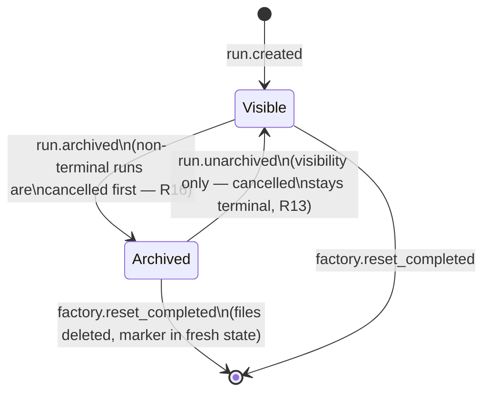
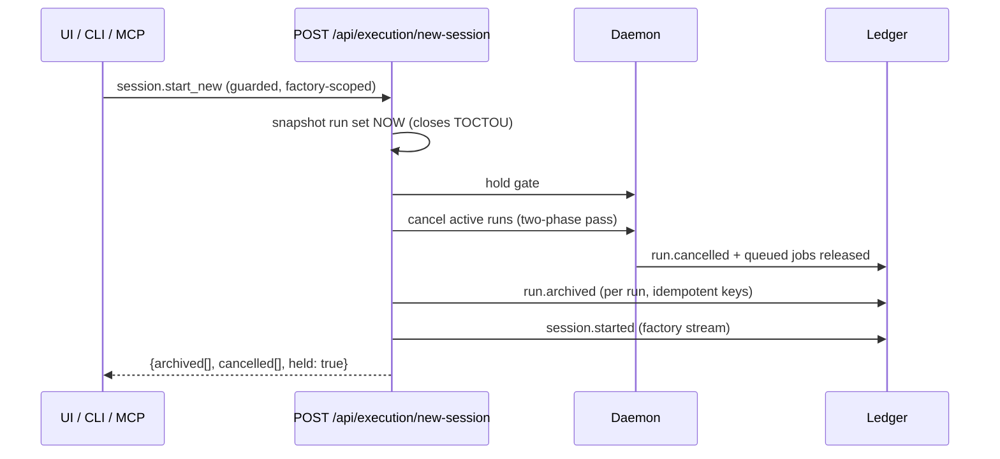

# feat: Run-focused floor and session lifecycle

## Summary

Implement the run-focused floor and session lifecycle as ledger-native features: two new run events (`run.archived`, `run.unarchived`) plus factory-stream markers (`session.started`, `factory.reset_completed`) drive default-view filtering, an atomic New Session command (hold gate → cancel actives → clear queue → archive), and a guarded Factory Reset that wipes only factory-managed storage. The floor reshapes around the existing focused-run model: a current-stage marker and one-line status headline derived from existing projections, progressive disclosure of panels, and an explicit "nothing needs you" state. Every new command lands with UI + CLI + MCP + ChatGPT Action parity via the route-derived parity test.

---

## Problem Frame

Real use surfaced two operator pains: the floor renders everything at once with no hierarchy of "what matters now," and cancel-all stops work without ever clearing the stage — in an append-only ledger world nothing can leave the view, so clutter is guaranteed. Full framing in the origin document (see Sources & References).

---

## Requirements

Origin requirements (R1–R12) carried verbatim from the origin document:

- R1. Floor defaults to one focused run; others collapse into a compact strip; one-click focus switch.
- R2. Focused run renders as a stage pipeline with a current-stage marker and per-stage status.
- R3. One-line status headline: what the run is doing now + how many items need the operator, items one click away.
- R4. Non-current panels collapse by default, expand on demand; every state maps to real ledger events.
- R5. Explicit "nothing needs you" state.
- R6. New Session archives all inactive runs and opens a clean floor; asks once about active runs (cancel-and-archive or abort).
- R7. Archive is reversible and non-destructive; archived runs remain on disk, searchable, replayable via a history view.
- R8. New Session resets execution state: gate re-held, queued-but-unstarted work cleared.
- R9. Factory Reset destructively wipes runs, ledger, generated workspaces; typed confirmation naming what is destroyed; visually and semantically separated from New Session.
- R10. Cancel updates visual state immediately and offers archive in the same moment.
- R11. New Session, archive, and Factory Reset have parity across floor UI, CLI, and MCP.
- R12. Lifecycle actions are audit-visible: archive/new-session recorded as events; reset records a marker in fresh state.

Plan-derived requirements (from flow analysis; behaviors the origin implies but does not pin):

- R13. Unarchive exists with the same parity as archive; it restores visibility only, never execution (cancelled stays terminal).
- R14. The floor's run list is live: runs started from CLI/MCP appear without a manual reload; auto-focus steals focus only when the floor is empty, otherwise the strip badges. If the focused run is archived from another surface, the floor refocuses the most recent visible run or shows the empty state with a notice.
- R15. Factory Reset bumps a reset-generation value surfaced through the polled execution overview; stale tabs detect it and show a forced-reload/re-auth banner instead of failing silently.
- R16. Archiving a non-terminal run cancels it first; there is no "archived but still executing" state.

**Origin actors:** A1 (Operator), A2 (Execution daemon), A3 (Connector surfaces)
**Origin flows:** F1 (Monitor a run), F2 (Start a fresh session), F3 (Dev-machine wipe)
**Origin acceptance examples:** AE1 (covers R6, R8), AE2 (covers R7), AE3 (covers R9), AE4 (covers R3, R5), AE5 (covers R10)

---

## Scope Boundaries

Carried from origin:

- Full attention-queue redesign — only the status headline is adopted.
- Session as a first-class entity — archive-by-default approximates it.
- Ledger compaction, pruning, or storage optimization — archive is a lifecycle concept, not a storage one.
- Multi-user, hosted, or team session semantics.
- Any change to gate, review, or deploy semantics themselves.
- Archive and reset never touch deployed external resources (live Render services); history retains last-known deploy state and URL.

### Deferred to Follow-Up Work

- Poll-loop consolidation (`TODOS.md` P2): the run-list liveness poll added by U5 follows the existing per-resource pattern; merging the floor's poll loops stays a separate change.
- Golden-run fixture with a full archive/new-session scenario: covered by route/projection tests in this plan; a dedicated fixture can follow if UI e2e wants replayable archive states.

---

## Context & Research

### Relevant Code and Patterns

- `packages/core/src/events/event-types.ts` — event registry with compile-time exhaustiveness (`EVENT_TYPES` + `EventPayloadMap`); the template for adding lifecycle events.
- `packages/core/src/projections/run-projection.ts` — `projectRun` fold, `RunStatus`/`RunExecutionState`, `isRealRun` phantom filtering, "cancellation is terminal" fold precedent, `resolveTargetRunId`.
- `packages/web/src/server/routes/runs.ts` — `cancelAllRuns` is the template for batch lifecycle commands (factory-scoped guard, idempotency keys, `resolveInterventionsForCancelledRun`, single `daemon.cancelRuns` call).
- `packages/web/src/server/execution/daemon.ts` — drain gate (process-local, boots held), `cancelRuns` two-phase pass (abort in-flight, then chained queued-job release) — the discipline for queue clearing.
- `packages/web/src/server/routes/execution.ts` — factory-scoped guard subjects, `auditFactoryCommand`, hold/resume routes; comment near line 502 documents why factory commands audit as log lines while guard denials land on the reserved `'factory'` stream.
- `packages/web/src/server/instance.ts` — globalThis singletons (store, app, daemon, CSRF) that Factory Reset must dispose and rebuild.
- `packages/web/src/server/runtime.ts` — `resolveFactoryDir`; storage layout: `events/<runId>.jsonl`, `operator-token.json`, `workspaces/`.
- `packages/web/src/components/factory-floor/FactoryFloor.tsx` — existing focused-run model (`focusedRunId`, `FocusedBlueprint` keyed remount) and binding hierarchy comment; `RunStrip` (MAX_CHIPS=6), `RunBoard` (ephemeral "Clear view"), `FactoryCommandBar` (arm/confirm destructive pattern), `RunCommandBar` (single-click cancel + refresh).
- `packages/web/src/lib/run-view.ts` — `deriveBlueprintLanes` (8 lanes: research, planning, queue, workers, gates, repair, package, deploy), `deriveFactoryPulse`, `severityClass` — the no-invention derivation style for the new stage/headline helpers.
- `packages/web/src/lib/polling.ts` + `use-run-aggregate.ts` / `use-intervention-queue.ts` / `use-execution-overview.ts` — the polling hook pattern for the new run-list liveness hook.
- `packages/web/test/server/connector-parity.test.ts` — route-derived parity contract (CONNECTOR_SURFACE, MCP tools, Action operationIds); commit `15c4c2c` is the direct precedent.
- `packages/core/src/knowledge/knowledge-projection.ts` — `knowledge.entry_redacted`/`entry_retired`: the reversible-visibility-by-event precedent for archive.
- `tests/e2e/factory-gate.spec.ts` — isolated `app.listen(0)` server pattern for gate-flipping e2e specs.

### Institutional Learnings

- `docs/runbooks/failure-taxonomy.md` + `packages/core/test/observability/failure-registry.test.ts` — event names matching `/(fail|error|reject|block|invalid|cancel|dead_letter|retry|fallback|setup_required|unavailable)/` force registry + runbook entries. The chosen names (`run.archived`, `run.unarchived`, `session.started`, `factory.reset_completed`) deliberately avoid the regex.
- `docs/runbooks/golden-run-replay.md` + `tests/e2e/golden-run-replay.spec.ts` — projections must stay pure and deterministic; the marketplace fixture must stay green; archive/reset must never mutate or delete events in place (reset deletes whole files as an explicit, marked discontinuity — see Key Technical Decisions).
- `ARCHITECTURE.md` "Hosted Scale Migration Seam" + `packages/core/test/events/event-store-contract.ts` — store invariants (append atomicity, idempotency, sequence monotonicity) that archive filtering and reset rebuild must preserve.
- `docs/design/DESIGN.md` + `docs/design/factory-floor-approved-direction.md` — binding UI contract: §5 hierarchy (exactly one focused run), §6 mandatory states (no optimistic success; explicit empty states), §7 color-never-alone, §8 anti-slop. The §5 surface table must be updated before implementing new surfaces.

### External References

- None — local patterns cover every layer (external research deliberately skipped).

---

## Key Technical Decisions

- Archive = per-run events + default-view filtering: `run.archived`/`run.unarchived` append to the run's own ledger; list endpoints filter `archived` unless `includeArchived` is requested. Rationale: preserves append-only invariants and replay determinism; mirrors the knowledge-redaction precedent.
- Archive of a non-terminal run cancels first (R16): the daemon's drain check only gates on paused/cancelled, so an archived-but-alive run's queued jobs would execute later. Route layer enforces cancel-then-archive; the fold records archive state regardless of status so replay is total.
- Event names avoid the failure-taxonomy regex by design: no failure-registry or runbook obligations for knowledge-track lifecycle events; the reset marker is `factory.reset_completed` (not `factory.reset_forced` or similar regex-matching names).
- Session/reset markers live on the reserved `'factory'` stream (runId `factory`), the same stream guard denials use; `isRealRun` already hides it from run lists. `session.started` records who/when/how many runs were archived; `factory.reset_completed` is the first event of the fresh state.
- Needs-you count = factory-wide union of open interventions and unpaired `review.requested` events; the focused-run headline shows that run's subset. Rationale: interventions alone lie when a review awaits decision (flow-analysis finding).
- "Active" for New Session confirmation = `status === 'running'` OR `executionState ∈ {queued, started, paused, blocked}`; everything else archives without confirmation.
- New Session is one atomic guarded server command (factory-scoped subject, command `session.start_new`): snapshot run set at execution time, then hold gate → cancel actives → release queued jobs → append `run.archived` per run → append `session.started` marker. Rationale: closes the TOCTOU window for runs created from CLI/MCP mid-confirmation.
- Factory Reset sequence: server-side typed-confirmation phrase in the request body; refuse while any job lease is active (no force override in v1); hold gate → stop daemon (awaits pass chain) → dispose globalThis singletons → delete factory-managed paths only (`events/`, factory-managed `workspaces/`, `operator-token.json`) → rebuild store → append `factory.reset_completed` + `session.started` → respond with new reset generation. User-supplied `localFolder` workspace targets are never deleted.
- Reset generation surfaced in the already-polled execution overview (R15): clients compare and render a forced-reload banner. Rationale: token/CSRF wipe otherwise breaks open tabs with unexplained guard rejections.
- Stage pipeline and headline are pure client-side derivations in `lib/run-view.ts` over the existing aggregate (no new projection fields unless implementation proves a gap): follows the `deriveBlueprintLanes` no-invention style.
- UI never optimistic: every lifecycle action confirms from events via the existing immediate-poll-after-mutation pattern (DESIGN.md §6).

---

## Open Questions

### Resolved During Planning

- Stage taxonomy mapping (origin deferred): reuse the eight `deriveBlueprintLanes` lanes as the pipeline; current stage = highest-precedence non-idle lane with active work, falling back to the furthest completed stage; retries render within their lane (repair), not as pipeline regression.
- Headline derivation (origin deferred): compose from `deriveFactoryPulse` (activeWorkers/queued/blocking) + interventions + unpaired reviews; exact copy strings deferred to implementation.
- History view location (origin deferred): `RunBoard` becomes the archive-aware history host (include-archived toggle, unarchive action); replay reuses the existing `/runs/[runId]` detail view — no new page.
- Wipe mechanics with a running daemon (origin deferred): sequence pinned in Key Technical Decisions; refuse-while-leased replaces a force flag in v1.
- Whether archive needs its own interventions handling: yes — archiving resolves the run's open interventions, mirroring `resolveInterventionsForCancelledRun`, so the floor never pins interventions for hidden runs.
- Cancel-and-archive mid-deploy: archive never touches external resources; the confirm dialog warns "deployed artifacts remain live" when the run has a live deploy; history retains the URL.

### Deferred to Implementation

- Exact microcopy for the headline, confirmations, and typed-reset phrase: copy is cheap to iterate at implementation time under DESIGN.md §8 rules.
- Whether the stage/headline derivations need any new aggregate fields: prefer pure derivation; add projection fields only if the aggregate provably lacks a needed signal.
- RunBoard pagination/virtualization threshold once archives grow large: measure first.
- Whether `session.started` should carry a session label/name: not needed for v1 semantics; decide when history UX is in front of us.

---

## High-Level Technical Design

> _This illustrates the intended approach and is directional guidance for review, not implementation specification. The implementing agent should treat it as context, not code to reproduce._

Run visibility lifecycle (orthogonal to run status; archive of non-terminal implies cancel first):

New Session as one atomic guarded command:

---

## Implementation Units

### U1. Core lifecycle events and projection fold

**Goal:** `run.archived`, `run.unarchived`, `session.started`, `factory.reset_completed` exist as first-class events; run projection exposes archive state; latest-run resolution is archive-aware.

**Requirements:** R7, R12, R13, R16 (fold side), AE2

**Dependencies:** None

**Files:**

- Modify: `packages/core/src/events/event-types.ts`
- Modify: `packages/core/src/projections/run-projection.ts`
- Test: `packages/core/test/projections/run-projection.test.ts`

**Approach:**

- Payload interfaces + `EventPayloadMap` + `EVENT_TYPES` entries (compile-time exhaustiveness enforces agreement).
- `RunProjection` gains `archived: boolean` and `archivedAt`; fold rules explicit in the "cancellation is terminal" style: archive/unarchive toggle visibility regardless of status; unarchive never revives execution state.
- Add a `isVisibleRun`-style helper (real AND not archived); make `resolveTargetRunId` skip archived runs.
- `session.started` / `factory.reset_completed` are factory-stream events; verify projection diagnostics tolerate them on the reserved stream (they never join run lists — `isRealRun` already excludes the stream).

**Patterns to follow:**

- Terminal-cancel fold rules in `projectRun`; `knowledge.entry_redacted` reversible-visibility precedent.

**Test scenarios:**

- Happy path: archive then unarchive a completed run → `archived` toggles, status unchanged.
- Edge case: `run.archived` on an already-archived run is idempotent; unarchive on a never-archived run is a no-op with no diagnostic.
- Edge case: Covers AE2. archived run's events replay identically (deep-equal double projection) with zero diagnostics.
- Edge case: late `run.started` after archive does not un-archive (mirror of terminal-cancel immunity).
- Happy path: `resolveTargetRunId` skips archived runs and picks the newest visible run.
- Integration: golden marketplace fixture still projects deep-equal with zero diagnostics (no archive events present).

**Verification:**

- Core test suite green including replay determinism; exhaustiveness check compiles; failure-registry test unaffected (names avoid the regex).

---

### U2. Archive/unarchive routes and run-list filtering

**Goal:** Per-run archive/unarchive commands and archived-aware listing across server loaders.

**Requirements:** R7, R13, R16, AE2, AE5 (server side)

**Dependencies:** U1

**Files:**

- Modify: `packages/web/src/server/routes/runs.ts`
- Modify: `packages/web/src/server/run-data.ts`
- Test: `packages/web/test/server/run-routes.test.ts`

**Approach:**

- `POST /api/runs/:id/archive` and `POST /api/runs/:id/unarchive`, guarded per-run (subject + version, stale-command protected).
- Archive of a non-terminal run performs cancel-then-archive in one command (reuse the cancel path, then append `run.archived`; single daemon `cancelRun` call).
- Archiving resolves the run's open interventions (mirror `resolveInterventionsForCancelledRun`).
- `GET /api/runs` gains `includeArchived` (default false); `loadRunList` applies the visible filter; run detail (`/api/runs/:id`) remains accessible for archived runs (history/replay path).
- Cancel response/`run.cancelled` handling extended so UI can offer archive immediately (R10 server support; optional `archive: true` option on cancel for parity with U7's CLI flag).

**Patterns to follow:**

- `cancelAllRuns` guard/idempotency structure; existing route tests' in-process `createApp` style.

**Test scenarios:**

- Happy path: archive a completed run → 200, `run.archived` appended, excluded from default list, included with `includeArchived`.
- Happy path: unarchive → visible again; execution state untouched.
- Error path: archive with stale version → stale-command rejection; no event appended.
- Edge case: archive a running run → run is cancelled first, queued jobs released, then archived (single command); response reports both.
- Edge case: archive resolves the run's open interventions; intervention queue no longer lists them.
- Integration: Covers AE2. archived run's events remain readable via `GET /api/runs/:id/events`.

**Verification:**

- Route tests green; default list never contains archived runs; archived detail/replay still served.

---

### U3. New Session command and daemon queue clearing

**Goal:** One atomic guarded command that delivers F2: snapshot → hold → cancel actives → clear queue → archive all → marker.

**Requirements:** R6, R8, R12, AE1

**Dependencies:** U1, U2

**Files:**

- Modify: `packages/web/src/server/routes/execution.ts`
- Modify: `packages/web/src/server/execution/daemon.ts`
- Test: `packages/web/test/server/execution-routes.test.ts`
- Test: `packages/web/test/server/execution-daemon.test.ts`

**Approach:**

- `POST /api/execution/new-session`, factory-scoped guard, command `session.start_new`, audited via `auditFactoryCommand`.
- Body carries `confirmActive: boolean`; if actives exist (per the R-decision definition) and `confirmActive` is false, respond 409-style with the active list so surfaces can confirm once (AE1's ask-once).
- Execution order per the sequence diagram; queued-job release reuses the `cancelRuns` phase-2 chained-pass discipline; archive appends use idempotency keys (`${runId}:run.archived`).
- Response: `{archived, cancelled, held: true}` for immediate UI confirmation via the standard post-mutation poll.

**Test scenarios:**

- Happy path: Covers AE1 / F2. three completed + one active, `confirmActive: true` → all archived, gate held, queue empty, `session.started` on factory stream.
- Edge case: active runs present with `confirmActive: false` → nothing changes, response lists actives.
- Edge case: run created between confirm and execution is included (snapshot at execution) — simulate by appending a run before the command lands.
- Edge case: paused and blocked runs count as active; completed/failed/cancelled do not.
- Error path: guard rejection (bad token/origin) → `security.command_rejected`, no state change.
- Integration: daemon in-flight job aborted and its queued siblings released as cancelled before archive events land (ordering observable in the ledger).

**Verification:**

- AE1 reproduced as a route test; ledger shows hold-cancel-release-archive-marker ordering; execution overview reports held + zero queued.

---

### U4. Factory Reset command

**Goal:** Guarded destructive wipe of factory-managed state with a marker in the fresh ledger and stale-tab detection support.

**Requirements:** R9, R12, R15, AE3

**Dependencies:** U1

**Files:**

- Create: `packages/web/src/server/factory-reset.ts`
- Modify: `packages/web/src/server/routes/execution.ts`
- Modify: `packages/web/src/server/instance.ts`
- Modify: `packages/web/src/server/runtime.ts`
- Modify: `packages/web/src/lib/types.ts`
- Modify: `packages/web/src/lib/execution-overview.ts`
- Test: `packages/web/test/server/factory-reset.test.ts`

**Approach:**

- `POST /api/execution/factory-reset` with server-side typed-confirmation phrase in the body; mismatch → rejection, nothing deleted (AE3 enforced server-side, not just UI).
- Refuse while any job lease is active; respond with the leased jobs so the operator can cancel first.
- Sequence: hold → daemon stop (awaits chained passes) → dispose/rebuild globalThis singletons (store cache and sequence high-water marks must not survive) → delete allowlisted factory-managed paths only → rebuild store → append `factory.reset_completed` + `session.started` → bump reset generation.
- Reset generation included in `getExecutionOverview` payload; monotonic value persisted with the fresh state.
- Pre-flight enumerates what will be destroyed (run count, archived count, workspace paths) for the UI confirmation copy (AE3/R9); user-supplied `localFolder` targets never appear in the allowlist.

**Execution note:** Test-first — write the refusal and allowlist tests before the deletion code; this unit is the plan's highest-blast-radius surface.

**Test scenarios:**

- Error path: Covers AE3. wrong/missing confirmation phrase → nothing deleted, state untouched.
- Error path: leased job active → refusal listing the lease; nothing deleted.
- Happy path: Covers F3. valid reset → factory dir wiped per allowlist, fresh ledger contains reset marker + session marker, response carries new generation.
- Edge case: user-supplied `localFolder` workspace target survives a reset (path outside allowlist).
- Edge case: post-reset append uses fresh sequence numbers starting at 1 (singleton caches rebuilt — no resurrection).
- Integration: reset generation visible via `GET /api/execution` after reset; differs from pre-reset value.

**Verification:**

- Reset is impossible accidentally (phrase + lease refusal), destroys exactly the allowlist, and the fresh state explains itself via the marker.

---

### U5. Floor legibility: stage pipeline, headline, idle state, live run list

**Goal:** Deliver F1 — the focused run reads as a pipeline with a current-stage marker and truthful headline; the floor stays honest with multiple runs and external surfaces.

**Requirements:** R1, R2, R3, R4, R5, R14, AE4

**Dependencies:** U1, U2 (visible-run filtering)

**Files:**

- Modify: `packages/web/src/lib/run-view.ts`
- Modify: `packages/web/src/lib/types.ts`
- Modify: `packages/web/src/components/factory-floor/FactoryFloor.tsx`
- Modify: `packages/web/src/components/factory-floor/BlueprintLanes.tsx`
- Modify: `packages/web/src/components/factory-floor/RunStrip.tsx`
- Create: `packages/web/src/lib/use-run-list.ts`
- Test: `packages/web/test/lib/run-view.test.ts`
- Test: `packages/web/test/components/factory-floor.test.tsx`

**Approach:**

- New pure helpers: `deriveCurrentStage(aggregate)` (precedence over the eight lanes) and `deriveStatusHeadline(aggregate, interventions, reviews)` (focused-run subset + factory-wide needs-you count) in the `deriveBlueprintLanes` no-invention style with `never` exhaustiveness.
- Needs-you unions open interventions and unpaired `review.requested` (Key Technical Decisions).
- `BlueprintLanes` gains the current-stage marker and collapsed-by-default lane cards (expand on demand); focused blueprint keeps the §5 "exactly one focused run" rule.
- Run-list liveness: `use-run-list` polls `GET /api/runs` on the shared 1.5s loop; auto-focus only when the floor has no focused run; strip badges otherwise; focused-run-archived-elsewhere → refocus newest visible run or empty state with an "archived — open in history" notice.
- Explicit idle state ("nothing needs you") follows the designed-empty-state treatment DESIGN.md §6 already mandates for the intervention queue.
- Update `docs/design/DESIGN.md` §5 surface table before implementing (Documentation Plan).

**Patterns to follow:**

- `deriveBlueprintLanes` / `deriveFactoryPulse`; polling hook triad; `severityClass` + color-never-alone.

**Test scenarios:**

- Happy path: Covers AE4 / F1. aggregate with a failed-gate retry decision pending → headline names one needs-you item; resolving it with nothing else pending → explicit idle state rendered.
- Happy path: current-stage marker moves as events advance stages (created→planned→running gates→deploy fixtures).
- Edge case: multiple active runs — headline shows focused subset, needs-you count includes the other run's intervention.
- Edge case: pending review with zero interventions → needs-you count is 1 (union rule).
- Edge case: focused run archived from another surface → floor refocuses newest visible run; if none, empty state with history notice.
- Edge case: run started externally while floor open → appears in strip without reload; focus not stolen when a run is already focused.
- Integration: lane cards collapsed by default; expanding one renders the existing panel content unchanged (no ledger-fidelity loss).

**Verification:**

- Component suite green; a seeded multi-run floor answers "what's happening / what needs me" from the headline alone; jsdom tests assert the idle state exists as a designed state, not absence of content.

---

### U6. Session lifecycle UI

**Goal:** Operator-facing New Session, Factory Reset, cancel→archive offer, and archived history view — all event-confirmed, never optimistic.

**Requirements:** R6, R7, R9, R10, AE1, AE2, AE3, AE5

**Dependencies:** U2, U3, U4, U5

**Files:**

- Modify: `packages/web/src/components/factory-floor/FactoryCommandBar.tsx`
- Modify: `packages/web/src/components/factory-floor/RunCommandBar.tsx`
- Modify: `packages/web/src/components/factory-floor/RunBoard.tsx`
- Modify: `packages/web/src/lib/api-client.ts`
- Modify: `packages/web/src/lib/use-execution-overview.ts`
- Test: `packages/web/test/components/factory-floor.test.tsx`

**Approach:**

- New Session control in `FactoryCommandBar` using the existing arm/confirm keyboard-contract pattern; when actives exist, the confirm names them (and warns "deployed artifacts remain live" when applicable).
- Factory Reset control visually separated (R9), typed-confirmation modal rendering the server's pre-flight enumeration (counts + literal paths); reset success → forced-reload banner path (R15 client side).
- `RunCommandBar` cancel gains the immediate-state + archive-offer moment (AE5) via the existing immediate-poll confirmation; no optimistic UI.
- `RunBoard` becomes the history host: include-archived toggle backed by `includeArchived`, unarchive action, replay links to the existing run detail view; replaces the ephemeral "Clear view" state with the real lifecycle.
- Stale-tab banner: `use-execution-overview` compares reset generation and renders the forced-reload/re-auth banner.

**Patterns to follow:**

- `FactoryCommandBar#CancelAllControl` (arm/confirm, focus contract, Escape disarms); `MutationResult` client pattern; DESIGN.md §6/§8.

**Test scenarios:**

- Happy path: Covers AE1. New Session with no actives → single click + confirm, floor empties, held banner shows.
- Edge case: actives present → confirm lists them; abort leaves everything untouched.
- Error path: Covers AE3. reset modal with wrong phrase → confirm disabled/rejected; nothing sent or server rejects.
- Happy path: Covers AE5. cancel → state updates on next poll tick and archive offer appears; accepting archives.
- Happy path: Covers AE2. history toggle reveals archived runs; unarchive returns one to the default view; replay link opens the run detail.
- Edge case: reset generation change → banner rendered, mutations disabled until reload.

**Verification:**

- All floor lifecycle actions confirmed from events; keyboard/focus contract holds for both destructive controls; history is reachable within one click of the board.

---

### U7. Connector parity: CLI, MCP, ChatGPT Action

**Goal:** Every lifecycle command exists on all surfaces; the route-derived parity test proves it.

**Requirements:** R11, R13 (parity side), AE1/AE3 (CLI-reachable)

**Dependencies:** U2, U3, U4

**Files:**

- Modify: `packages/cli/src/commands/execution.ts`
- Modify: `packages/cli/src/api-client.ts`
- Modify: `packages/cli/src/index.ts`
- Modify: `packages/web/src/server/mcp.ts`
- Modify: `integrations/chatgpt/actions.openai.yaml`
- Test: `packages/web/test/server/connector-parity.test.ts`
- Test: `packages/web/test/server/mcp.test.ts`
- Test: `packages/cli/test/execution-commands.test.ts`

**Approach:**

- CLI: `software-factory archive <runId>` / `unarchive <runId>` / `new-session [--confirm-active]` / `factory-reset` (prompting for the typed phrase) / `cancel --archive`; thin wrappers per the ARCHITECTURE.md rule.
- MCP: TOOLS entries + `tools/call` cases delegating via `deps.app.handle(internalRequest(...))` — never reimplementing logic.
- Action: operations with mapped operationIds on matching method+path; schema stays valid OpenAPI 3.1.
- `CONNECTOR_SURFACE` entries for every new route (or written exclusions >10 chars — expected: factory-reset excluded from the ChatGPT Action surface with a written destructive-scope reason, mirroring how high-blast-radius ops are treated).

**Test scenarios:**

- Happy path: parity test passes with all new routes mapped or explicitly excluded with reasons.
- Happy path: MCP `tools/call` for archive/new-session round-trips through the internal app and returns route-shaped results.
- Happy path: CLI new-session against a seeded in-process server archives and holds (mirror of AE1).
- Error path: CLI factory-reset without the typed phrase aborts locally without a request.
- Edge case: `cancel --archive` performs cancel-then-archive in one command from the CLI.

**Verification:**

- `connector-parity.test.ts`, `mcp.test.ts`, `chatgpt-action-schema.test.ts`, and CLI suites green; no surface can drift silently.

---

### U8. End-to-end session lifecycle coverage

**Goal:** Prove the composed flows (F1–F3) against a real server + browser, using the isolated-server pattern for gate-flipping specs.

**Requirements:** F1, F2, F3, AE1–AE5 (end-to-end layer)

**Dependencies:** U3, U4, U5, U6, U7

**Files:**

- Create: `tests/e2e/session-lifecycle.spec.ts`
- Modify: `tests/e2e/seed-run.ts` (archive-state seeding helper if needed)

**Approach:**

- Isolated `app.listen(0)` servers for new-session and reset specs (never flip the shared dev server's gate — `factory-gate.spec.ts` precedent); shared-server spec for the focused-floor/headline read-only assertions.
- Golden-run replay spec must remain untouched and green.

**Test scenarios:**

- Integration: Covers AE1 / F2. seeded multi-run floor → New Session → floor empty, held banner, history shows archived runs.
- Integration: Covers AE4 / F1. seeded run with pending intervention → headline + needs-you count render; resolve → explicit idle state.
- Integration: Covers AE3 / F3. reset spec on isolated server: wrong phrase rejected; right phrase wipes and fresh floor shows reset marker provenance; stale tab shows the reload banner.
- Integration: Covers AE2. archived run replay: open archived run from history, events render in the detail view.

**Verification:**

- e2e suite green locally; golden-run replay unchanged; no spec mutates the shared dev server's gate.

---

## System-Wide Impact

- **Interaction graph:** run-list consumers all gain the archive filter — floor props loader, `GET /api/runs`, MCP `software_factory_list_runs`, ChatGPT Action list operation, CLI list command, and `resolveTargetRunId` callers.
- **Error propagation:** guard rejections for new commands surface as `security.command_rejected` (existing critical taxonomy entry); new-session/reset failures must leave a consistent ledger (idempotency keys make re-runs safe).
- **State lifecycle risks:** reset vs. globalThis singletons and daemon in-flight state (U4 sequence + tests); archive vs. queued jobs (R16); interventions must never pin archived runs.
- **API surface parity:** enforced mechanically by `connector-parity.test.ts`; CLI parity by convention + tests (U7).
- **Integration coverage:** ledger ordering of the new-session pass, reset-generation propagation to open tabs, archive filtering across server-rendered props and polled lists (U8).
- **Unchanged invariants:** append-only ledger and replay determinism; drain gate stays process-local and boots held; review/gate/deploy semantics untouched; `EventStore` contract suite unchanged (reset deletes files through a dedicated path, not a store API).

---

## Risk Analysis & Mitigation

| Risk                                                                   | Likelihood | Impact   | Mitigation                                                                                                                          |
| ---------------------------------------------------------------------- | ---------- | -------- | ----------------------------------------------------------------------------------------------------------------------------------- |
| Factory reset deletes user data outside factory scope                  | Low        | Critical | Allowlist-only deletion; `localFolder` targets excluded by construction; path-enumeration test (U4); typed server-side confirmation |
| Reset races daemon; cached singletons resurrect the old ledger         | Med        | High     | Pinned sequence (stop → dispose → delete → rebuild → marker); refuse-while-leased; fresh-sequence test                              |
| Archived run's queued work executes later                              | Med        | High     | R16 cancel-first at the route layer; queue-release reuse of the chained-pass discipline; ledger-ordering test (U3)                  |
| Floor reshape regresses existing panels/tests                          | Med        | Med      | Reuse existing focus model; collapsed cards render existing panels unchanged; component suite extended, not replaced                |
| Parity drift across four surfaces (floor UI, CLI, MCP, ChatGPT Action) | Low        | Med      | Route-derived parity test fails the build on drift; exclusions require written reasons                                              |
| Headline lies ("nothing needs you" while a review waits)               | Med        | High     | Needs-you union rule + AE4 tests at unit, component, and e2e layers                                                                 |

---

## Documentation Plan

- `docs/design/DESIGN.md` §5 surface table: add stage pipeline, headline, history view, New Session and Factory Reset controls **before** implementing U5/U6 (the doc's own rule).
- `docs/runbooks/local-development.md` + `docs/runbooks/cloud-deployment.md`: New Session and Factory Reset sections (what they do, what survives, reset-generation behavior on hosted).
- `ARCHITECTURE.md`: event list addition for the four lifecycle events and the factory-stream marker convention.
- `docs/runbooks/failure-taxonomy.md`: no entries required (names avoid the regex) — note the deliberate naming in the PR description instead.

---

## Sources & References

- **Origin document:** [docs/brainstorms/2026-07-28-run-focused-floor-and-session-lifecycle-requirements.md](docs/brainstorms/2026-07-28-run-focused-floor-and-session-lifecycle-requirements.md)
- Related code: `packages/web/src/server/routes/runs.ts` (`cancelAllRuns`), `packages/web/src/server/execution/daemon.ts`, `packages/web/src/lib/run-view.ts`, `packages/web/test/server/connector-parity.test.ts`
- Related commits: `001866d` (drain gate, held-by-default), `15c4c2c` (cancel-all parity + route-derived parity test)
- Prior plans: `docs/plans/2026-06-28-001-feat-full-factory-build-loop-plan.md`
