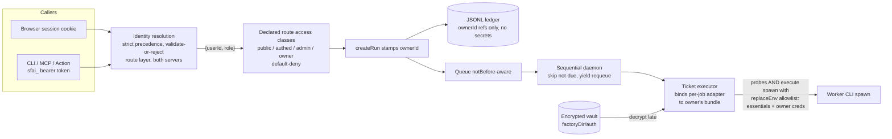
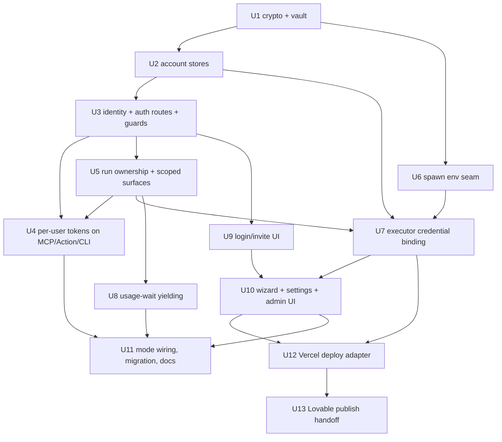

# feat: Multi-user cloud accounts — login, credential wizard, per-user execution

## Summary

Implement invite-gated multi-user accounts on the cloud factory by layering an identity system (file-backed accounts/sessions/invites/API tokens, scrypt passwords, AES-256-GCM credential vault) onto the existing framework-agnostic route layer, stamping run ownership into the ledger, scoping every read/control surface per user with one admin, and binding each run's execution adapter to the owner's decrypted credentials in an allowlisted spawn environment. Execution stays sequential with usage-limit waits yielding the executor so users' runs interleave fairly. A final phase extends the generated-app deploy stage with per-user deploy targets: a Vercel adapter and a Lovable publish-and-import handoff (user-directed scope extension, 2026-08-20).

---

## Problem Frame

The deployed factory is single-tenant: one shared operator token (embedded in every server-rendered page), credentials in the server env, all worker spawns inheriting that env, and every GET route public. Sharing a deployment today means sharing the owner's identity, bill, and secrets. Full context in the origin document (see Sources & References).

---

## Requirements

Origin requirements R1–R17 govern (see origin doc). Plan-level restatement of the load-bearing ones:

- R1. Cloud multi-user mode gains a login screen; unauthenticated access limited to login, invite redemption, and a status-only liveness endpoint (health-check exception resolved during planning). Local mode unchanged.
- R2. Admin-issued single-use revocable invites are the only account-creation path (admin bootstrap via a hardened env-seeded invite — resolved during planning).
- R3. One admin role; users see/control only their own runs; admin sees/controls all.
- R4. Password reset = admin re-invite; re-invite redemption invalidates prior sessions and API tokens.
- R5. Per-user API tokens for CLI/MCP/Action; the shared operator token retires in cloud multi-user mode.
- R6–R9. Credential wizard: Claude plan token or Anthropic API key; OpenAI API key or Codex auth.json upload; optional GitHub token. Live-validated, replaceable, presence-only display, encrypted at rest (see the qualified Codex materialization window in Key Technical Decisions), surviving restarts.
- R10–R13. Allowlist-based worker spawn env carrying only the owner's credentials; admin uses the same rails; per-user Codex home; per-user GitHub token for checkout/publish. (Scope note resolving an origin-text tension: origin R10's "ALL runs" applies within cloud multi-user mode — local single-user mode keeps today's inherit+scrub spawn env by explicit user decision; see Scope Boundaries.)
- R14. Missing/invalid/expired credentials block the run with an owner-directed intervention; fix + retry resumes.
- R15. Usage-limit waits yield the sequential executor so other users' runs proceed (mechanism decided: yield-and-requeue).
- R16–R17. All surfaces scoped per authenticated user; runs carry durable owner attribution.

**Deploy targets for generated apps (plan-level additions, user-directed 2026-08-20 — extends the origin doc):**
- R18. Generated apps can deploy to Vercel via a per-user Vercel token: project create/deploy through the Vercel API, health check, hosted URL — mirroring the existing Render deploy semantics.
- R19. "Deploy to Lovable" is a publish-and-import handoff: the generated repo is published to GitHub with the owner's token and the run's deploy artifact carries a Lovable import link plus instructions (Lovable exposes no hosting/deploy API — this is the honest maximum automation).
- R20. Deploy provider is selectable per run (render | vercel | lovable-handoff); in multi-user mode the deploy stage uses the RUN OWNER's deploy credentials (per-user Render API key / Vercel token collected by the wizard), retiring server-level deploy keys the same way R11 retires model keys.

**Flow-analysis gap register (G-IDs referenced by units below):** G1 cross-user concurrency promise (resolved: yield), G2 admin bootstrap, G3 admin lockout/break-glass, G4 revoke semantics for in-flight runs, G5 single-tenant→multi-user migration, G6 health-check/auth split, G7 master-key failure behavior, G8 drain-gate roles after deploys, G9 factory-wide command roles, G10 per-user API-token lifecycle, G11 credential delete/replace with active runs, G12 invite lifecycle details (expiry/race/username rules), G13 session lifecycle (expiry/logout/CSRF-across-restarts), G14 intervention scoping + restart copy, G15 GitHub-token enforcement at preflight, G16 admin acts on a user's run with the owner's credentials, G17 probe copy for usage-limited-but-valid credentials, G18 post-login deep-link return.

**Origin actors:** A1 admin (deploy owner), A2 invited user, A3 worker processes, A4 remote callers (CLI/MCP/Action).
**Origin flows:** F1 invite + account creation, F2 credential wizard, F3 personalized run, F4 admin oversight, F5 credential failure escape path. Planning adds F0 admin bootstrap, F6 upgrade/migration, F7 session end, F8 API-token issuance (gap analysis).
**Origin acceptance examples:** AE1 (env isolation), AE2 (credential expiry mid-run), AE3 (invite revocation/re-invite), AE4 (visibility scoping), AE5 (usage-wait fairness — satisfied via yielding; the origin success criterion "two users run concurrently" is softened to "two users' runs interleave without blocking each other," per user decision during planning).

---

## Scope Boundaries

Carried from origin: no self-serve signup/billing/quotas/abuse prevention (auth-endpoint throttling is carved back IN as a security control — see Key Technical Decisions); no OS-level isolation between users (app-layer scoping + trust); no email infrastructure; no local worker agent; no teams or multiple admins; no horizontal-scaling changes.

Plan-local additions:

- No true concurrent execution across users — the daemon stays a sequential single executor; fairness comes from yielding (user decision).
- No database — accounts/sessions/tokens/credentials use file-backed sidecar stores on the persistent disk, behind operation-level interfaces the future DB seam can replace.
- No Next.js middleware as a security boundary — all auth enforcement lives in the shared route layer so the standalone node:http server is equally protected; middleware may be added later purely for page-redirect UX.
- Local single-user mode keeps today's behavior byte-for-byte: no login, loopback operator token, env-based worker credentials. This is a deliberate carve-out from origin R10's "ALL runs" wording — on a single-operator laptop the env IS the owner's credential set, and there is no co-tenant to protect against; the allowlist applies wherever more than one identity exists (cloud multi-user mode).
- The deploy-target phase (R18–R20) extends the origin doc by explicit user direction (2026-08-20); it is deliberately last and separable — Phases 1–6 ship the multi-user feature complete without it.

### Deferred to Follow-Up Work

- Key-rotation deliverable as one coherent unit: `SF_MASTER_KEY_PREVIOUS` decrypt window + re-encrypt sweep tooling. v1 ships versioned blobs (cheap, forward-compatible) so rotation bolts on without migration; the previous-key handling and sweep CLI land together later.
- scrypt param-raise with transparent rehash-on-login: PHC strings already encode params, so old hashes verify forever; the rehash machinery ships with the future param raise, not v1.
- Playwright e2e coverage of the login/wizard flows: follow-up once the flows stabilize; this plan carries route/component tests.
- `docs/solutions/` capture of credential-isolation and per-user-token learnings after landing (via `/ce-compound`).

---

## Context & Research

### Relevant Code and Patterns

- Guard seam: `packages/core/src/security/command-guard.ts` (pure `checkCommand` with injected `verifyToken` per request via `guardMutation` in `packages/web/src/server/app.ts`) — identity-aware auth extends this injection point; GET routes are currently unguarded by design and gain guards for the first time.
- Token pattern: `packages/core/src/security/operator-token.ts` (`generateOperatorToken`, `verifyOperatorToken` with SHA-256 + `timingSafeEqual`, `createFileOperatorTokenStore` — mode-0600 JSON file, load-or-null) — the template for the new sidecar stores' file handling; the store *interfaces* are shaped at operation level instead (see Key Technical Decisions).
- Store-contract precedent: `packages/core/test/events/event-store-contract.ts` — one executable contract suite run against every backend; the auth stores adopt the same shape so the future DB implementation has an acceptance bar.
- Browser session today: `getLocalSession()` in `packages/web/src/server/instance.ts` embeds the operator token + per-process CSRF into every page via `SessionProvider` (`packages/web/src/components/session-context.tsx`, `packages/web/src/lib/session.ts`) — the login gate must replace this exposure, not wrap it.
- MCP bridge: `packages/web/src/server/mcp.ts` verifies the caller's bearer itself and then forwards with the server's own tokens (double-verifier + privilege escalation — both removed by U4); ChatGPT Action schema `integrations/chatgpt/actions.openai.yaml`; CLI token loading `packages/cli/src/operator-token.ts`.
- Ownership seam: `RunCreatedPayload` in `packages/core/src/events/event-types.ts` (all-optional fields; `mode?` precedent for ledger compatibility) + `projectRun` fold in `packages/core/src/projections/run-projection.ts`; run listing/filtering in `packages/web/src/server/routes/runs.ts`, `events.ts`, `execution.ts`, and server-component loaders in `packages/web/src/server/run-data.ts`.
- Worker spawn env: `packages/core/src/adapters/cli-adapter-base.ts` spawns BOTH the `detectSetup` probes and `execute` with `scrubNestedSessionEnv()` — any per-user credential seam must cover the probe path too, or multi-user runs block at the scheduler's setup probe (`packages/worker/src/runner/scheduler.ts`) before a ticket ever runs. `packages/core/src/adapters/node-command-runner.ts` supports `replaceEnv: true` (exclusive env). All env knobs route through `packages/web/src/server/adapter-env.ts` (three entry points must agree — prior `standalone.ts` bug).
- Credential-handling precedent (E5): checkout token read at exec time only, injected via child env header, sanitized from errors (`packages/worker/src/git/git-checkout.ts` `checkoutAuthEnv`, `sanitizeCheckoutDetail`); presence-only reporting in `packages/web/src/server/routes/setup.ts` + `adapter-setup-snapshot.ts`.
- Execution loop: `packages/web/src/server/execution/daemon.ts` (sequential drain, held-by-default gate with per-run `allowRunWhileHeld` grants, safe yielded-requeue semantics), `packages/worker/src/runner/worker-runner.ts` (usage-wait sleeps in chunked hops today — `usage-wait.test.ts` pins it; `UsageWaitPolicy` already threads daemon config → `SchedulerConfig` → `RunTicketParams`), `packages/worker/src/runner/scheduler.ts`.
- Form/upload UI patterns: `packages/web/src/components/factory-floor/RunControl.tsx` (file upload via `file.text()`, busy/error state, useId labels), `SetupChecklist.tsx` (presence-only status list).
- Test conventions: framework-agnostic app driven via `app.handle()` with in-memory stores (`packages/web/test/server/run-routes.test.ts`), fake `CommandRunner` for adapters (`packages/worker/test/adapters/*`), helpers in `test/_helpers/`.

### Institutional Learnings

- E5 invariant is two rules: credential-surface separation AND presence-only value reporting — this plan revises only where secrets REST (encrypted store vs env); both rules stay enforced per user (origin Key Decisions; `docs/runbooks/workspace-materialization.md`).
- `scrubNestedSessionEnv` blanks `CLAUDE_*`/`ANTHROPIC_BASE_URL` with an explicit `CLAUDE_CODE_OAUTH_TOKEN` carve-out; injection order vs scrub must be deliberate and tested. Claude plan token requires `ANTHROPIC_API_KEY` absent in the same spawn — per-user injection is exclusive per credential type, never additive.
- Prompts ride stdin, never argv (Windows `.cmd` shim); secrets never ride argv.
- ARCHITECTURE.md explicitly requires "a new plan" before widening toward multi-tenancy — this is that plan; single instance, one daemon, one ledger writer stays inviolate.
- The append-only ledger can never carry secret values — events carry credential references only.

### External References

- OWASP Password Storage / Session Management / CSRF / Secrets Management cheat sheets: scrypt N=2^17,r=8,p=1 with explicit `maxmem`, PHC string format; 256-bit session tokens hashed (SHA-256) at rest in `__Host-`-style HttpOnly/Secure/SameSite=Lax cookie, rotation on login; session-bound CSRF; AES-256-GCM with random 96-bit IVs, AAD binding, HKDF subkeys from one env master key, versioned blobs; hashed single-use invites; `sfai_<id>_<secret>` API tokens with selector lookup + hashed secret; login throttling as a baseline control.
- Next.js 15.5: `cookies()` is async; cookie writes only in route handlers/server actions — prefer emitting `Set-Cookie` on the shared route layer's Response (portable to standalone node:http); auth checks belong in a data-access layer, not layouts. The auth.json upload rides as a JSON string field (client reads the file via the RunControl `file.text()` pattern) — NOT multipart `formData()`, which the shared JSON-only route transport cannot carry; the ~64KB cap is enforced on the JSON field in the credentials route.
- Node 22: `createCipher` removed (use `createCipheriv`); `timingSafeEqual` requires equal lengths — hash both sides first; async `scrypt` (never `scryptSync` on the login path).

---

## Key Technical Decisions

- **Identity enforcement lives in the shared route layer** (`app.ts`), not Next middleware: the standalone node:http server must be equally protected; Next middleware would silently not run there.
- **Route access is declared, default-deny**: `RouteDef` gains an `access` classification (`public | authenticated | admin | owner-scoped`); the dispatcher fails closed on unclassified routes, and `connector-parity.test.ts` asserts every route is classified — a future route cannot ship unguarded by omission.
- **Multi-user activates explicitly and never downgrades silently**: cloud mode + `SF_MULTI_USER=1` + `SF_MASTER_KEY` set; boot fails closed if the flag is on but the key is missing/malformed. Conversely, the legacy operator token is disabled based on *multi-user state on disk* (auth stores initialized), not the env flag alone — a dropped or misspelled flag on an initialized deployment fails toward multi-user auth, never back to shared-token access.
- **Sidecar file stores with operation-level interfaces, not CRUD**: `accounts`, `sessions`, `api-tokens`, `invites`, and per-user credential vault under `<factoryDir>/auth/`, file handling modeled on the operator-token store (0600, load-or-null, serialized writes). Interfaces carry the cross-store invariants as single operations — `redeemInvite(...)` atomically consumes the invite and creates the account; `revokeUser(...)` invalidates sessions + API tokens in one call — so routes never compose multi-store sequences and a future DB swap replaces implementations only. A parameterized contract suite (event-store-contract precedent) runs against in-memory and file backends.
- **Crypto stack (all node:crypto, zero new deps)**: scrypt (N=2^17, r=8, p=1, explicit maxmem, PHC-format storage, NFKC normalization) for passwords; HKDF-SHA256 subkeys from `SF_MASTER_KEY` (32 bytes, validated at boot) with purpose/user-scoped info strings; AES-256-GCM with random 12-byte IV per record and AAD binding `keyVersion:userId:credentialName`; versioned blob format (rotation-ready; the previous-key window + sweep ship as one later deliverable).
- **Token designs**: sessions = 32-byte random, SHA-256-hashed at rest, HttpOnly cookie, rotated at login, sliding 30-day + server-side expiry, logout deletes the record; cookie flags are **default-secure** (`__Host-` + `Secure` + `SameSite=Lax`) with an explicit `SF_INSECURE_COOKIES=1` opt-out for plain-HTTP LAN use — and the opt-out ALSO drops the `__Host-` prefix (prefixed cookies require `Secure` per spec; keeping the name would produce a cookie browsers silently reject); CSRF token becomes per-session (stored with the session) so restarts never strand valid sessions; the login POST AND the invite-redemption POST (both pre-session, both state-changing) are protected by the mandatory origin check plus the same pre-auth double-submit cookie, and `SF_ALLOWED_ORIGINS`/public base URL configuration is required in multi-user cloud; **invite tokens get the same at-rest treatment as everything else** — high-entropy random values, SHA-256 hash stored (never the token), `timingSafeEqual` comparison — since a readable invites file would otherwise let a same-UID process mint itself an account (they also ride URLs, so short expiry + single-use + hashing are the mitigation for platform request logs); API tokens = `sfai_<selector>_<secret>` shown once, hashed at rest, one named token per user (rotate = mint new + revoke old), auto-revoked on re-invite/revocation. Bearer-token calls are CSRF-exempt in every mode (browsers cannot set Authorization cross-site) — this exemption also covers legacy header-token callers in single-tenant mode so the MCP pass-through (U4) does not regress them.
- **Identity resolution is strict-precedence, validate-or-reject**: exactly one credential class is authoritative per request (session cookie, else `sfai_` bearer/`x-operator-token`, else legacy operator token where still valid). An invalid higher-precedence credential rejects the request — it never falls through to a lower class, closing token-confusion and precedence-laundering. In multi-user mode the legacy token 401s with a "multi-user is enabled — use your personal API token" message.
- **No cached auth decisions**: identity resolution reads live session/token/account state on every request; revocation, expiry, and re-invite take effect on the next request, with no role/identity caching layer. (The stores are local files — a read per request is cheap; this is the R4 "invalidates prior sessions" guarantee.)
- **Hardened admin bootstrap**: `SF_BOOTSTRAP_INVITE` must be a generated high-entropy value; it is compared via SHA-256 + `timingSafeEqual` (never plaintext equality), its value never appears in logs (armed/consumed state only), and it is **consume-once** — after the first admin exists it is inert. Break-glass admin reset requires setting a *new* value plus an explicit `SF_BOOTSTRAP_REARM=1` flag, so a previously-leaked value can never be replayed and the reset path cannot fire silently on every boot.
- **Auth-endpoint throttling (carved back in)**: per-IP and per-account failure throttling with temporary lockout on login, invite/bootstrap redemption, and bearer-token failures, plus a small global cap on concurrent unauthenticated scrypt verifications — the login KDF runs in the same single process as the execution daemon, so unthrottled scrypt is a trivial DoS on everyone's runs (and at N=2^17 each in-flight verification costs ~128 MiB, so the cap is sized by RAM — effectively 1–2 on small instances). Client-IP derivation is specified, not naive: behind Render's proxy the socket address is proxy-owned, so per-IP keying reads the trusted position of `X-Forwarded-For` (falling back to socket address off-platform); attacker-appended XFF entries can neither evade per-IP throttling nor poison another client's bucket. Product-level quotas/abuse prevention remain out of scope per origin; this is a security control mandated by the single-process design.
- **Per-run execution binding at the CATALOG, before selection**: the ticket executor constructs a per-job, bundle-bound adapter catalog BEFORE `selectExecutionAdapter` runs — adapter SELECTION itself probes setup through the catalog, so binding any later would fail every multi-user run at selection time, not just at the scheduler probe. The catalog factory gains a spawn-env-bundle option so `detectSetup` probes and `execute` both spawn with the owner's env from one binding point. Env composition stays in one place (`cli-adapter-base`): minimal essentials (PATH, HOME, TMP…) + scrub overrides + bundle, spawned with `replaceEnv: true`. No bundle (local/single-tenant) = today's inherit+scrub behavior, byte-identical.
- **Spawn-env denylist invariant**: `SF_MASTER_KEY`, `SF_MASTER_KEY_PREVIOUS`, `SF_BOOTSTRAP_INVITE`, and `SF_*` configuration generally can never enter a spawn bundle — including via the essentials list — pinned by a negative test, not left to implementation judgment.
- **Credential exclusivity**: a user's bundle contains exactly one Claude credential (`CLAUDE_CODE_OAUTH_TOKEN` XOR `ANTHROPIC_API_KEY`) and Codex uses either `OPENAI_API_KEY` or a per-user `CODEX_HOME` — never both, never mixed with server env.
- **Codex home lifecycle (qualified encrypted-at-rest)**: the encrypted auth.json blob is the source of truth; it is materialized to an **ephemeral OS-temp per-run directory** (0700) immediately before spawn — never onto the persistent disk — deleted in a finally on run end, with an orphan sweep at daemon boot for crashed runs; refreshed tokens re-encrypt back under a per-user mutex and a newer upload always supersedes a stale refresh write-back. The encrypted-at-rest guarantee therefore excludes only the in-run materialization window, and that window never touches the persistent disk or its backups.
- **Master key hygiene**: `SF_MASTER_KEY` arrives via the platform secret store (env) and must never be written to a file under the factory dir; boot warns if a key-like file is detected there (runbook invariant + check).
- **Usage-wait fairness via yielding on the existing policy seam**: the yield decision rides `UsageWaitPolicy` (already threaded daemon → scheduler → worker-runner) as an optional callback consulted **per wait hop** — and when the callback is supplied (multi-user), sleeps are chunked into SHORT hops (≤60 seconds) rather than today's up-to-60-minute `maxDelayMs` hop, so cross-user yield latency is bounded by one short hop, not an hour. A lone user (no callback) keeps today's long in-place sleeps and pinned behavior. The requeue carries a not-before hint through named fields on the existing result contracts (`RunTicketResult` → scheduler result → `TicketExecutionResult` → `enqueueJob`), and the drain loop skips not-yet-due jobs. Existing safe yielded-requeue semantics (attempt+1, no failure-budget burn) unchanged.
- **Gate roles**: factory-wide hold/resume/cancel-all/clear-all become admin-only; a user's own start/retry keeps its per-run gate bypass (existing `allowRunWhileHeld`); interrupted runs resume via the owner's explicit retry.
- **Health-check split with a static liveness body**: the new liveness endpoint returns a static literal (`{"status":"ok"}`) — no store reads, no mode/bootstrap/account/version/key-state reflection, byte-identical in every deployment state (it must not fingerprint the bootstrap window); render.yaml healthCheckPath moves to it; `/api/setup` becomes authenticated and per-user in multi-user mode.

---

## Open Questions

### Resolved During Planning

- Fairness mechanism (origin deferred): yield-and-requeue with not-before, chosen over concurrent executors (user decision; success criterion softened to interleaving).
- Account/session storage location (origin deferred): file-backed sidecar stores under `<factoryDir>/auth/` with operation-level interfaces + backend-parameterized contract suite.
- Encryption scheme (origin deferred): AES-256-GCM + HKDF subkeys from `SF_MASTER_KEY`, versioned blobs; previous-key window deferred into the rotation follow-up.
- Per-user token integration (origin deferred): strict-precedence identity resolution in the route layer feeding the existing injected-verifier guard seam; declared per-route access classes; MCP becomes a pure pass-through.
- Codex auth.json refresh sync (origin deferred): per-user mutex + newer-upload-wins write-back; ephemeral OS-temp materialization.
- Cookie security flags (was deferred): default-secure (`__Host-`/`Secure`/`SameSite=Lax`) with explicit `SF_INSECURE_COOKIES=1` opt-out.
- Product gaps adopted from flow analysis (origin amendments): F0 admin bootstrap + break-glass via hardened `SF_BOOTSTRAP_INVITE` (+`SF_BOOTSTRAP_REARM`); revoking a user cancels their non-terminal runs and closes their interventions; migration — legacy runs admin-owned, retired operator token 401s with explicit guidance, pre-upgrade queued ownerless work blocks with an admin-directed intervention; static liveness exception to R1; master-key failure boots the app, login works, credentials show unreadable, runs block with admin-directed interventions; credential delete/replace warns when active runs use it and takes effect at next spawn; invites expire (7 days), redemption is atomic first-commit-wins, usernames case-insensitively unique; sessions allow concurrency, 401s deep-link back through login; interventions are owner-scoped with admin-global view and owner-comprehensible restart copy.

### Deferred to Implementation

- Exact essentials allowlist for spawned CLIs (PATH/HOME/TMP/locale set differs per platform): finalize while watching real spawns on Linux + Windows — under the pinned `SF_*` denylist invariant.
- Login/redemption throttle parameters (attempt counts, lockout windows): tune during U2/U3. The scrypt concurrency cap is sized by MEMORY, not the file-store write path — N=2^17 costs ~128 MiB per in-flight verification, so the cap is 1–2 on small instances.

(The container CLI env-credential check was PROMOTED out of deferral: it is now the Phase 1 exit gate — see Implementation Units — because the entire per-user execution design rests on it and the check needs only the already-built image plus a test credential.)

---

## High-Level Technical Design

> *This illustrates the intended approach and is directional guidance for review, not implementation specification. The implementing agent should treat it as context, not code to reproduce.*

Unit dependency graph:

(U12/U13 are deliberately outside U11's dependency set: Phases 1–6 ship the multi-user feature complete; Phase 7 lands afterward and carries its own doc updates.)

---

## Implementation Units

**Phase 1 exit gate (run before U6 starts):** container CLI smoke check — build/pull the existing cloud image and verify that the pinned `claude`/`codex` CLI versions honor env-provided credentials on the `detectSetup` probe path with server keys unset (one test credential each). The entire per-user execution design (U6/U7) rests on this; it needs no new code, only the image and a token. If a CLI ignores env credentials in favor of on-disk auth, U6/U7 adopt a per-user-home fallback for that CLI (the Codex `CODEX_HOME` path already models it) BEFORE building the binding seam. U7 keeps a regression re-check.

### Phase 1 — Identity foundation

### U1. Crypto primitives and encrypted credential vault (core)

**Goal:** Zero-dependency security primitives: password hashing, HKDF key derivation, AES-256-GCM secret box, and the encrypted per-user credential vault store.

**Requirements:** R9 (origin R6–R9); vault credential-type surface also serves R20 (deploy credentials)

**Dependencies:** None

**Files:**
- Create: `packages/core/src/security/password.ts` (scrypt hash/verify, PHC format)
- Create: `packages/core/src/security/secret-box.ts` (HKDF subkeys, GCM encrypt/decrypt, versioned blob)
- Create: `packages/core/src/security/credential-vault.ts` (typed per-user credential records: claude token / anthropic key / openai key / codex auth.json / github token / render api key / vercel token; presence-only views; in-memory + file stores)
- Modify: `packages/core/src/index.ts` (exports)
- Test: `packages/core/test/security/password.test.ts`, `packages/core/test/security/secret-box.test.ts`, `packages/core/test/security/credential-vault.test.ts`

**Approach:**
- Mirror `operator-token.ts` file handling: pure functions + store interfaces + file store with 0600 writes and load-or-null.
- Master key validated once (32 bytes) by a factory function; wrong/missing key yields a vault whose reads fail with a typed "unreadable" state (never a throw into routes) — the U7/U10 surfaces render it.
- AAD binds every blob to `keyVersion:userId:credentialName`; blobs carry a version byte for future rotation (previous-key window itself is the deferred rotation deliverable).
- PHC strings encode scrypt params, so future param raises verify old hashes without migration (no rehash machinery in v1).

**Execution note:** Test-first — these primitives gate everything downstream and are pure/deterministic.

**Patterns to follow:** `packages/core/src/security/operator-token.ts`; E5 presence-only views (`runtime.ts` `*Present` booleans).

**Test scenarios:**
- Happy path: hash then verify a password (round-trip, NFKC-normalized input variants match).
- Happy path: encrypt/decrypt a credential round-trips; presence view never contains the value.
- Edge case: verify succeeds against a PHC string with non-current (older) params (forward-compat pin, no rehash expected).
- Error path: tampered ciphertext or wrong AAD (blob swapped between users) fails closed with no partial plaintext.
- Error path: malformed/short master key rejected at construction with an actionable message.
- Integration: file store round-trip on disk; missing file → null; malformed file → null (not a crash).

**Verification:** Core test suite green; no credential value appears in any store's presence view or error message.

---

### U2. Accounts, sessions, invites, and API-token stores (web server)

**Goal:** The account system's state layer with operation-level interfaces carrying the cross-store invariants: users (one admin), hashed sessions with per-session CSRF, single-use expiring invites with atomic redemption, `sfai_` API tokens, and auth-attempt throttling state — all file-backed under `<factoryDir>/auth/`.

**Requirements:** R1–R5 (origin), F0/F7/F8 (planning-added flows)

**Dependencies:** U1

**Files:**
- Create: `packages/web/src/server/auth/accounts.ts` (users: id, username case-insensitive-unique, PHC password, role, revokedAt)
- Create: `packages/web/src/server/auth/sessions.ts` (hashed session records, per-session CSRF, sliding + absolute expiry, rotation, logout)
- Create: `packages/web/src/server/auth/invites.ts` (issued→redeemed|revoked|expired lifecycle; tokens high-entropy with SHA-256 hash at rest + timingSafe compare; `redeemInvite` atomically consumes + creates the account; 7-day expiry; re-invite semantics)
- Create: `packages/web/src/server/auth/api-tokens.ts` (`sfai_<selector>_<secret>`, hashed secret, mint/rotate/revoke)
- Create: `packages/web/src/server/auth/throttle.ts` (per-IP/per-account failure counters + lockout windows + scrypt concurrency cap sized by memory; client IP derived from the trusted X-Forwarded-For position behind Render's proxy, socket address off-platform)
- Test: `packages/web/test/server/auth-stores.test.ts` (parameterized contract suite over in-memory AND file backends)

**Approach:**
- Cross-store invariants are single interface operations — `redeemInvite(...)` returns the created account atomically (first-commit-wins under the serialized write path); `revokeUser(...)` invalidates sessions and API tokens in one call (run cancellation composes in U7) — routes never sequence stores themselves, keeping the DB-swap seam honest.
- The contract suite mirrors `event-store-contract.ts`: every scenario runs against both backends and becomes the acceptance bar for a future DB implementation.
- Hardened bootstrap: `SF_BOOTSTRAP_INVITE` compared via SHA-256 + `timingSafeEqual`, minimum-entropy enforced, value never logged (armed/consumed only), consume-once; break-glass reset requires a NEW value + `SF_BOOTSTRAP_REARM=1`.

**Test scenarios:**
- Happy path: issue invite → redeem → account exists, invite consumed atomically; login verifies password and mints a rotated session.
- Happy path: mint API token, verify by selector + timingSafe hash compare; token value retrievable only at mint time.
- Edge case (Covers AE3): revoked invite redemption fails generically; concurrent double-redemption — exactly one account, loser gets the used-invite failure.
- Edge case: username collision (including against a revoked user, case-insensitive) rejected; expired invite (>7 days) rejected; expired/idle-expired session rejected server-side.
- Error path: re-invite for an existing user resets password AND invalidates that user's sessions and API tokens (one operation).
- Error path: bootstrap with no admin creates the admin and marks the code consumed; re-presenting the same value later fails; rearm flag + new value resets only the admin's password; low-entropy bootstrap value rejected at boot.
- Error path: repeated login failures trip per-account and per-IP lockout; lockout expires.
- Error path: invites store contains only token hashes — a leaked store file cannot redeem an account (negative assertion on the persisted bytes).
- Error path: attacker-appended `X-Forwarded-For` entries neither evade per-IP throttling nor poison another client's lockout bucket (trusted-position derivation pinned).
- Integration: sessions survive process restart (file store) and their per-session CSRF still validates.

**Verification:** Contract suite green against both backends; no plaintext session/API-token/password/bootstrap value persisted or logged anywhere (hashes/PHC only).

---

### Phase 2 — AuthN/AuthZ across surfaces

### U3. Identity resolution, auth routes, and declared route access

**Goal:** Every request on both servers resolves to an identity via strict-precedence validate-or-reject; routes carry declared access classes with default-deny; login/logout/invite/bootstrap routes exist with throttling; factory-wide controls become admin-only; static liveness endpoint carved out. (Owner-scoped read *filtering* lands in U5 — this unit delivers authentication and role classes.)

**Requirements:** R1–R4 (origin), G6/G8/G9 resolutions

**Dependencies:** U2

**Files:**
- Create: `packages/web/src/server/routes/auth.ts` (POST login/logout, GET+POST invite redemption, GET current identity)
- Create: `packages/web/src/server/auth/identity.ts` (strict-precedence resolution: session cookie → sfai bearer → legacy operator token where valid; live store reads, no caching)
- Modify: `packages/web/src/server/app.ts` (`RouteDef.access` classification consumed by the dispatcher, default-deny on unclassified; RouteContext gains identity; guardMutation consumes identity + role; CSRF exemption for bearer/header-token callers in every mode; Set-Cookie emitted on the shared Response so standalone works)
- Modify: `packages/web/src/server/routes/setup.ts` (authed in multi-user mode) and Create: static liveness route (always public, no store reads)
- Modify: `packages/web/src/server/routes/execution.ts` (hold/resume/cancel-all/clear-all admin-only)
- Modify: `render.yaml` (healthCheckPath → liveness endpoint)
- Test: `packages/web/test/server/auth-routes.test.ts`, updates to `packages/web/test/server/command-guard.test.ts`, `execution-routes.test.ts`, `setup-routes.test.ts`, `connector-parity.test.ts` (asserts every route declares an access class)

**Approach:**
- Auth enforcement is a route-layer concern (never Next middleware); single-tenant modes resolve every caller to the implicit admin so existing behavior and tests stay intact.
- Legacy-token disablement derives from multi-user state on disk (initialized auth stores), not the env flag alone — no silent downgrade.
- Login POST protected by the mandatory origin check + pre-auth double-submit cookie; per-session CSRF thereafter; bearer calls CSRF-exempt.

**Test scenarios:**
- Happy path: login sets HttpOnly default-secure cookie + rotated session; logout deletes the record; identity endpoint reflects role.
- Edge case: `SF_INSECURE_COOKIES=1` emits a Set-Cookie WITHOUT the `__Host-` prefix and without `Secure` (a prefixed insecure cookie would be silently rejected by browsers); default mode asserts the prefixed secure form.
- Happy path: the invite-redemption POST enforces the same origin check + pre-auth double-submit cookie as login (pre-session CSRF pinned on both).
- Happy path: bearer-token mutation succeeds without CSRF headers (exemption) in both single-tenant and multi-user modes.
- Edge case (Covers G18): unauthenticated GET on an authenticated route → 401 carrying a return-to affordance for the UI unit.
- Edge case: liveness endpoint responds byte-identically (static literal) across multi-user on/off, bootstrap armed/consumed, zero/some accounts; `/api/setup` 401s anonymously in multi-user mode.
- Edge case: request carrying an invalid session cookie AND a valid bearer is rejected (strict precedence — no fallthrough).
- Error path: legacy operator token on an initialized multi-user deployment → 401 with migration guidance even when `SF_MULTI_USER` is unset (downgrade fail-closed); same token in single-tenant cloud → works unchanged.
- Error path: non-admin calling hold/resume/cancel-all/clear-all → 403; admin succeeds.
- Error path: token revoked between two requests → second request 401s (no cached auth decision).
- Error path: unclassified route registered in a test app → dispatcher refuses it (default-deny pin).
- Error path: repeated failed logins → throttled with lockout; valid session + wrong per-session CSRF → 403 with a distinguishable reason.
- Integration: identical behavior via `app.handle()` under the Next mount fixture and a standalone-style construction.

**Verification:** Existing single-tenant test suites pass unchanged; connector-parity enforces access classification; no route responds with the shared operator token in multi-user mode.

---

### U4. Per-user tokens on MCP, ChatGPT Action, and CLI

**Goal:** Remote surfaces authenticate as a specific user; the MCP bridge becomes a pure pass-through (no second verifier, no privilege escalation); the Action schema documents the personal token; the CLI sends/stores one.

**Requirements:** R5 (origin), A4

**Dependencies:** U3, U5 (the MCP cross-run-visibility test requires U5's owner-scoped read filtering — this unit lands after U5 despite its Phase 2 grouping)

**Files:**
- Modify: `packages/web/src/server/mcp.ts` (remove bridge-side verification and server-token injection; forward the caller's Authorization header verbatim into `app.handle()`; one mapping function translates route-layer 401/403 into the JSON-RPC error shapes)
- Modify: `integrations/chatgpt/actions.openai.yaml` (security scheme description → personal API token)
- Modify: `packages/cli/src/operator-token.ts`, `packages/cli/src/api-client.ts` (accept `SF_API_TOKEN`/`sfai_` values through the existing header slot; legacy name keeps working for single-tenant)
- Test: updates to `packages/web/test/server/mcp.test.ts`, `connector-parity.test.ts`

**Approach:** Same header conventions (`Authorization: Bearer` / `x-operator-token`) so existing connector configs only swap the value; identity/attribution then flows from U3's resolution. The single-tenant path relies on U3's bearer CSRF exemption — the bridge no longer injects the server CSRF token, so this regression is pinned explicitly.

**Test scenarios:**
- Happy path: MCP call with user B's token creates a run owned by B; B's token cannot see A's runs through MCP tools.
- Happy path (regression pin): single-tenant MCP mutations with the legacy operator token still succeed after the bridge stops injecting server tokens.
- Error path: MCP call with a revoked token → JSON-RPC auth error translated from the route-layer 401 (the bridge itself performs no verification).
- Error path (migration): MCP call with the legacy operator token on an initialized multi-user deployment → auth error carrying the migration message.
- Integration: connector-parity test derives the full route surface with access classes annotated.

**Verification:** `mcp.ts` contains no token verification and no server-credential injection; parity suite green; single-tenant MCP suite green.

---

### Phase 3 — Ownership and visibility

### U5. Run ownership in the ledger and owner-scoped surfaces

**Goal:** Runs durably carry `ownerId`; every list/detail/event/intervention surface filters by identity (this is where AE4 lands); owner-or-admin control on run mutations; legacy runs admin-owned.

**Requirements:** R3, R16, R17 (origin AE4), G14, G16

**Dependencies:** U3

**Files:**
- Modify: `packages/core/src/events/event-types.ts` (`ownerId?` on `RunCreatedPayload`), `packages/core/src/projections/run-projection.ts` (fold + expose; absent → admin-owned)
- Modify: `packages/web/src/server/routes/runs.ts` (stamp ownerId + actor id at create; filter list; owner-or-admin on cancel/publish), `routes/events.ts`, `routes/execution.ts` (per-run commands owner-or-admin; interventions owner-scoped + admin-global; owner-comprehensible restart-abandonment copy), `packages/web/src/server/run-data.ts` (loaders take identity)
- Modify: `packages/web/src/server/mcp.ts` tool descriptions where they promise cross-run visibility
- Test: updates to `packages/web/test/server/run-routes.test.ts`, `execution-routes.test.ts`, `events-routes` coverage

**Approach:** Pure projection layer over the shared ledger (no per-user ledgers); the `owner-scoped` route access class declared in U3 becomes enforceable here; admin actions on a user's run execute with the OWNER's credentials and record the admin as the event actor (G16).

**Test scenarios:**
- Happy path (Covers AE4): B's run list/detail/events exclude A's; admin sees all with owner labels.
- Happy path: run created via B's session carries ownerId B in `run.created` and actor id B.
- Edge case: pre-existing ledger without ownerId projects as admin-owned; suite replaying the golden ledger stays green.
- Error path: B mutating A's run → 403 + `security.command_rejected`; admin mutating B's run succeeds with admin actor recorded.
- Integration: interventions listing scoped to owner; admin resolves a user's retry_choice; credential-type interventions remain owner-actionable only.

**Verification:** Golden-ledger replay unaffected; scoping proven in route tests for every read surface named in R16.

---

### Phase 4 — Per-user execution

### U6. Spawn-env composition with replaceEnv allowlist (core adapters)

**Goal:** Adapters accept an env bundle at construction that governs BOTH setup probes and execution spawns: exclusive allowlisted child env (essentials + scrub + bundle), with the no-bundle path byte-identical to today.

**Requirements:** R10, R11 (origin AE1)

**Dependencies:** U1 (types only)

**Files:**
- Modify: `packages/core/src/adapters/cli-adapter-base.ts` (optional spawn-env bundle in `CliAdapterDeps`/config; compose essentials + scrub + bundle; `replaceEnv: true` when a bundle is present — for `detectSetup` AND `execute`)
- Modify: `packages/core/src/adapters/adapter-catalog.ts` (`createDefaultAdapterCatalog`/`createAdapterCatalog` gain a spawn-env-bundle option so a per-job BOUND CATALOG can be constructed — adapter selection probes through the catalog, so the bundle must exist at catalog construction, not after selection)
- Modify: `packages/core/src/adapters/claude-code-cli-adapter.ts`, `codex-cli-adapter.ts` (accept/forward the bundle option; codex honors a bundle-provided `CODEX_HOME`)
- Modify: `packages/core/src/adapters/session-env.ts` (export the essentials allowlist helper + the `SF_*` denylist guard)
- Test: `packages/worker/test/runner/worker-env-injection.test.ts` (new), updates to `packages/worker/test/adapters/claude-tooling.test.ts`

**Approach:**
- Binding at adapter construction (not `AdapterTask`) keeps one seam for probes and execution and avoids threading a field through `scheduler.ts`/`worker-runner.ts`; U7 constructs per-job bound adapters.
- Composition order pinned by tests: essentials → scrub overrides → bundle (bundle wins); exclusivity enforced at bundle construction (one Claude credential; `OPENAI_API_KEY` xor `CODEX_HOME`).
- Denylist invariant: bundle construction rejects — and the essentials helper filters — every `SF_*` variable (master key, previous key, bootstrap invite enumerated in the negative test).

**Execution note:** Test-first — AE1 is the security core of the feature.

**Test scenarios:**
- Happy path (Covers AE1): with a bundle, the fake runner receives ONLY essentials + bundle keys for BOTH the auth probe and the exec spawn — a sentinel server secret in `process.env` never appears.
- Happy path: without a bundle, spawn env is byte-identical to today's inherit+scrub (regression pin).
- Edge case: bundle containing `CLAUDE_CODE_OAUTH_TOKEN` spawns with `ANTHROPIC_API_KEY` absent even if set server-side.
- Edge case: `CODEX_HOME` from the bundle reaches the codex spawn; claude spawns never receive it.
- Error path: bundle with both Claude credentials rejected at construction; bundle (or essentials) attempting to carry any `SF_*` variable rejected (denylist negative test).
- Integration: scrub carve-outs still apply on top of a bundle (nested-session markers blanked).

**Verification:** New suite green; existing adapter suites green (no-bundle path unchanged).

---

### U7. Executor-level credential binding at execution time

**Goal:** The executor resolves the run owner's credentials just-in-time and binds a per-job adapter: decrypt late, ephemeral Codex home materialization with write-back, per-user GitHub token for checkout/publish, revocation cascade to runs, and R14 blocking interventions for missing/invalid/unreadable credentials.

**Requirements:** R10, R12, R13, R14 (origin AE2, F5), G7, G11, G15

**Dependencies:** U2, U5, U6

**Files:**
- Create: `packages/web/src/server/execution/credential-bundles.ts` (vault → per-run bundle; ephemeral OS-temp codex-home materialize + finally-cleanup + boot orphan sweep; write-back with per-user mutex; newer-upload-wins)
- Modify: `packages/web/src/server/execution/ticket-executor.ts` (resolve owner bundle; construct the per-job BUNDLE-BOUND CATALOG via the U6 seam BEFORE `selectExecutionAdapter`, so selection-time probes, the scheduler probe, and execution all spawn owner-scoped), `packages/web/src/server/execution/preflight.ts` (per-owner credential checks incl. GitHub-for-repo-source at preflight; owner-directed fix messages; admin-directed message for master-key-unreadable), `packages/web/src/server/workspace/runtime-materializer.ts` (owner's GitHub token instead of `SF_GIT_CHECKOUT_TOKEN` in multi-user mode)
- Modify: `packages/web/src/server/routes/auth.ts` or accounts service (revocation composes `cancelRuns` + intervention closure)
- Modify: `packages/worker/src/runner/worker-runner.ts` (or its deps contract) + `packages/worker/src/runner/scheduler.ts` — thread a per-run REDACTOR (derived from the bound bundle's credential values, rolling-buffer ≥ longest credential) through runTicket deps so every ledger append of worker-derived text (progress, wait notes, failure reasons) is scrubbed at the append site in packages/worker, where those appends actually happen
- Test: `packages/web/test/server/credential-bundles.test.ts`, updates to preflight/executor suites, redactor tests in `packages/worker/test/runner/`

**Approach:**
- Decrypt immediately before binding in the executor path; never cache plaintext in module state; sanitize credential text from all error/event strings (existing `sanitizeCheckoutDetail` precedent).
- Ledger events reference credential ids/presence only — never values.
- Container smoke check during this unit: confirm the pinned CLI versions honor env credentials on the probe path (deferred question).

**Test scenarios:**
- Happy path: B's queued run probes and spawns with B's decrypted bundle; A's subsequent run gets A's.
- Happy path (Covers AE2): token invalid mid-run → run blocks with owner-named intervention; replacing the credential + retry resumes.
- Edge case (Covers F5/G11): credential deleted while run queued → preflight/next-spawn blocks with R14 intervention; replaced credential takes effect on next spawn only.
- Edge case: codex-home materialized under OS temp (never the factory dir), deleted in finally on completion AND on failure; boot orphan sweep removes leftovers from a simulated crash; write-back re-encrypts refreshed auth.json; a fresh upload during the run wins over the stale write-back (mutex + timestamp compare).
- Error path (G7): master key unreadable → run blocks with ADMIN-directed intervention; login and non-credential surfaces unaffected.
- Error path (G15): repo-source run without a GitHub token fails at preflight with the owner-directed message, never mid-checkout.
- Integration: revoking a user cancels their leased/queued runs and closes their interventions; no worker spawn occurs afterward.
- Integration: no appended event across the executor fixture contains any credential value (grep-style negative assertion) — INCLUDING a credential split across two stream writes: a token emitted half in one chunk, half in the next must not be reconstructible from the appended event sequence (rolling-buffer redaction pinned).

**Verification:** AE1/AE2-class assertions pass end-to-end through the executor fixture; multi-user runs pass the scheduler setup probe with server-level keys unset.

---

### U8. Usage-wait yielding for cross-user fairness

**Goal:** A run sleeping on a usage-limit reset yields the sequential executor when other owners' jobs wait — re-evaluated each wait hop — requeueing with a not-before hint; the drain loop skips not-due jobs.

**Requirements:** R15 (origin AE5, softened criterion)

**Dependencies:** U5 (job ownership via run projection)

**Files:**
- Modify: `packages/worker/src/runner/worker-runner.ts` (yield decision as an optional callback on the existing `UsageWaitPolicy`, consulted per wait hop; structured yield outcome with not-before on `RunTicketResult`), `packages/worker/src/runner/scheduler.ts` (propagate the yield outcome on the scheduler result), `packages/web/src/server/execution/ticket-executor.ts` (map to `TicketExecutionResult`), `packages/web/src/server/execution/daemon.ts` (requeue carries notBefore; drain skips not-yet-due jobs; supplies the "other owners queued?" callback), `packages/web/src/server/execution/queue.ts` + `packages/core/src/events/event-types.ts` (optional notBefore on the queue payload — ledger-compat)
- Test: updates to `packages/worker/test/runner/usage-wait.test.ts`, `packages/web/test/server/execution-routes.test.ts` daemon fairness cases

**Approach:** Ride the already-threaded `UsageWaitPolicy` (daemon config → SchedulerConfig → RunTicketParams) — zero new parameter plumbing. When the yield callback is present (multi-user), each usage-wait sleep is CHUNKED into short hops (≤60s) with the callback consulted per hop, so cross-user yield latency is seconds-to-one-minute, never the 60-minute `maxDelayMs` hop; without a callback (lone user / local), today's long in-place sleeps and pinned tests stay byte-identical. Existing safe yielded-requeue semantics (attempt+1, no failure-budget burn) unchanged. Target: another owner's queued run starts within ~1 minute of arrival even if a usage-waiting run held the executor.

**Test scenarios:**
- Happy path (Covers AE5): B usage-waiting + C queued → B yields, C executes, B resumes after notBefore.
- Happy path: C's job arrives while B is mid-sleep → B converts to a yield within one wait hop (per-hop re-evaluation).
- Edge case: single-user deployment — B's usage wait sleeps in place exactly as the current pinned tests expect.
- Edge case: notBefore in the future + nothing else queued → drain idles rather than busy-looping; pre-notBefore replay of the ledger folds cleanly (optional-field compat).
- Error path: yield-requeued run cancelled while waiting → released cancelled, never re-claimed.
- Integration: run projection shows an honest "waiting for usage window (yielded)" reason on the owner's view.

**Verification:** Both fairness AEs demonstrable in daemon tests; existing usage-wait suite updated, not weakened (in-place path still pinned).

---

### Phase 5 — UI

### U9. Login, invite redemption, and session plumbing in the web app

**Goal:** Cloud multi-user browsers authenticate via the login page; server components stop embedding the operator token; deep links survive the login redirect.

**Requirements:** R1, R2, R4 (origin F1, F7), G13, G18

**Dependencies:** U3

**Files:**
- Create: `packages/web/src/app/login/page.tsx`, `packages/web/src/app/invite/[token]/page.tsx`
- Modify: `packages/web/src/server/instance.ts` + `packages/web/src/app/*/page.tsx` (identity-aware session loading; in multi-user mode pages carry `{csrfToken, identity}` — never the operator token), `packages/web/src/lib/session.ts`, `packages/web/src/lib/api-client.ts` (cookie-auth mutations + per-session CSRF; 401 handler → login with return-to), `packages/web/src/components/session-context.tsx`, `AppShell` (logout + current-user affordance)
- Test: `packages/web/test/components/auth-pages.test.tsx`, updates to `factory-floor.test.tsx` fixtures

**Approach:** Single-tenant modes render exactly today's session shape (no login) — the identity-aware path is additive behind the mode flag; redirect handling implemented at the page/server-component layer per Next 15 guidance (no layout auth checks).

**Test scenarios:**
- Happy path: invite link → set username/password → lands in wizard, logged in.
- Happy path: login → factory floor; logout → login screen; session cookie flags (HttpOnly) asserted on the response.
- Edge case (Covers G18): unauthenticated deep link to a run → login → back to that run.
- Edge case: expired session mid-poll → one 401 → redirected to login without a render crash.
- Edge case (Covers G12): opening an expired, revoked, or already-redeemed invite link renders ONE designed failure state with a single generic message ("This invite is no longer valid — ask your admin for a new one") — no oracle distinguishing the three causes, no blank/dead page.
- Error path: wrong password → generic failure, no username-exists oracle.
- Integration: multi-user page HTML contains no operator token anywhere (regression grep in test).

**Verification:** Component suite green; manual smoke via preview shows login-gated floor in multi-user mode and unchanged local mode.

---

### U10. Credential wizard, settings, and admin panel

**Goal:** The onboarding wizard (four credential types with live validation), a settings surface (credentials, API token mint/rotate, logout), and the admin panel (invites, users, revoke, global run view).

**Requirements:** R6–R8 (origin F2, F4, F8), G10, G11, G17

**Dependencies:** U7, U9

**Files:**
- Create: `packages/web/src/app/onboarding/page.tsx`, `packages/web/src/app/settings/page.tsx`, `packages/web/src/app/admin/page.tsx`; components under `packages/web/src/components/auth/` (CredentialWizard, ApiTokenPanel, AdminUsers, AdminInvites)
- Create: `packages/web/src/server/routes/credentials.ts` (guarded CRUD + validate probes + auth.json upload with size cap) and admin routes for invites/users
- Modify: `packages/web/src/server/routes/setup.ts` (per-user credential presence in multi-user mode)
- Test: `packages/web/test/server/credentials-routes.test.ts`, `packages/web/test/components/credential-wizard.test.tsx`

**Approach:**
- Live validation probes reuse the U6/U7 bound-adapter machinery per credential (claude/codex/GitHub API ping) and distinguish auth-failure from usage-limited/transient (G17 copy). Every probe shows a pending/busy state per credential (submit disabled, in-flight indicator) reusing the RunControl busy/error pattern — no double-submits during slow probes.
- The wizard also collects the deploy credentials (Render API key, Vercel token — both optional, needed only for deploys; used by U12). GitHub-token step copy recommends a fine-grained, repo-scoped PAT, mirroring the `claude setup-token` minting guidance.
- auth.json upload via the RunControl `file.text()` pattern with a 64KB cap and JSON validation; values never echoed back (presence + validated-at timestamp only).
- Delete/replace flows warn when active runs use the credential (names the runs; G11).
- Revoking a user is confirmed first: the AdminUsers action shows a confirmation naming the user's non-terminal runs and open interventions before executing (mirrors the credential-delete warning; revoke is the most destructive admin action and has no undo).
- Zero-credential landing: the wizard stays skippable, and a user who exits with no usable execution credential gets a factory-floor empty/nudge state linking back to the wizard — a first login never dead-ends.

**Test scenarios:**
- Happy path: paste Claude token → probe passes → saved encrypted → presence shows ready; same for API keys, GitHub token, auth.json upload, and the deploy credentials (Render key / Vercel token).
- Happy path: during a probe the credential's submit is disabled and a busy indicator shows; a second submit during flight is a no-op.
- Happy path (F8): mint API token shown exactly once; rotate revokes the old.
- Edge case: user exits the wizard with zero execution credentials → factory floor renders the nudge state linking to the wizard; adding a credential clears it.
- Error path: revoke without confirming does nothing; the confirmation names the user's 2 non-terminal runs before the destructive action fires.
- Edge case (G17): probe hitting a usage-limited-but-valid credential reports "valid, currently rate-limited," not invalid.
- Edge case: oversized or non-JSON auth.json rejected with actionable message.
- Error path: invalid credential rejected at wizard with the mint-instructions copy (`claude setup-token`).
- Error path: deleting a credential in use warns and, on confirm, subsequent spawns block per R14.
- Integration: admin revokes a user → user's session dies, runs cancelled (asserted via routes), user list shows revoked state.

**Verification:** Wizard-to-first-run walkable in preview with a real token; presence-only guarantee asserted in route tests.

---

### Phase 6 — Cutover

### U11. Mode wiring, migration, deployment, and docs

**Goal:** `SF_MULTI_USER` activation with fail-closed boot validation (both directions), env surface, migration behavior for existing deployments, and documentation — including ARCHITECTURE.md, which this plan partially invalidates.

**Requirements:** R1 (mode gating), F0/F6, G5, G7

**Dependencies:** U4, U8, U10

**Files:**
- Modify: `packages/web/src/server/runtime.ts` (multi-user config resolution: `SF_MULTI_USER`, `SF_MASTER_KEY`, `SF_BOOTSTRAP_INVITE`, `SF_BOOTSTRAP_REARM`, `SF_INSECURE_COOKIES`; fail-closed validation incl. entropy check, the key-file-on-disk warning, and a boot-time requirement that `SF_ALLOWED_ORIGINS`/public base URL is configured when multi-user is on — the pre-session CSRF defense depends on the origin check), `render.yaml`, `.env.example`
- Modify: `ARCHITECTURE.md` (entry-point auth-model table, MCP auth section, read-route guard policy, migration-seam table gains the auth-store contracts, multi-tenancy scope note references this plan)
- Modify: `docs/runbooks/cloud-deployment.md` (+ new section: multi-user setup, migration from single-tenant, break-glass, master-key hygiene: platform secret store only, never a file under the factory dir), `README.md` (brief)
- Test: updates to `packages/web/test/server/runtime-config.test.ts`

**Approach:** Migration is documentation + honest failure modes (already built in U3/U5/U7): legacy token 401 message, admin-owned legacy runs, ownerless queued work blocking with admin intervention — this unit wires the flags, writes the operator story, and adds the boot log lines that make a misconfigured deploy self-explanatory.

**Test scenarios:**
- Happy path: multi-user on + valid key → boots; runtime config exposes the mode.
- Error path: `SF_MULTI_USER=1` without a valid `SF_MASTER_KEY` → boot fails with the exact remediation message; low-entropy `SF_BOOTSTRAP_INVITE` rejected.
- Edge case: initialized auth stores + flag unset → legacy token still refused (downgrade fail-closed, pinned at runtime-config level too).
- Edge case: single-tenant cloud and local modes resolve identically to today with the new vars unset (regression pin).
- Test expectation for docs files: none — prose.

**Verification:** Runtime suite green; a fresh render.yaml deploy walkthrough in the runbook covers bootstrap → invite → wizard → run with zero server-env model keys.

---

### Phase 7 — Deploy targets for generated apps (user-directed scope extension; separable from Phases 1–6)

### U12. Vercel deploy adapter with per-user deploy credentials

**Goal:** The run-completion deploy stage gains a Vercel provider: per-run selectable target, project create/deploy via the Vercel API using the RUN OWNER's Vercel token, deploy polling, and a hosted health check before the URL is surfaced — mirroring the Render provider's semantics and event taxonomy. In multi-user mode the Render provider likewise switches to the owner's Render API key from the vault (server-level `SF_RENDER_API_KEY` retires per R11's pattern).

**Requirements:** R18, R20

**Dependencies:** U7 (owner credential resolution), U10 (wizard collects the deploy credentials)

**Files:**
- Modify: `packages/web/src/server/execution/completion-stage.ts` (provider selection per run; owner-credential resolution for deploy)
- Create: the Vercel provider module mirroring the existing Render provider (locate the Render deploy/provider modules alongside `completion-stage.ts` and `packages/worker/src/git/git-destination.ts`; the Vercel module lives beside them with the same interface)
- Modify: `packages/web/src/server/runtime.ts` (deploy runtime config gains vercel fields, presence-only), `packages/core/src/events/event-types.ts` only if deploy event payloads need an optional provider field (ledger-compat)
- Modify: run creation surface (deploy-target run setting) in `packages/web/src/server/routes/runs.ts` + `RunControl` deploy-target selector
- Test: new provider tests mirroring the existing Render deploy tests; updates to completion-stage suites

**Approach:**
- Mirror, don't invent: same fail-closed posture as Render — missing deploy credentials pause the DEPLOY stage with `deploy.setup_required` + an owner-directed intervention, never the run; hosted URL only after the provider reports live AND the hosted health check passes.
- Generated apps are Next.js, so the Vercel deploy path is deliberately thin: publish repo (existing) → create/link Vercel project → trigger deploy → poll → health check.

**Patterns to follow:** the Render deploy flow documented in `docs/runbooks/render-deployment.md` (order of operations, failure taxonomy, `deploy.*` events); presence-only credential reporting.

**Test scenarios:**
- Happy path: run with deploy target vercel + owner's token present → deploy events fire in the documented order → hosted URL only after health passes.
- Error path: target vercel with no Vercel token in the owner's vault → deploy pauses with `deploy.setup_required` naming the wizard fix; run still completes locally.
- Error path: provider/deploy failure → retryable deploy state with evidence, mirroring Render's failure taxonomy.
- Integration: in multi-user mode the deploy stage never reads server-level deploy keys (negative assertion mirroring AE1's env discipline).

**Verification:** A generated app deploys to Vercel end-to-end with a per-user token in a test/mocked provider harness; Render path regression-pinned.

---

### U13. Lovable publish-and-import handoff

**Goal:** "Deploy to Lovable" as an honest handoff: publish the generated repo to GitHub with the owner's token (existing publish path), then record a deploy artifact carrying the Lovable import link and step-by-step instructions — surfaced in the run's deploy panel and the run outputs contract. No fake hosted URL: the deploy state is `handoff_ready`, not `hosted`.

**Requirements:** R19, R20

**Dependencies:** U12 (provider-selection plumbing)

**Files:**
- Modify: `packages/web/src/server/execution/completion-stage.ts` (lovable-handoff provider branch), `packages/cli/src/run-outputs.ts`-adjacent artifact contract (handoff artifact carries the import link), deploy panel copy in the run UI
- Test: completion-stage handoff scenarios; run-outputs contract test updates

**Approach:** Lovable exposes no hosting/deploy API — automation stops at the GitHub publish plus a generated import link/instructions; the artifact makes that explicit rather than pretending. Reuses the owner's GitHub token (R13) for the publish.

**Test scenarios:**
- Happy path: target lovable-handoff → repo published with the owner's token → deploy artifact contains the import link + instructions → deploy state `handoff_ready`, no hosted URL claimed.
- Error path: publish fails (no GitHub token) → owner-directed intervention per R14; no artifact emitted.
- Integration: run outputs contract exposes the handoff artifact the same way it exposes Render's hosted URL (parity across CLI/MCP/UI surfaces).

**Verification:** A completed run targeting lovable-handoff yields a clickable import link in the deploy panel and the outputs contract; nothing anywhere claims Lovable hosting.

---

## System-Wide Impact

- **Interaction graph:** identity resolution touches every route on both server entry points — made mechanically true by the declared per-route access classes with default-deny; MCP/Action/CLI swap token semantics (bridge becomes pass-through); daemon drain gains notBefore skipping; adapter construction gains the bundle path covering probes and execution.
- **Error propagation:** auth failures are distinguishable classes (401 unauthenticated, 403 role/CSRF, guard `security.command_rejected` unchanged for command-level denials); credential failures always surface as owner-directed (or admin-directed for master-key) interventions, never silent run failures; MCP translates route-layer auth errors into JSON-RPC shapes without re-deciding them.
- **State lifecycle risks:** codex-home write-back races (mutexed, newer-upload-wins); ephemeral materialization cleanup on crash (finally + boot orphan sweep); session/CSRF drift across restarts (per-session CSRF eliminates it); decrypted values never outlive the binding path (no module-level caching); revocation racing an in-flight spawn (cancel path aborts before next spawn; current ticket finishes — documented residual).
- **Residual isolation limits (accepted and documented):** one OS user means a worker with shell access can in principle read another pid's `/proc/<pid>/environ` and any same-UID files; sequential execution limits concurrent cross-user exposure but not crash residue. Worker stdout legitimately streams to the owner's UI and the ledger — a build step that dumps its environment would echo the owner's OWN tokens; a scrub pass over streamed worker output redacts known credential values for that run before append, and the redactor maintains a **rolling buffer at least as long as the longest bound credential** so a token split across two stream chunks still redacts (chunks are appended as separate ledger events — without cross-chunk buffering, per-event grep tests pass while the leak lands). Hard walls remain the deferred per-user sandbox work (origin scope).
- **API surface parity:** every read surface listed in origin R16 (floor, run pages, events, operator dashboard, MCP tools, Action ops) carries an access class; `connector-parity.test.ts` is the structural enforcement point.
- **Integration coverage:** end-to-end fixtures must prove ledger events never contain secret values, spawn envs never contain server secrets (probe AND exec paths), and single-tenant suites pass byte-identically.
- **Unchanged invariants:** append-only single-writer JSONL ledger and event-store contract; sequential single-daemon execution; E5 presence-only reporting and credential-surface separation; the boot-held drain gate with per-run start grants; local mode's complete current behavior.

---

## Risk Analysis & Mitigation

| Risk | Likelihood | Impact | Mitigation |
|------|-----------|--------|------------|
| Env-read attacker gains standing admin takeover via bootstrap invite | Low/Med | Critical | Hashed timingSafe compare, entropy check, consume-once, rearm requires new value + explicit flag, value never logged |
| Silent auth downgrade to the legacy shared token (flag dropped/mis-set) | Low | Critical | Legacy-token disable derived from on-disk multi-user state, not the env flag; pinned by tests |
| Secrets leak into the append-only ledger or streamed run logs | Low | Critical | Sanitizer at every credential touchpoint + per-run known-value scrub on streamed worker output; negative tests grep appended events |
| Worker receives a server secret via the essentials path | Low | Critical | `SF_*` denylist invariant with enumerated negative test; replaceEnv exclusive composition |
| Plaintext codex auth.json exposed on disk during/after runs | Med | High | Ephemeral OS-temp materialization (never the persistent disk), finally-cleanup + boot orphan sweep; master key never in a file (boot check + runbook) |
| Unauthenticated scrypt flood starves the sequential daemon (DoS) | Med | High | Per-IP/per-account throttling + lockout + global cap on concurrent unauthenticated KDF work |
| Multi-user runs fail the scheduler auth probe once server keys retire | High (if unaddressed) | High | Executor-level per-job adapter binding covers detectSetup AND execute (U6/U7 design) |
| Allowlist env breaks worker CLIs (missing essential var per platform) | Med | High | U6 pins essentials via fake-runner tests; U7 container smoke check; no-bundle path preserved |
| Revocation latency creates an authz window | Low | Med | No cached auth decisions — live store reads per request; revoke-then-request pinned in tests |
| Codex refresh-token clobber corrupts a user's login | Med | Med | Per-user mutex + newer-upload-wins; degrades to R14 intervention (re-upload), never silent |
| Read-guard flip breaks existing single-tenant users/tests | Med | High | Explicit opt-in flag; single-tenant resolves to implicit admin; regression pins on existing suites; default-deny catches new-route drift |
| Master-key mishandling locks all users out of credentials | Low | High | Boot-time key validation, typed unreadable state, admin-directed interventions, versioned blobs for future rotation, backup guidance |

---

## Alternative Approaches Considered

- **True concurrent execution (one active run per user):** rejected for v1 by user decision — large rework of the sequential drain/lease design; yielding delivers fairness at a fraction of the risk.
- **Database-backed accounts (SQLite/Postgres):** rejected — the repo's storage seam deliberately defers DBs; operation-level file stores behind a contract suite keep the future migration clean and ship without new dependencies.
- **JWT sessions/invites:** rejected — revocation and single-use require server state anyway; random tokens hashed at rest have a smaller attack surface.
- **Next middleware as the auth boundary:** rejected — it does not run on the standalone node:http server; route-layer enforcement with declared access classes covers both.
- **Spawn-env bundle as an `AdapterTask` field:** rejected during deepening — it misses the `detectSetup` probe path (multi-user runs would block at the scheduler's setup probe) and would thread three extra contracts through scheduler/worker-runner; construction-level binding covers both spawn paths at one seam.
- **Encrypting the whole factory dir / OS-level per-user isolation:** out of scope per origin (P2/P3 sandbox work).

---

## Documentation / Operational Notes

- New env surface: `SF_MULTI_USER`, `SF_MASTER_KEY`, `SF_BOOTSTRAP_INVITE` (+ `SF_BOOTSTRAP_REARM`), `SF_INSECURE_COOKIES`; retirement of server-level `ANTHROPIC_API_KEY`/`OPENAI_API_KEY`/`SF_GIT_CHECKOUT_TOKEN` for execution in multi-user mode — render.yaml, `.env.example`, ARCHITECTURE.md, and the cloud runbook all updated in U11.
- Master-key hygiene is a documented invariant: platform secret store only; never a file under the factory dir (boot check warns).
- Migration playbook (U11): enable flag + set master key → boot → redeem bootstrap invite as admin → complete wizard → mint admin API token → reconfigure CLI/MCP/Action connectors → invite users.
- Render healthCheckPath moves to the static liveness endpoint in the same deploy that enables auth on `/api/setup` (single render.yaml change — no window where health checks 401).
- Monitoring: boot log lines for multi-user mode, key validation, bootstrap-invite state (armed/consumed — never the value), and throttle lockout events.

---

## Sources & References

- **Origin document:** [docs/brainstorms/2026-08-20-multi-user-cloud-accounts-requirements.md](../brainstorms/2026-08-20-multi-user-cloud-accounts-requirements.md)
- Related code: `packages/core/src/security/operator-token.ts`, `packages/core/src/security/command-guard.ts`, `packages/core/src/adapters/session-env.ts`, `packages/core/src/adapters/cli-adapter-base.ts`, `packages/web/src/server/app.ts`, `packages/web/src/server/mcp.ts`, `packages/web/src/server/execution/daemon.ts`, `packages/web/src/server/execution/ticket-executor.ts`, `packages/worker/src/runner/scheduler.ts`, `packages/worker/src/runner/worker-runner.ts`
- Constraint docs: `ARCHITECTURE.md` (Hosted Scale Migration Seam; multi-tenancy requires a new plan — this is it), `docs/runbooks/cloud-deployment.md`, `docs/runbooks/workspace-materialization.md` (E5 pattern), `packages/core/test/events/event-store-contract.ts` (contract-suite precedent)
- External: OWASP Password Storage / Session Management / CSRF / Secrets Management cheat sheets; Next.js 15 authentication guide and async `cookies()` reference; Node 22 crypto docs
